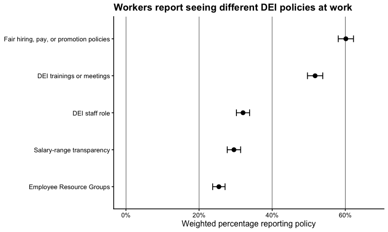
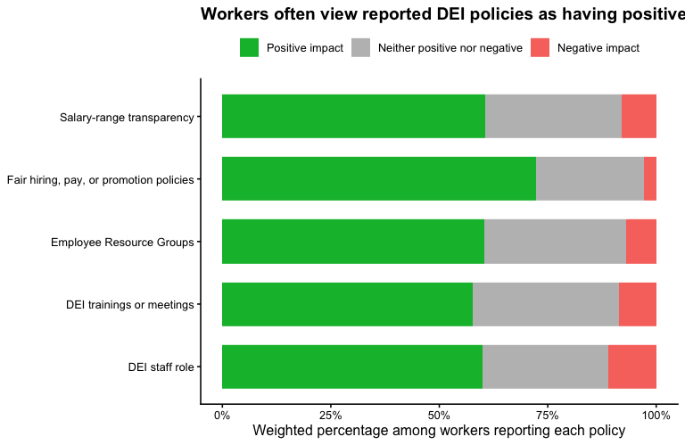

# Overview

This appendix uses Pew Research Center's 2023 American Trends Panel Wave 121 survey as descriptive context for the portfolio project on DEI commitments and organizational credibility. The goal is not to test the experimental hypotheses directly. Instead, this appendix summarizes whether workers report seeing common workplace DEI policies and how workers who report those policies evaluate their impact.

The public-facing portfolio page can use these descriptive results to motivate the experimental studies: DEI policies are not abstract commitments; they are workplace signals that employees may notice and evaluate.

# Data import

Update the `raw_data_path` below to point to the public Pew `.sav` file on your computer.


``` r
raw_data_path <- "~/Documents/reseach projects for websites/dei rollbacks/dei lay perceptions pew 2023/W121_Feb23/ATP W121.sav"

data_raw <- haven::read_sav(raw_data_path)
```

# Variables used

The Pew survey asked workers whether their organization had five workplace DEI policies and, among workers who reported each policy, what impact that policy had where they work.


``` r
policy1_vars <- c(
  "DEIPOLICY1_a_W121",
  "DEIPOLICY1_b_W121",
  "DEIPOLICY1_c_W121",
  "DEIPOLICY1_d_W121",
  "DEIPOLICY1_e_W121"
)

policy2_vars <- c(
  "DEIPOLICY2_a_W121",
  "DEIPOLICY2_b_W121",
  "DEIPOLICY2_c_W121",
  "DEIPOLICY2_d_W121",
  "DEIPOLICY2_e_W121"
)

policy_labels <- c(
  "DEIPOLICY1_a_W121" = "DEI staff role",
  "DEIPOLICY1_b_W121" = "DEI trainings or meetings",
  "DEIPOLICY1_c_W121" = "Fair hiring, pay, or promotion policies",
  "DEIPOLICY1_d_W121" = "Employee Resource Groups",
  "DEIPOLICY1_e_W121" = "Salary-range transparency",
  "DEIPOLICY2_a_W121" = "DEI staff role",
  "DEIPOLICY2_b_W121" = "DEI trainings or meetings",
  "DEIPOLICY2_c_W121" = "Fair hiring, pay, or promotion policies",
  "DEIPOLICY2_d_W121" = "Employee Resource Groups",
  "DEIPOLICY2_e_W121" = "Salary-range transparency"
)
```

# Data preparation

Refused responses are coded as `99` in several Pew variables. They are set to missing here. Structural missingness is preserved; for example, impact questions were only asked when respondents reported that a given policy was present.


``` r
vars_to_clean <- c(
  policy1_vars,
  policy2_vars,
  "WEIGHT_W121",
  "QKEY",
  "F_GENDER",
  "F_RACECMB",
  "F_AGECAT",
  "F_EDUCCAT",
  "F_IDEO"
)

vars_to_clean <- intersect(vars_to_clean, names(data_raw))

data <- data_raw %>%
  dplyr::mutate(
    dplyr::across(
      dplyr::all_of(vars_to_clean),
      ~ {
        x <- .x
        x_num <- as_num(x)
        x[x_num == 99] <- NA
        x
      }
    )
  )
```

# Sample checks

<table class="table table-striped table-hover table-condensed" style="width: auto !important; margin-left: auto; margin-right: auto;">
<caption>Sample size</caption>
 <thead>
  <tr>
   <th> Sample definition </th>
   <th> N </th>
  </tr>
 </thead>
<tbody>
  <tr>
   <td> Workers included in Pew ATP Wave 121 public dataset </td>
   <td> 5902 </td>
  </tr>
</tbody>
</table>

<table class="table table-striped table-hover table-condensed" style="width: auto !important; margin-left: auto; margin-right: auto;">
<caption>Gender distribution</caption>
 <thead>
  <tr>
   <th> Gender </th>
   <th> N </th>
   <th> Percent </th>
  </tr>
 </thead>
<tbody>
  <tr>
   <td> Men </td>
   <td> 2793 </td>
   <td> 47.9% </td>
  </tr>
  <tr>
   <td> Women </td>
   <td> 3039 </td>
   <td> 52.1% </td>
  </tr>
</tbody>
</table>

# DEI policy prevalence

This section estimates the percentage of workers who reported that their workplace had each DEI policy. Responses of "not sure" are retained in the denominator; the estimate is the share who answered "yes."


``` r
policy_prevalence_long <- data %>%
  dplyr::select(QKEY, WEIGHT_W121, dplyr::all_of(policy1_vars)) %>%
  tidyr::pivot_longer(
    cols = dplyr::all_of(policy1_vars),
    names_to = "policy_var",
    values_to = "policy_response"
  ) %>%
  dplyr::mutate(
    policy_response_num = as_num(policy_response),
    policy = dplyr::recode(policy_var, !!!policy_labels),
    reported_policy = dplyr::case_when(
      policy_response_num == 1 ~ 1,
      policy_response_num %in% c(2, 3) ~ 0,
      TRUE ~ NA_real_
    )
  ) %>%
  dplyr::filter(!is.na(reported_policy), !is.na(WEIGHT_W121))

prevalence_design <- survey::svydesign(
  ids = ~QKEY,
  weights = ~WEIGHT_W121,
  data = policy_prevalence_long
)

prevalence_est <- survey::svyby(
  ~reported_policy,
  ~policy,
  prevalence_design,
  survey::svymean,
  na.rm = TRUE,
  vartype = c("se", "ci")
) %>%
  as.data.frame() %>%
  dplyr::rename(
    proportion = reported_policy,
    se = se,
    ci_lower = ci_l,
    ci_upper = ci_u
  ) %>%
  dplyr::mutate(
    policy = forcats::fct_reorder(policy, proportion)
  )
```

<table class="table table-striped table-hover table-condensed" style="width: auto !important; margin-left: auto; margin-right: auto;">
<caption>Workers reporting each DEI policy at their workplace</caption>
 <thead>
  <tr>
   <th>   </th>
   <th> Policy </th>
   <th> % reporting policy </th>
   <th> 95% CI </th>
  </tr>
 </thead>
<tbody>
  <tr>
   <td> Fair hiring, pay, or promotion policies </td>
   <td> Fair hiring, pay, or promotion policies </td>
   <td> 60.2% </td>
   <td> 58.1%–62.2% </td>
  </tr>
  <tr>
   <td> DEI trainings or meetings </td>
   <td> DEI trainings or meetings </td>
   <td> 51.7% </td>
   <td> 49.6%–53.8% </td>
  </tr>
  <tr>
   <td> DEI staff role </td>
   <td> DEI staff role </td>
   <td> 32.0% </td>
   <td> 30.2%–33.8% </td>
  </tr>
  <tr>
   <td> Salary-range transparency </td>
   <td> Salary-range transparency </td>
   <td> 29.5% </td>
   <td> 27.7%–31.4% </td>
  </tr>
  <tr>
   <td> Employee Resource Groups </td>
   <td> Employee Resource Groups </td>
   <td> 25.4% </td>
   <td> 23.7%–27.1% </td>
  </tr>
</tbody>
</table>

<!-- -->

# Perceived impact of reported DEI policies

This section summarizes perceived impact among workers who reported that their workplace had each policy and were therefore asked the corresponding impact item.


``` r
policy_impact_long <- data %>%
  dplyr::select(QKEY, WEIGHT_W121, dplyr::all_of(policy2_vars)) %>%
  tidyr::pivot_longer(
    cols = dplyr::all_of(policy2_vars),
    names_to = "policy_var",
    values_to = "impact_response"
  ) %>%
  dplyr::mutate(
    impact_response_num = as_num(impact_response),
    policy = dplyr::recode(policy_var, !!!policy_labels),
    impact_category = dplyr::case_when(
      impact_response_num %in% c(1, 2) ~ "Positive impact",
      impact_response_num == 3 ~ "Neither positive nor negative",
      impact_response_num %in% c(4, 5) ~ "Negative impact",
      TRUE ~ NA_character_
    ),
    impact_category = factor(
      impact_category,
      levels = c("Positive impact", "Neither positive nor negative", "Negative impact")
    )
  ) %>%
  dplyr::filter(!is.na(impact_category), !is.na(WEIGHT_W121))

impact_design <- survey::svydesign(
  ids = ~QKEY,
  weights = ~WEIGHT_W121,
  data = policy_impact_long
)

impact_est <- survey::svyby(
  ~I(impact_category == "Positive impact") +
    I(impact_category == "Neither positive nor negative") +
    I(impact_category == "Negative impact"),
  ~policy,
  impact_design,
  survey::svymean,
  na.rm = TRUE
) %>%
  as.data.frame()

names(impact_est) <- names(impact_est) %>%
  stringr::str_replace_all("I\\(impact_category == \\\"", "") %>%
  stringr::str_replace_all("\\\"\\)TRUE", "")

impact_plot_df <- impact_est %>%
  dplyr::select(policy, `Positive impact`, `Neither positive nor negative`, `Negative impact`) %>%
  tidyr::pivot_longer(
    cols = -policy,
    names_to = "impact_category",
    values_to = "proportion"
  ) %>%
  dplyr::mutate(
    impact_category = factor(
      impact_category,
      levels = c("Positive impact", "Neither positive nor negative", "Negative impact")
    )
  )
```

<table class="table table-striped table-hover table-condensed" style="width: auto !important; margin-left: auto; margin-right: auto;">
<caption>Perceived impact of DEI policies among workers who report having each policy</caption>
 <thead>
  <tr>
   <th> Policy </th>
   <th> Positive impact </th>
   <th> Neither positive nor negative </th>
   <th> Negative impact </th>
  </tr>
 </thead>
<tbody>
  <tr>
   <td> DEI staff role </td>
   <td> 60.0% </td>
   <td> 29.0% </td>
   <td> 11.0% </td>
  </tr>
  <tr>
   <td> DEI trainings or meetings </td>
   <td> 57.7% </td>
   <td> 33.7% </td>
   <td> 8.6% </td>
  </tr>
  <tr>
   <td> Employee Resource Groups </td>
   <td> 60.3% </td>
   <td> 32.6% </td>
   <td> 7.0% </td>
  </tr>
  <tr>
   <td> Fair hiring, pay, or promotion policies </td>
   <td> 72.3% </td>
   <td> 24.9% </td>
   <td> 2.8% </td>
  </tr>
  <tr>
   <td> Salary-range transparency </td>
   <td> 60.7% </td>
   <td> 31.5% </td>
   <td> 7.9% </td>
  </tr>
</tbody>
</table>

<!-- -->

# Export figures

Run this chunk if you want to save the two figures for the public portfolio page.


``` r
ggsave(
  "../assets/img/dei-pew-policy-prevalence.png",
  pew_policy_prevalence_plot,
  width = 8,
  height = 4.8,
  dpi = 300
)

ggsave(
  "../assets/img/dei-pew-policy-impact.png",
  pew_policy_impact_plot,
  width = 8,
  height = 5.2,
  dpi = 300
)
```

# Brief takeaway

The Pew data provide descriptive context for the experimental studies. Workers report seeing a range of workplace DEI policies, and workers who report those policies often evaluate their impact. This supports the public-facing project framing: DEI policies operate as visible organizational signals that people can notice, interpret, and evaluate.
