This file generates figures for the Linked Fate at Work portfolio case study. The graphs are used for the public-facing project page and technical appendices.


## Study 1: Workplace Relationships

### Study 1: White Women / Women of Color Comparison


``` r
data_l_w = subset(data_l_lfsb_means, scale_name == "lfsb_woc_ww_mean")
data_l_w = subset(data_l_w, gen_name == "women")
data_l_w$group2 = factor(data_l_w$group2, levels = c("Women of color", "White women" )) 

data_l_w <- data_l_lfsb_means %>%
  dplyr::filter(
    scale_name == "lfsb_woc_ww_mean",
    gen_name == "women"
  ) %>%
  dplyr::mutate(
    scale_val = as.numeric(scale_val),
    participant_group = dplyr::case_when(
      race_name == "poc" ~ "Women of color",
      race_name == "white" ~ "White women",
      TRUE ~ NA_character_
    ),
    participant_group = factor(
      participant_group,
      levels = c("Women of color", "White women")
    ),
    x_base = as.numeric(participant_group)
  ) %>%
  dplyr::filter(
    !is.na(participant_group),
    !is.na(scale_val)
  )

ggplot(data_l_w, aes(y = scale_val)) +
  geom_flat_violin(
    aes(
      x = x_base + 0.18,
      group = participant_group,
      fill = participant_group
    ),
    alpha = 0.6,
    color = NA,
    width = 0.55
  ) +
  geom_point(
    aes(x = x_base - 0.08),
    position = position_jitter(width = 0.15, height = 0),
    size = 1,
    alpha = 0.6,
    color = "black",
    show.legend = FALSE
  ) +
  stat_summary(
    aes(
      x = x_base - 0.08,
      group = participant_group
    ),
    fun = mean,
    geom = "point",
    size = 5,
    shape = 18,
    color = "black"
  ) +
  stat_summary(
    aes(
      x = x_base - 0.08,
      group = participant_group
    ),
    fun.data = mean_cl_boot,
    geom = "errorbar",
    width = 0.08,
    linewidth = 1,
    color = "black"
  ) +
  coord_cartesian(ylim = c(1, 7)) +
  scale_y_continuous(
    name = "Linked fate",
    expand = c(0, 0),
    breaks = seq(1, 7, 1)
  ) +
  scale_x_continuous(
    name = NULL,
    breaks = c(1, 2),
    labels = c("Women of color", "White women"),
    limits = c(0.5, 2.6)
  ) +
  scale_fill_manual(
    values = c(
      "Women of color" = "#2FB3EA",
      "White women" = "#89939C"
    )
  ) +
  theme_classic() +
  theme(
    text = element_text(color = "black"),
    axis.text.x = element_text(size = 14, color = "black"),
    axis.title.x = element_blank(),
    axis.ticks.x = element_blank(),
    axis.text.y = element_text(size = 14, color = "black"),
    axis.title.y = element_text(size = 18),
    legend.position = "none",
    plot.margin = margin(.5, .1, 0, .25, "cm")
  )
```

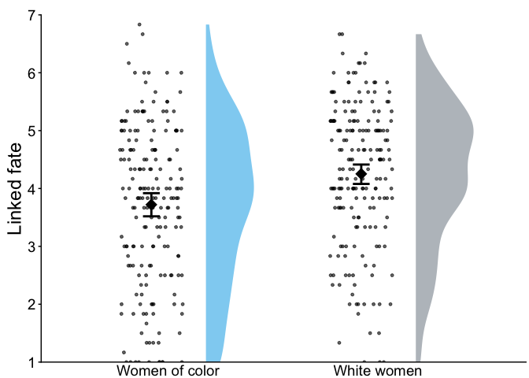<!-- -->

### Study 1: All Race-Gender Comparisons
#### Figure

``` r
pd = position_dodge(.92)

data_l_lfsb_means %>%
  ggplot(aes(x = scale_name, y= scale_val, colour = group2, fill = group2)) +
  geom_bar(stat = "summary", 
           fun = mean,
           position = "dodge") +
  stat_summary(fun.data=mean_se,
               geom='errorbar',
               #fun.args=list(conf.int=.95),
               size=.6,
               aes(width=.3),
               color="black",
               position=pd) +
  coord_cartesian(ylim = c(1,7)) +
  scale_y_continuous(name = "Linked fate", expand = c(0,0), breaks=seq(1,7,1)) + # set ticks at 1, 2, 3, 4 +
  scale_x_discrete(name = "Relationship",
                   limits = c("lfsb_woc_moc_mean",
                        "lfsb_woc_ww_mean",
                        "lfsb_woc_wm_mean",
                        "lfsb_moc_ww_mean",
                        "lfsb_moc_wm_mean",
                        "lfsb_ww_wm_mean"),
                   labels = c("lfsb_woc_moc_mean" = "Women of color / Men of color",
                        "lfsb_woc_ww_mean" = "Women of color/\nWhite women",
                        "lfsb_woc_wm_mean" = "Women of color/\nWhite men",
                        "lfsb_moc_ww_mean" = "Men of color/\nWhite women",
                        "lfsb_moc_wm_mean" = "Men of color/\nWhite men",
                        "lfsb_ww_wm_mean" = "White women/\nWhite men")) +
  theme_classic() +
  theme(text = element_text(color = "black"),
        axis.text.x = element_text(color = "black", angle = 45, hjust = 1),
        #axis.title.x = element_blank(),
        axis.text.y = element_text(color = "black"),
        legend.text = element_text(),
        axis.title = element_text(size = 14)) + # +
  scale_fill_discrete(labels = c("men of color" = "Men of color (MOC)",
                        "white men" = "White men (WM)",
                        "white women" = "White women (WW)",
                        "women of color" = "Women of color (WOC)")) +
  labs(fill = "Participant race and gender") +
  scale_colour_discrete(guide="none") +
  theme(plot.margin = margin(.5,.1,0,.25, "cm"))  #(order goes top, right, bottom, left) 
```

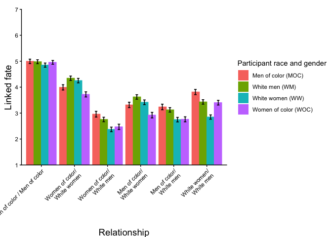<!-- -->

## Studies 2a–2b: Mediator Studies
## Study 2a: Black Women and White Women


### Linked Fate


#### Figure

``` r
pd = position_dodge(.92)

lf_wb = data %>%
  ggplot(aes(x = race_name, y= linkedfate, fill = as.factor(race_name))) +
  geom_bar(stat = "summary", 
           fun = mean,
           position = "dodge") +
  stat_summary(fun.data=mean_se,
               geom='errorbar',
               #fun.args=list(conf.int=.95),
               linewidth=.6,
               aes(width=.3),
               color="black",
               position=pd) +
  coord_cartesian(ylim = c(1,7)) +
  scale_y_continuous(name = "Linked fate", expand = c(0,0), breaks=seq(1,7,1)) + # set ticks at 1, 2, 3, 4 +
    scale_x_discrete(name = "Comparison Group",
                   limits = c("Black women",
                              "White women"
                              )
                   #labels = c("linkedfate_woc" = "Linked fate with\nwomen of color",
                         #     "linkedfate_ww" = "Linked fate with\nWhite women")
                     ) +
 # scale_fill_discrete(labels = c("black_p" = "Black women", 
  #                             "white_p" = "White women")) +
  theme_classic() +
  theme(text = element_text(color = "black"),
        axis.text.x = element_text(size = 14, color = "black"),
        axis.title.x = element_blank(),
        axis.text.y = element_text(size = 14, color = "black"),
        axis.title.y = element_text(size = 14, color = "black"),
        #axis.title.y = element_blank(),
        legend.title = element_text(size = 18, hjust = .5),
        legend.text = element_text(size = 14),
        axis.title = element_text(size = 14),
        legend.position = "top",
        legend.title.position = "top"
        #legend.justification = "center",
        #legend.direction = "vertical",
        ) + 
  #labs(fill = "Participant race") +
  scale_colour_discrete(guide="none",
                        breaks = c("Black women" = "Black women", "White women" = "White women")
                        #labels = c("Black women" = "Black women", "White women" = "White women")
                        ) +
  scale_fill_manual(guide = "none",
                    name = "Participant Race", 
                    breaks = c("Black women" = "Black women", "White women" = "White women"),
                  #labels = c("black_p" = "Black women", "white_p" = "White women"),
                  values = c("#2FB3EA","#89939C")) +
  theme(plot.margin = margin(.5,.1,0,.25, "cm"))  #(order goes top, right, bottom, left) 

  
lf_wb
```

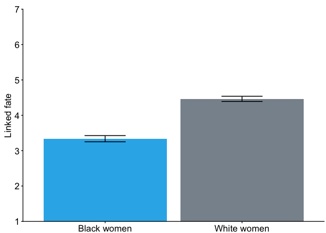<!-- -->

### Relational Orientation
 


#### Figures
##### White Women → Black Women

``` r
pd = position_dodge(.92)

ro_wb = data %>%
  ggplot(aes(x = race_name, y= supp_comp_wb, fill = as.factor(race_name))) +
  geom_bar(stat = "summary", 
           fun = mean,
           position = "dodge") +
  stat_summary(fun.data=mean_se,
               geom='errorbar',
               #fun.args=list(conf.int=.95),
               size=.6,
               aes(width=.3),
               color="black",
               position=pd) +
  coord_cartesian(ylim = c(1,7)) +
  scale_y_continuous(name = "Relational orientation", expand = c(0,0), breaks=seq(1,7,1)) + # set ticks at 1, 2, 3, 4 +
  scale_x_discrete(name = "Comparison Group",
                   limits = c("Black women",
                              "White women"
                              )
                   #labels = c("linkedfate_woc" = "Linked fate with\nwomen of color",
                         #     "linkedfate_ww" = "Linked fate with\nWhite women")
                     ) +
 # scale_fill_discrete(labels = c("black_p" = "Black women", 
  #                             "white_p" = "White women")) +
  theme_classic() +
  theme(text = element_text(color = "black"),
        axis.text.x = element_text(size = 14, color = "black"),
        axis.title.x = element_blank(),
        axis.text.y = element_text(size = 14, color = "black"),
        axis.title.y = element_text(size = 14, color = "black"),
        #axis.title.y = element_blank(),
        legend.title = element_text(size = 18, hjust = .5),
        legend.text = element_text(size = 14),
        axis.title = element_text(size = 14),
        legend.position = "top",
        legend.title.position = "top"
        #legend.justification = "center",
        #legend.direction = "vertical",
        ) + 
  #labs(fill = "Participant race") +
  scale_colour_discrete(guide="none",
                        breaks = c("Black women" = "Black women", "White women" = "White women")
                        #labels = c("Black women" = "Black women", "White women" = "White women")
                        ) +
  scale_fill_manual(guide = "none",
                    name = "Participant Race", 
                    breaks = c("Black women" = "Black women", "White women" = "White women"),
                  #labels = c("black_p" = "Black women", "white_p" = "White women"),
                  values = c("#2FB3EA","#89939C")) +
  theme(plot.margin = margin(.5,.1,0,.25, "cm"))  #(order goes top, right, bottom, left) 

ro_wb
```

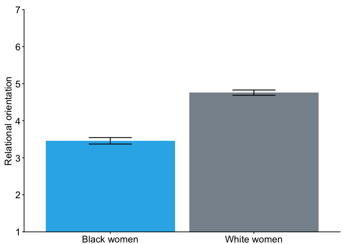<!-- -->
##### Black Women → White Women

``` r
pd = position_dodge(.92)

ro_bw = data %>%
  ggplot(aes(x = race_name, y= supp_comp_bw, fill = as.factor(race_name))) +
  geom_bar(stat = "summary", 
           fun = mean,
           position = "dodge") +
  stat_summary(fun.data=mean_se,
               geom='errorbar',
               #fun.args=list(conf.int=.95),
               size=.6,
               aes(width=.3),
               color="black",
               position=pd) +
  coord_cartesian(ylim = c(1,7)) +
  scale_y_continuous(name = "Competition", expand = c(0,0), breaks=seq(1,7,1)) + # set ticks at 1, 2, 3, 4 +
  scale_x_discrete(name = "Comparison Group",
                   limits = c("Black women",
                              "White women"
                              )
                   #labels = c("linkedfate_woc" = "Linked fate with\nwomen of color",
                         #     "linkedfate_ww" = "Linked fate with\nWhite women")
                     ) +
 # scale_fill_discrete(labels = c("black_p" = "Black women", 
  #                             "white_p" = "White women")) +
  theme_classic() +
  theme(text = element_text(color = "black"),
        axis.text.x = element_text(size = 14, color = "black"),
        axis.title.x = element_blank(),
        axis.text.y = element_text(size = 14, color = "black"),
        axis.title.y = element_blank(),
        legend.title = element_text(size = 18, hjust = .5),
        legend.text = element_text(size = 14),
        axis.title = element_text(size = 14),
        legend.position = "top",
        legend.title.position = "top"
        #legend.justification = "center",
        #legend.direction = "vertical",
        ) + 
  #labs(fill = "Participant race") +
  scale_colour_discrete(guide="none",
                        breaks = c("Black women" = "Black women", "White women" = "White women")
                        #labels = c("Black women" = "Black women", "White women" = "White women")
                        ) +
  scale_fill_manual(guide = "none",
                    name = "Participant Race", 
                    breaks = c("Black women" = "Black women", "White women" = "White women"),
                  #labels = c("black_p" = "Black women", "white_p" = "White women"),
                  values = c("#2FB3EA","#89939C")) +
  theme(plot.margin = margin(.5,.1,0,.25, "cm"))  #(order goes top, right, bottom, left) 


ro_bw
```

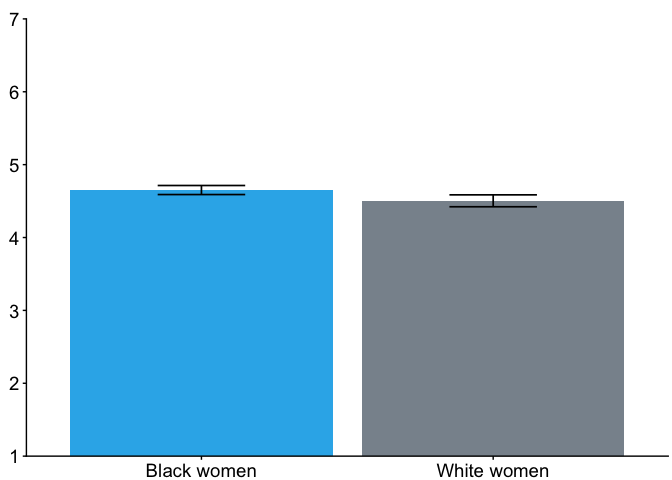<!-- -->

### Bias Map

#### Pity Elicitation


#### Figures
##### White Women → Black Women

``` r
pd = position_dodge(.92)

e_wb = data %>%
  ggplot(aes(x = race_name, y= emotion_ww, fill = as.factor(race_name))) +
  geom_bar(stat = "summary", 
           fun = mean,
           position = "dodge") +
  stat_summary(fun.data=mean_se,
               geom='errorbar',
               #fun.args=list(conf.int=.95),
               size=.6,
               aes(width=.3),
               color="black",
               position=pd) +
  coord_cartesian(ylim = c(1,7)) +
  scale_y_continuous(name = "Pity elicitation", expand = c(0,0), breaks=seq(1,7,1)) + # set ticks at 1, 2, 3, 4 +
  scale_x_discrete(name = "Comparison Group",
                   limits = c("Black women",
                              "White women"
                              )
                   #labels = c("linkedfate_woc" = "Linked fate with\nwomen of color",
                         #     "linkedfate_ww" = "Linked fate with\nWhite women")
                     ) +
 # scale_fill_discrete(labels = c("black_p" = "Black women", 
  #                             "white_p" = "White women")) +
  theme_classic() +
  theme(text = element_text(color = "black"),
        axis.text.x = element_text(size = 14, color = "black"),
        axis.title.x = element_blank(),
        axis.text.y = element_text(size = 14, color = "black"),
        axis.title.y = element_text(size = 14, color = "black"),
        #axis.title.y = element_blank(),
        legend.title = element_text(size = 18, hjust = .5),
        legend.text = element_text(size = 14),
        axis.title = element_text(size = 14),
        legend.position = "top",
        legend.title.position = "top"
        #legend.justification = "center",
        #legend.direction = "vertical",
        ) + 
  #labs(fill = "Participant race") +
  scale_colour_discrete(guide="none",
                        breaks = c("Black women" = "Black women", "White women" = "White women")
                        #labels = c("Black women" = "Black women", "White women" = "White women")
                        ) +
  scale_fill_manual(guide = "none",
                    name = "Participant Race", 
                    breaks = c("Black women" = "Black women", "White women" = "White women"),
                  #labels = c("black_p" = "Black women", "white_p" = "White women"),
                  values = c("#2FB3EA","#89939C")) +
  theme(plot.margin = margin(.5,.1,0,.25, "cm"))  #(order goes top, right, bottom, left) 

e_wb
```

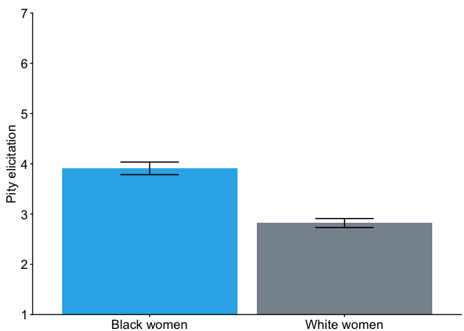<!-- -->

##### Black Women → White Women


``` r
pd = position_dodge(.92)

e_bw = data %>%
  ggplot(aes(x = race_name, y= emotion_bw, fill = as.factor(race_name))) +
  geom_bar(stat = "summary", 
           fun = mean,
           position = "dodge") +
  stat_summary(fun.data=mean_se,
               geom='errorbar',
               #fun.args=list(conf.int=.95),
               size=.6,
               aes(width=.3),
               color="black",
               position=pd) +
  coord_cartesian(ylim = c(1,7)) +
  scale_y_continuous(name = "Pity elicitation", expand = c(0,0), breaks=seq(1,7,1)) + # set ticks at 1, 2, 3, 4 +
  scale_x_discrete(name = "Comparison Group",
                   limits = c("Black women",
                              "White women"
                              )
                   #labels = c("linkedfate_woc" = "Linked fate with\nwomen of color",
                         #     "linkedfate_ww" = "Linked fate with\nWhite women")
                     ) +
 # scale_fill_discrete(labels = c("black_p" = "Black women", 
  #                             "white_p" = "White women")) +
  theme_classic() +
  theme(text = element_text(color = "black"),
        axis.text.x = element_text(size = 14, color = "black"),
        axis.title.x = element_blank(),
        axis.text.y = element_text(size = 14, color = "black"),
        axis.title.y = element_blank(),
        legend.title = element_text(size = 18, hjust = .5),
        legend.text = element_text(size = 14),
        axis.title = element_text(size = 14),
        legend.position = "top",
        legend.title.position = "top"
        #legend.justification = "center",
        #legend.direction = "vertical",
        ) + 
  #labs(fill = "Participant race") +
  scale_colour_discrete(guide="none",
                        breaks = c("Black women" = "Black women", "White women" = "White women")
                        #labels = c("Black women" = "Black women", "White women" = "White women")
                        ) +
  scale_fill_manual(guide = "none",
                    name = "Participant Race", 
                    breaks = c("Black women" = "Black women", "White women" = "White women"),
                  #labels = c("black_p" = "Black women", "white_p" = "White women"),
                  values = c("#2FB3EA","#89939C")) +
  theme(plot.margin = margin(.5,.1,0,.25, "cm"))  #(order goes top, right, bottom, left) 

e_bw
```

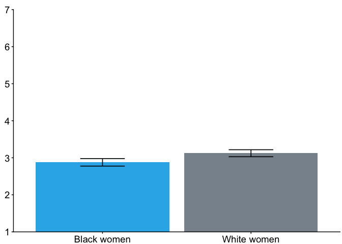<!-- -->

#### Active Facilitation


#### Figures

##### White Women → Black Women

``` r
pd = position_dodge(.92)

b_wb = data %>%
  ggplot(aes(x = race_name, y= behavior_ww, fill = as.factor(race_name))) +
  geom_bar(stat = "summary", 
           fun = mean,
           position = "dodge") +
  stat_summary(fun.data=mean_se,
               geom='errorbar',
               #fun.args=list(conf.int=.95),
               size=.6,
               aes(width=.3),
               color="black",
               position=pd) +
  coord_cartesian(ylim = c(1,7)) +
  scale_y_continuous(name = "Active facilitation", expand = c(0,0), breaks=seq(1,7,1)) + # set ticks at 1, 2, 3, 4 +
   scale_x_discrete(name = "Comparison Group",
                   limits = c("Black women",
                              "White women"
                              )
                   #labels = c("linkedfate_woc" = "Linked fate with\nwomen of color",
                         #     "linkedfate_ww" = "Linked fate with\nWhite women")
                     ) +
 # scale_fill_discrete(labels = c("black_p" = "Black women", 
  #                             "white_p" = "White women")) +
  theme_classic() +
  theme(text = element_text(color = "black"),
        axis.text.x = element_text(size = 14, color = "black"),
        axis.title.x = element_blank(),
        axis.text.y = element_text(size = 14, color = "black"),
        axis.title.y = element_text(size = 14, color = "black"),
       # axis.title.y = element_blank(),
        legend.title = element_text(size = 18, hjust = .5),
        legend.text = element_text(size = 14),
        axis.title = element_text(size = 14),
        legend.position = "top",
        legend.title.position = "top"
        #legend.justification = "center",
        #legend.direction = "vertical",
        ) + 
  #labs(fill = "Participant race") +
  scale_colour_discrete(guide="none",
                        breaks = c("Black women" = "Black women", "White women" = "White women")
                        #labels = c("Black women" = "Black women", "White women" = "White women")
                        ) +
  scale_fill_manual(guide="none",
                    name = "Participant Race", 
                    breaks = c("Black women" = "Black women", "White women" = "White women"),
                  #labels = c("black_p" = "Black women", "white_p" = "White women"),
                  values = c("#2FB3EA","#89939C")) +
  theme(plot.margin = margin(.5,.1,0,.25, "cm"))  #(order goes top, right, bottom, left) 

b_wb
```

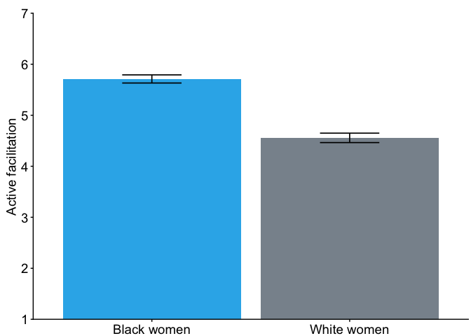<!-- -->

##### Black Women → White Women


``` r
pd = position_dodge(.92)

b_bw = data %>%
  ggplot(aes(x = race_name, y= behavior_bw, fill = as.factor(race_name))) +
  geom_bar(stat = "summary", 
           fun = mean,
           position = "dodge") +
  stat_summary(fun.data=mean_se,
               geom='errorbar',
               #fun.args=list(conf.int=.95),
               size=.6,
               aes(width=.3),
               color="black",
               position=pd) +
  coord_cartesian(ylim = c(1,7)) +
  scale_y_continuous(name = "Active faciliation", expand = c(0,0), breaks=seq(1,7,1)) + # set ticks at 1, 2, 3, 4 +
  scale_x_discrete(name = "Comparison Group",
                   limits = c("Black women",
                              "White women"
                              )
                   #labels = c("linkedfate_woc" = "Linked fate with\nwomen of color",
                         #     "linkedfate_ww" = "Linked fate with\nWhite women")
                     ) +
 # scale_fill_discrete(labels = c("black_p" = "Black women", 
  #                             "white_p" = "White women")) +
  theme_classic() +
  theme(text = element_text(color = "black"),
        axis.text.x = element_text(size = 14, color = "black"),
        axis.title.x = element_blank(),
        axis.text.y = element_text(size = 14, color = "black"),
        axis.title.y = element_blank(),
        legend.title = element_text(size = 18, hjust = .5),
        legend.text = element_text(size = 14),
        axis.title = element_text(size = 14),
        legend.position = "top",
        legend.title.position = "top"
        #legend.justification = "center",
        #legend.direction = "vertical",
        ) + 
  #labs(fill = "Participant race") +
  scale_colour_discrete(guide="none",
                        breaks = c("Black women" = "Black women", "White women" = "White women")
                        #labels = c("Black women" = "Black women", "White women" = "White women")
                        ) +
  scale_fill_manual(guide="none",
                    name = "Participant Race", 
                    breaks = c("Black women" = "Black women", "White women" = "White women"),
                  #labels = c("black_p" = "Black women", "white_p" = "White women"),
                  values = c("#2FB3EA","#89939C")) +
  theme(plot.margin = margin(.5,.1,0,.25, "cm"))  #(order goes top, right, bottom, left) 


b_bw
```

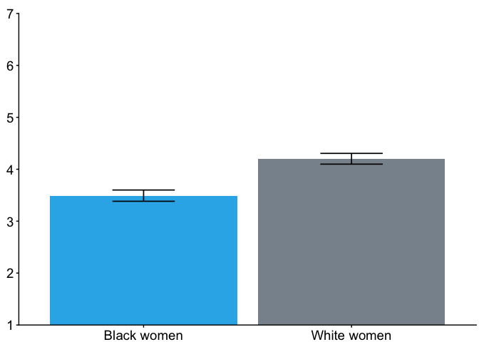<!-- -->

### Study 2a Combined Figure


``` r
ggarrange(ro_wb, ro_bw,
          e_wb, e_bw,
          b_wb, b_bw,
          nrow = 3,
          ncol = 2)
```

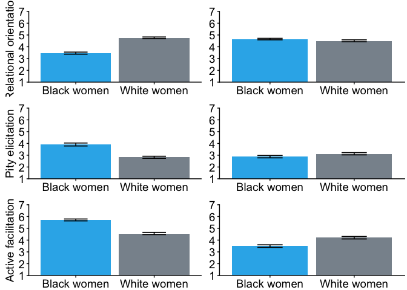<!-- -->

## Study 2b: Latina Women and White Women


### Linked Fate


#### Figure

``` r
pd = position_dodge(.92)

lf_wl = data %>%
  ggplot(aes(x = race_name, y= linkedfate, fill = as.factor(race_name))) +
  geom_bar(stat = "summary", 
           fun = mean,
           position = "dodge") +
  stat_summary(fun.data=mean_se,
               geom='errorbar',
               #fun.args=list(conf.int=.95),
               size=.6,
               aes(width=.3),
               color="black",
               position=pd) +
  coord_cartesian(ylim = c(1,7)) +
  scale_y_continuous(name = "Linked fate", expand = c(0,0), breaks=seq(1,7,1)) + # set ticks at 1, 2, 3, 4
    scale_x_discrete(name = "Comparison Group",
                   limits = c("Latina women",
                              "White women"
                              )
                   #labels = c("linkedfate_woc" = "Linked fate with\nwomen of color",
                         #     "linkedfate_ww" = "Linked fate with\nWhite women")
                     ) +
 # scale_fill_discrete(labels = c("black_p" = "Black women", 
  #                             "white_p" = "White women")) +
  theme_classic() +
  theme(text = element_text(color = "black"),
        axis.text.x = element_text(size = 14, color = "black"),
        axis.title.x = element_blank(),
        axis.text.y = element_text(size = 14, color = "black"),
        axis.title.y = element_text(size = 14, color = "black"),
        #axis.title.y = element_blank(),
        legend.title = element_text(size = 18, hjust = .5),
        legend.text = element_text(size = 14),
        axis.title = element_text(size = 14),
        legend.position = "top",
        legend.title.position = "top"
        #legend.justification = "center",
        #legend.direction = "vertical",
        ) + 
  #labs(fill = "Participant race") +
  scale_colour_discrete(guide="none",
                        breaks = c("Latina women" = "Latina women","White women" = "White women")
                        #labels = c("Latina women" = "Latina women", "White women" = "White women")
                        ) +
  scale_fill_manual(guide="none",
                    name = "Participant Race", 
                    breaks = c("Latina women" = "Latina women", "White women" = "White women"),
                  #labels = c("latina_p" = "Latina women", "white_p" = "White women"),
                  values = c("#0078AB", "#89939C")) +
  theme(plot.margin = margin(.5,.1,0,.25, "cm"))  #(order goes top, right, bottom, left) 

lf_wl
```

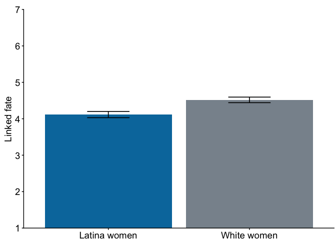<!-- -->

### Relational Orientation


#### Latina Women → White Women


#### Figures
##### White Women → Latina Women

``` r
pd = position_dodge(.92)

ro_wl = data %>%
  ggplot(aes(x = race_name, y= supp_comp_wl, fill = as.factor(race_name))) +
  geom_bar(stat = "summary", 
           fun = mean,
           position = "dodge") +
  stat_summary(fun.data=mean_se,
               geom='errorbar',
               #fun.args=list(conf.int=.95),
               size=.6,
               aes(width=.3),
               color="black",
               position=pd) +
  coord_cartesian(ylim = c(1,7)) +
  scale_y_continuous(name = "Relational orientation", expand = c(0,0), breaks=seq(1,7,1)) + # set ticks at 1, 2, 3, 4 +
  scale_x_discrete(name = "Comparison Group",
                   limits = c("Latina women",
                              "White women"
                              )
                   #labels = c("linkedfate_woc" = "Linked fate with\nwomen of color",
                         #     "linkedfate_ww" = "Linked fate with\nWhite women")
                     ) +
 # scale_fill_discrete(labels = c("black_p" = "Black women", 
  #                             "white_p" = "White women")) +
  theme_classic() +
  theme(text = element_text(color = "black"),
        axis.text.x = element_text(size = 14, color = "black"),
        axis.title.x = element_blank(),
        axis.text.y = element_text(size = 14, color = "black"),
        axis.title.y = element_text(size = 14, color = "black"),
        #axis.title.y = element_blank(),
        legend.title = element_text(size = 18, hjust = .5),
        legend.text = element_text(size = 14),
        axis.title = element_text(size = 14),
        legend.position = "top",
        legend.title.position = "top"
        #legend.justification = "center",
        #legend.direction = "vertical",
        ) + 
  #labs(fill = "Participant race") +
  scale_colour_discrete(guide="none",
                        breaks = c("Latina women" = "Latina women","White women" = "White women")
                        #labels = c("Latina women" = "Latina women", "White women" = "White women")
                        ) +
  scale_fill_manual(guide="none",
                    name = "Participant Race", 
                    breaks = c("Latina women" = "Latina women", "White women" = "White women"),
                  #labels = c("latina_p" = "Latina women", "white_p" = "White women"),
                  values = c("#0078AB", "#89939C")) +
  theme(plot.margin = margin(.5,.1,0,.25, "cm"))  #(order goes top, right, bottom, left) 

ro_wl
```

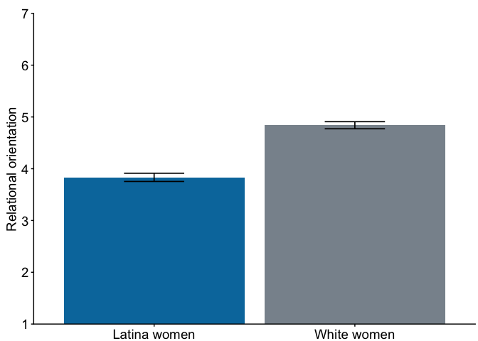<!-- -->

##### Latina Women → White Women


``` r
pd = position_dodge(.92)

ro_lw = data %>%
  ggplot(aes(x = race_name, y= supp_comp_lw, fill = as.factor(race_name))) +
  geom_bar(stat = "summary", 
           fun = mean,
           position = "dodge") +
  stat_summary(fun.data=mean_se,
               geom='errorbar',
               #fun.args=list(conf.int=.95),
               size=.6,
               aes(width=.3),
               color="black",
               position=pd) +
  coord_cartesian(ylim = c(1,7)) +
  scale_y_continuous(name = "Relational orientation", expand = c(0,0), breaks=seq(1,7,1)) + # set ticks at 1, 2, 3, 4 +
  scale_x_discrete(name = "Comparison Group",
                   limits = c("Latina women",
                              "White women"
                              )
                   #labels = c("linkedfate_woc" = "Linked fate with\nwomen of color",
                         #     "linkedfate_ww" = "Linked fate with\nWhite women")
                     ) +
 # scale_fill_discrete(labels = c("black_p" = "Black women", 
  #                             "white_p" = "White women")) +
  theme_classic() +
  theme(text = element_text(color = "black"),
        axis.text.x = element_text(size = 14, color = "black"),
        axis.title.x = element_blank(),
        axis.text.y = element_text(size = 14, color = "black"),
        axis.title.y = element_blank(),
        legend.title = element_text(size = 18, hjust = .5),
        legend.text = element_text(size = 14),
        axis.title = element_text(size = 14),
        legend.position = "top",
        legend.title.position = "top"
        #legend.justification = "center",
        #legend.direction = "vertical",
        ) + 
  #labs(fill = "Participant race") +
  scale_colour_discrete(guide="none",
                        breaks = c("Latina women" = "Latina women","White women" = "White women")
                        #labels = c("Latina women" = "Latina women", "White women" = "White women")
                        ) +
  scale_fill_manual(guide="none",
                    name = "Participant Race", 
                    breaks = c("Latina women" = "Latina women", "White women" = "White women"),
                  #labels = c("latina_p" = "Latina women", "white_p" = "White women"),
                  values = c("#0078AB", "#89939C")) +
  theme(plot.margin = margin(.5,.1,0,.25, "cm"))  #(order goes top, right, bottom, left) 

ro_lw
```

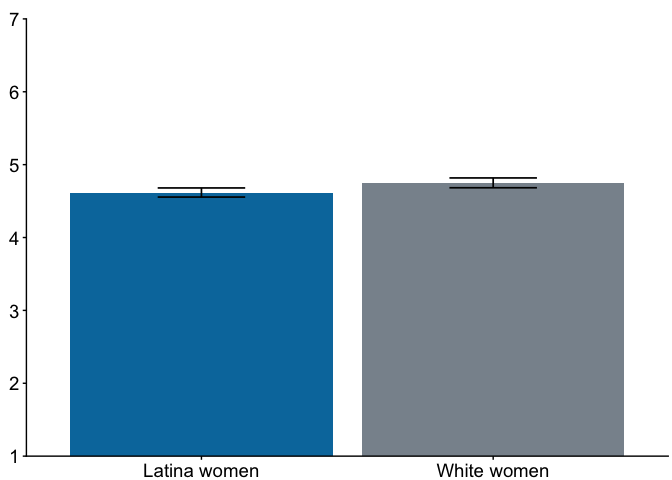<!-- -->

### Bias Map

#### Pity Elicitation


#### Figures

##### White Women → Latina Women


``` r
pd = position_dodge(.92)

e_wl = data %>%
  ggplot(aes(x = race_name, y= emotion_ww, fill = as.factor(race_name))) +
  geom_bar(stat = "summary", 
           fun = mean,
           position = "dodge") +
  stat_summary(fun.data=mean_se,
               geom='errorbar',
               #fun.args=list(conf.int=.95),
               size=.6,
               aes(width=.3),
               color="black",
               position=pd) +
  coord_cartesian(ylim = c(1,7)) +
  scale_y_continuous(name = "Pity elicitation", expand = c(0,0), breaks=seq(1,7,1)) + # set ticks at 1, 2, 3, 4 +
  scale_x_discrete(name = "Comparison Group",
                   limits = c("Latina women",
                              "White women"
                              )
                   #labels = c("linkedfate_woc" = "Linked fate with\nwomen of color",
                         #     "linkedfate_ww" = "Linked fate with\nWhite women")
                     ) +
 # scale_fill_discrete(labels = c("black_p" = "Black women", 
  #                             "white_p" = "White women")) +
  theme_classic() +
  theme(text = element_text(color = "black"),
        axis.text.x = element_text(size = 14, color = "black"),
        axis.title.x = element_blank(),
        axis.text.y = element_text(size = 14, color = "black"),
        axis.title.y = element_text(size = 14, color = "black"),
        #axis.title.y = element_blank(),
        legend.title = element_text(size = 18, hjust = .5),
        legend.text = element_text(size = 14),
        axis.title = element_text(size = 14),
        legend.position = "top",
        legend.title.position = "top"
        #legend.justification = "center",
        #legend.direction = "vertical",
        ) + 
  #labs(fill = "Participant race") +
  scale_colour_discrete(guide="none",
                        breaks = c("Latina women" = "Latina women","White women" = "White women")
                        #labels = c("Latina women" = "Latina women", "White women" = "White women")
                        ) +
  scale_fill_manual(guide="none",
                    name = "Participant Race", 
                    breaks = c("Latina women" = "Latina women", "White women" = "White women"),
                  #labels = c("latina_p" = "Latina women", "white_p" = "White women"),
                  values = c("#0078AB", "#89939C")) +
  theme(plot.margin = margin(.5,.1,0,.25, "cm"))  #(order goes top, right, bottom, left) 

e_wl
```

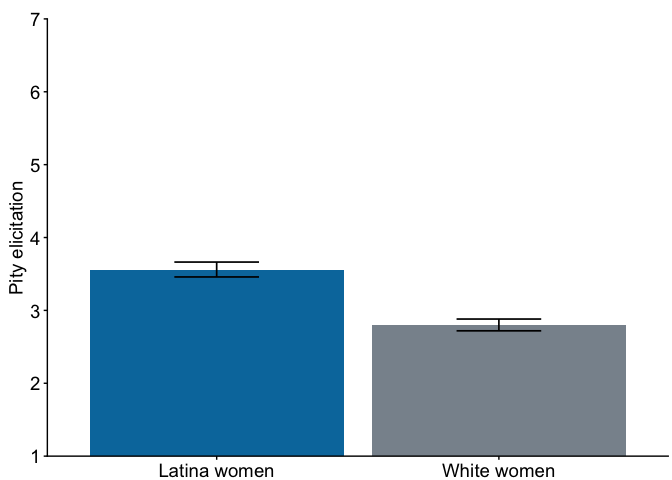<!-- -->

##### Latina Women → White Women


``` r
pd = position_dodge(.92)

e_lw = data %>%
  ggplot(aes(x = race_name, y= emotion_lw, fill = as.factor(race_name))) +
  geom_bar(stat = "summary", 
           fun = mean,
           position = "dodge") +
  stat_summary(fun.data=mean_se,
               geom='errorbar',
               #fun.args=list(conf.int=.95),
               size=.6,
               aes(width=.3),
               color="black",
               position=pd) +
  coord_cartesian(ylim = c(1,7)) +
  scale_y_continuous(name = "Pity elicitation", expand = c(0,0), breaks=seq(1,7,1)) + # set ticks at 1, 2, 3, 4 +
   scale_x_discrete(name = "Comparison Group",
                   limits = c("Latina women",
                              "White women"
                              )
                   #labels = c("linkedfate_woc" = "Linked fate with\nwomen of color",
                         #     "linkedfate_ww" = "Linked fate with\nWhite women")
                     ) +
 # scale_fill_discrete(labels = c("black_p" = "Black women", 
  #                             "white_p" = "White women")) +
  theme_classic() +
  theme(text = element_text(color = "black"),
        axis.text.x = element_text(size = 14, color = "black"),
        axis.title.x = element_blank(),
        axis.text.y = element_text(size = 14, color = "black"),
        axis.title.y = element_blank(),
        legend.title = element_text(size = 18, hjust = .5),
        legend.text = element_text(size = 14),
        axis.title = element_text(size = 14),
        legend.position = "top",
        legend.title.position = "top"
        #legend.justification = "center",
        #legend.direction = "vertical",
        ) + 
  #labs(fill = "Participant race") +
  scale_colour_discrete(guide="none",
                        breaks = c("Latina women" = "Latina women","White women" = "White women")
                        #labels = c("Latina women" = "Latina women", "White women" = "White women")
                        ) +
  scale_fill_manual(guide="none",
                    name = "Participant Race", 
                    breaks = c("Latina women" = "Latina women", "White women" = "White women"),
                  #labels = c("latina_p" = "Latina women", "white_p" = "White women"),
                  values = c("#0078AB", "#89939C")) +
  theme(plot.margin = margin(.5,.1,0,.25, "cm"))  #(order goes top, right, bottom, left) 

e_lw
```

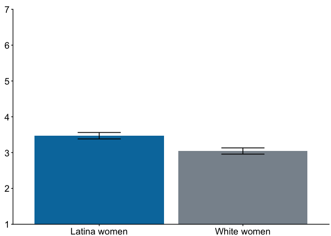<!-- -->

#### Active Facilitation


#### Figures

##### White Women → Latina Women

``` r
pd = position_dodge(.92)

b_wl = data %>%
  ggplot(aes(x = race_name, y= behavior_ww, fill = as.factor(race_name))) +
  geom_bar(stat = "summary", 
           fun = mean,
           position = "dodge") +
  stat_summary(fun.data=mean_se,
               geom='errorbar',
               #fun.args=list(conf.int=.95),
               size=.6,
               aes(width=.3),
               color="black",
               position=pd) +
  coord_cartesian(ylim = c(1,7)) +
  scale_y_continuous(name = "Active facilitation", expand = c(0,0), breaks=seq(1,7,1)) + # set ticks at 1, 2, 3, 4 +
  scale_x_discrete(name = "Comparison Group",
                   limits = c("Latina women",
                              "White women"
                              )
                   #labels = c("linkedfate_woc" = "Linked fate with\nwomen of color",
                         #     "linkedfate_ww" = "Linked fate with\nWhite women")
                     ) +
 # scale_fill_discrete(labels = c("black_p" = "Black women", 
  #                             "white_p" = "White women")) +
  theme_classic() +
  theme(text = element_text(color = "black"),
        axis.text.x = element_text(size = 14, color = "black"),
        axis.title.x = element_blank(),
        axis.text.y = element_text(size = 14, color = "black"),
        axis.title.y = element_text(size = 14, color = "black"),
        #axis.title.y = element_blank(),
        legend.title = element_text(size = 18, hjust = .5),
        legend.text = element_text(size = 14),
        axis.title = element_text(size = 14),
        legend.position = "top",
        legend.title.position = "top"
        #legend.justification = "center",
        #legend.direction = "vertical",
        ) + 
  #labs(fill = "Participant race") +
  scale_colour_discrete(guide="none",
                        breaks = c("Latina women" = "Latina women","White women" = "White women")
                        #labels = c("Latina women" = "Latina women", "White women" = "White women")
                        ) +
  scale_fill_manual(guide="none",
                    name = "Participant Race", 
                    breaks = c("Latina women" = "Latina women", "White women" = "White women"),
                  #labels = c("latina_p" = "Latina women", "white_p" = "White women"),
                  values = c("#0078AB", "#89939C")) +
  theme(plot.margin = margin(.5,.1,0,.25, "cm"))  #(order goes top, right, bottom, left) 

b_wl
```

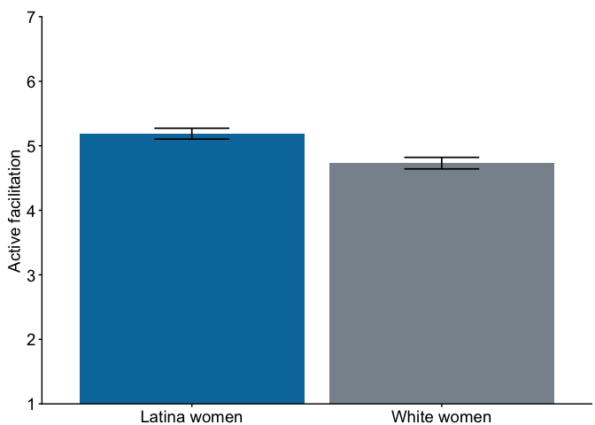<!-- -->

##### Latina Women → White Women


``` r
pd = position_dodge(.92)

b_lw = data %>%
  ggplot(aes(x = race_name, y= behavior_lw, fill = as.factor(race_name))) +
  geom_bar(stat = "summary", 
           fun = mean,
           position = "dodge") +
  stat_summary(fun.data=mean_se,
               geom='errorbar',
               #fun.args=list(conf.int=.95),
               size=.6,
               aes(width=.3),
               color="black",
               position=pd) +
  coord_cartesian(ylim = c(1,7)) +
  scale_y_continuous(name = "Active facilitation", expand = c(0,0), breaks=seq(1,7,1)) + # set ticks at 1, 2, 3, 4 +
  scale_x_discrete(name = "Comparison Group",
                   limits = c("White women",
                              "Latina women")
                   #labels = c("linkedfate_woc" = "Linked fate with\nwomen of color",
                         #     "linkedfate_ww" = "Linked fate with\nWhite women")
                     ) +
 # scale_fill_discrete(labels = c("black_p" = "Black women", 
  #                             "white_p" = "White women")) +
  theme_classic() +
  theme(text = element_text(color = "black"),
        axis.text.x = element_text(size = 14, color = "black"),
        axis.title.x = element_blank(),
        axis.text.y = element_text(size = 14, color = "black"),
        axis.title.y = element_blank(),
        legend.title = element_text(size = 18, hjust = .5),
        legend.text = element_text(size = 14),
        axis.title = element_text(size = 14),
        legend.position = "top",
        legend.title.position = "top"
        #legend.justification = "center",
        #legend.direction = "vertical",
        ) + # +
  #labs(fill = "Participant race") +
  scale_colour_discrete(guide="none",
                        breaks = c("White women" = "White women", "Latina women" = "Latina women")#,
                        #labels = c("White women" = "White women", "Latina women" = "Latina women")
                        ) +
  scale_fill_manual(guide="none",
                    name = "Participant Race", 
                  breaks= c("White women" = "White women", "Latina women" = "Latina women"),
                 # labels = c("white_p" = "White women", "latina_p" = "Latina women") #,
                  values = c("#0078AB", "#89939C")) +
  theme(plot.margin = margin(.5,.1,0,.25, "cm"))  #(order goes top, right, bottom, left) 

b_lw
```

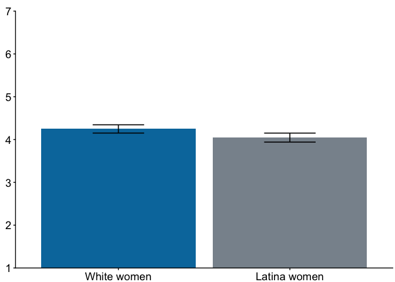<!-- -->

### Study 2b Combined Figure


``` r
ggarrange(ro_wl, ro_lw,
          e_wl, e_lw,
          b_wl, b_lw,
          nrow = 3,
          ncol = 2)
```

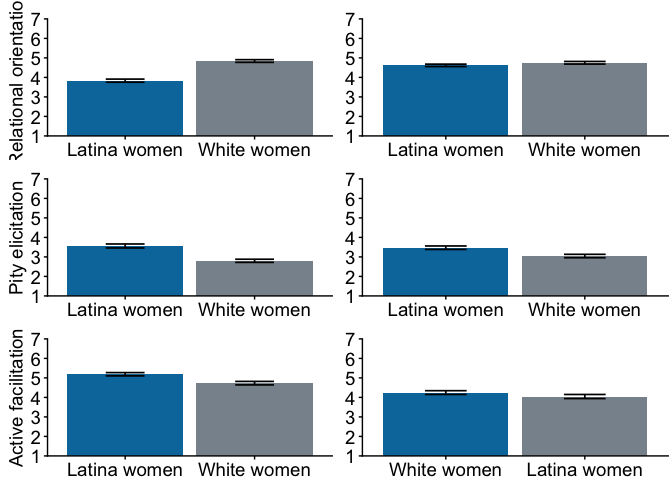<!-- -->

``` r
# Study 2b plot export
```

## Study 3a: Black Women and White Women


### Self-Applicability


``` r
pd = position_dodge(.92)

bsa = data_bw %>%
  ggplot(aes(x = webad_race, y= sa_mean, fill = prace_name)) +
  geom_bar(stat = "summary", 
           fun = mean,
           position = "dodge") +
  stat_summary(fun.data=mean_se,
               geom='errorbar',
               #fun.args=list(conf.int=.95),
               size=.6,
               aes(width=.3),
               color="black",
               position=pd) +
  coord_cartesian(ylim = c(1,7)) +
  scale_y_continuous(name = "Self-applicability", expand = c(0,0), breaks=seq(1,7,1)) + # set ticks at 1, 2, 3, 4 +
  scale_x_discrete(name = "Diversity Initiative Ad",
                   limits = c("majority black",
                              "majority white"),
                   labels = c("majority black" = "Majority\nBlack\nPanel",
                              "majority white" = "Majority\nWhite\nPanel")) +
  scale_fill_discrete(labels = c("black_p" = "Black women", 
                               "white_p" = "White women")) +
  theme_classic() +
  theme(text = element_text(color = "black"),
        axis.text.x = element_text(size = 14, color = "black"),
        axis.title.x = element_blank(),
        axis.text.y = element_text(size = 14, color = "black"),
        axis.title.y = element_text(size = 14, color = "black"),
        #axis.title.y = element_blank(),
        legend.title = element_text(size = 18, hjust = .5),
        legend.text = element_text(size = 14),
        axis.title = element_text(size = 14),
        legend.position = "top",
        legend.title.position = "top",
        #legend.justification = "center",
        #legend.direction = "vertical",
        ) + # +
  #labs(fill = "Participant race") +
  scale_colour_discrete(guide="none",
                        labels = c("black_p" = "Black women", "white_p" = "White women")
                        ) +
  scale_fill_manual(name = "Participant Race", 
                  labels = c("black_p" = "Black women", "white_p" = "White women"),
                  values = c("#2FB3EA", "#89939C")) +
  theme(plot.margin = margin(.5,.1,0,.25, "cm"))  #(order goes top, right, bottom, left) 

bsa
```

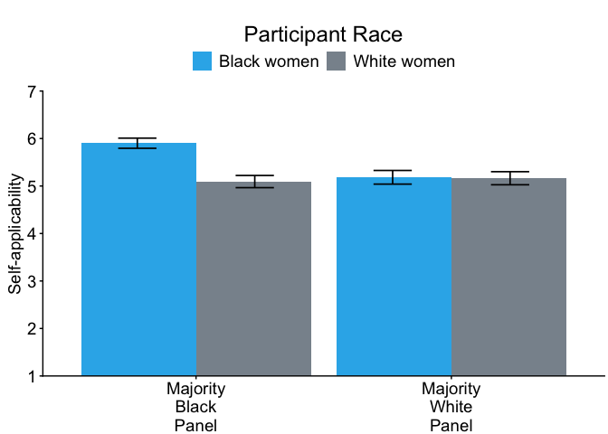<!-- -->

### Inclusion


``` r
pd = position_dodge(.92)

bi = data_bw %>%
  ggplot(aes(x = webad_race, y= in_mean, fill = prace_name)) +
  geom_bar(stat = "summary", 
           fun = mean,
           position = "dodge") +
  stat_summary(fun.data=mean_se,
               geom='errorbar',
               #fun.args=list(conf.int=.95),
               size=.6,
               aes(width=.3),
               color="black",
               position=pd) +
  coord_cartesian(ylim = c(1,7)) +
  scale_y_continuous(name = "Inclusion", expand = c(0,0), breaks=seq(1,7,1)) + # set ticks at 1, 2, 3, 4 +
  scale_x_discrete(name = "Diversity Initiative Ad",
                   limits = c("majority black",
                              "majority white"),
                   labels = c("majority black" = "Majority\nBlack\nPanel",
                              "majority white" = "Majority\nWhite\nPanel")) +
  scale_fill_discrete(labels = c("black_p" = "Black women", 
                               "white_p" = "White women")) +
  theme_classic() +
  theme(text = element_text(color = "black"),
        axis.text.x = element_text(size = 14, color = "black"),
        axis.title.x = element_blank(),
        axis.text.y = element_text(size = 14, color = "black"),
        axis.title.y = element_text(size = 14, color = "black"),
        #axis.title.y = element_blank(),
        legend.title = element_text(size = 18, hjust = .5),
        legend.text = element_text(size = 14),
        axis.title = element_text(size = 14),
        legend.position = "top",
        legend.title.position = "top",
        #legend.justification = "center",
        #legend.direction = "vertical",
        ) + # +
  #labs(fill = "Participant race") +
  scale_colour_discrete(guide="none",
                        labels = c("black_p" = "Black women", "white_p" = "White women")
                        ) +
  scale_fill_manual(name = "Participant Race", 
                  labels = c("black_p" = "Black women", "white_p" = "White women"),
                  values = c("#2FB3EA", "#89939C")) +
  theme(plot.margin = margin(.5,.1,0,.25, "cm"))  #(order goes top, right, bottom, left) 

bi
```

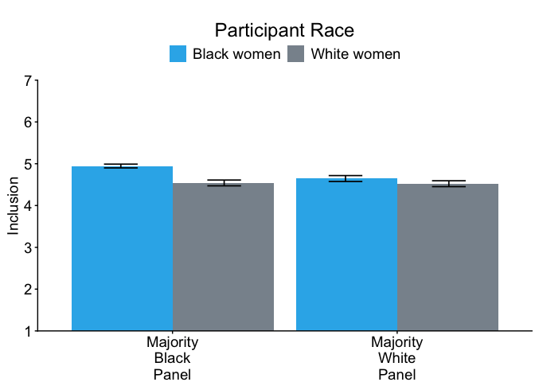<!-- -->

### Linked Fate


``` r
pd = position_dodge(.92)

blf = data_bw %>%
  ggplot(aes(x = webad_race, y= lfsb_mean, fill = prace_name)) +
  geom_bar(stat = "summary", 
           fun = mean,
           position = "dodge") +
  stat_summary(fun.data=mean_se,
               geom='errorbar',
               #fun.args=list(conf.int=.95),
               size=.6,
               aes(width=.3),
               color="black",
               position=pd) +
  coord_cartesian(ylim = c(1,7)) +
  scale_y_continuous(name = "Linked fate", expand = c(0,0), breaks=seq(1,7,1)) + # set ticks at 1, 2, 3, 4 +
  scale_x_discrete(name = "Diversity Initiative Ad",
                   limits = c("majority black",
                              "majority white"),
                   labels = c("majority black" = "Majority\nBlack\nPanel",
                              "majority white" = "Majority\nWhite\nPanel")) +
 # scale_fill_discrete(labels = c("black_p" = "Black women", 
  #                             "white_p" = "White women")) +
  theme_classic() +
  theme(text = element_text(color = "black"),
        axis.text.x = element_text(size = 14, color = "black"),
        axis.title.x = element_blank(),
        axis.text.y = element_text(size = 14, color = "black"),
        axis.title.y = element_text(size = 14, color = "black"),
        #axis.title.y = element_blank(),
        legend.title = element_text(size = 18, hjust = .5),
        legend.text = element_text(size = 14),
        axis.title = element_text(size = 14),
        legend.position = "top",
        legend.title.position = "top",
        #legend.justification = "center",
        #legend.direction = "vertical",
        ) + # +
  #labs(fill = "Participant race") +
  scale_colour_discrete(guide="none",
                        labels = c("black_p" = "Black women", "white_p" = "White women")
                        ) +
  scale_fill_manual(name = "Participant Race", 
                  labels = c("black_p" = "Black women", "white_p" = "White women"),
                  values = c("#2FB3EA", "#89939C")) +
  theme(plot.margin = margin(.5,.1,0,.25, "cm"))  #(order goes top, right, bottom, left) 

blf
```

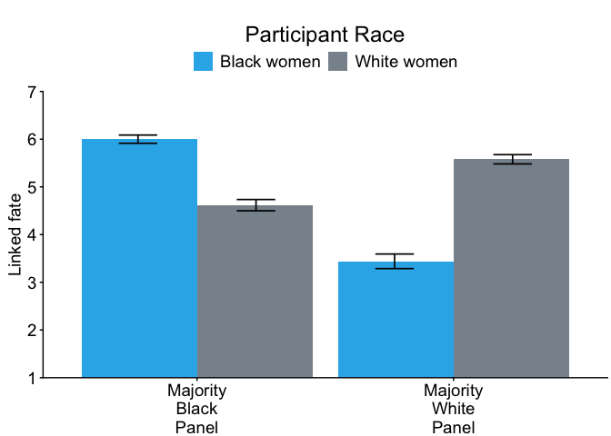<!-- -->

### Study 3a Combined Figure


``` r
ggarrange(blf,bsa,bi,
          nrow = 1,
          common.legend = TRUE)
```

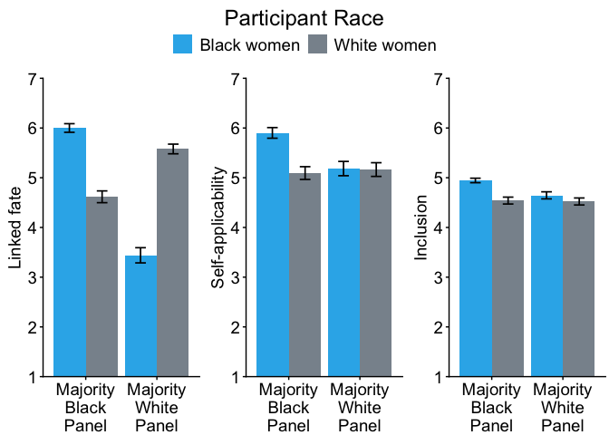<!-- -->

## Study 3b: Latina Women and White Women


``` r
data_lw <- read_csv("~/Dropbox/Research/current projects/diversity gatekeeping/studies + data/workshop study Oct:Nov 24/data + analyses/lw_ww/gen div workshop LW_WW Nov 24 CLEAN.csv")
```

### Self-Applicability


``` r
pd = position_dodge(.92)

lsa = data_lw %>%
  ggplot(aes(x = webad_race, y= sa_mean, fill = prace_name)) +
  geom_bar(stat = "summary", 
           fun = mean,
           position = "dodge") +
  scale_y_continuous(name = "Self-applicability", expand = c(0,0), breaks=seq(1,7,1)) + # set ticks at 1, 2, 3, 4 +
  stat_summary(fun.data=mean_se,
               geom='errorbar',
               #fun.args=list(conf.int=.95),
               size=.6,
               aes(width=.3),
               color="black",
               position=pd) +
  coord_cartesian(ylim = c(1,7)) +
  scale_x_discrete(name = "Diversity Initiative Ad",
               limits = c("majority latina",
                          "majority white"),
               labels = c("majority latina" = "Majority\nLatina\nPanel",
                          "majority white" = "Majority\nWhite\nPanel")) +
# scale_fill_discrete(labels = c("black_p" = "Black women", 
#                             "white_p" = "White women")) +
  theme_classic() +
  theme(text = element_text(color = "black"),
        axis.text.x = element_text(size = 14, color = "black"),
        axis.title.x = element_blank(),
        axis.text.y = element_text(size = 14, color = "black"),
        axis.title.y = element_text(size = 14, color = "black"),
        #axis.title.y = element_blank(),
        legend.title = element_text(size = 18, hjust = .5),
        legend.text = element_text(size = 14),
        axis.title = element_text(size = 14),
        legend.position = "top",
        legend.title.position = "top",
        #legend.justification = "center",
        #legend.direction = "vertical",
        ) + # +
  #labs(fill = "Participant race") +
  scale_colour_discrete(guide="none",
                        labels = c("latina_p" = "Latina women", "white_p" = "White women")
                        ) +
  scale_fill_manual(name = "Participant Race", 
                  labels = c("latina_p" = "Latina women", "white_p" = "White women"),
                  values = c("#0078AB", "#89939C")) +
  theme(plot.margin = margin(.5,.1,0,.25, "cm"))  #(order goes top, right, bottom, left) 

lsa
```

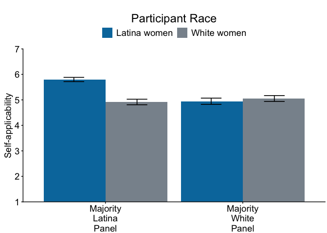<!-- -->

### Inclusion


``` r
pd = position_dodge(.92)

li = data_lw %>%
  ggplot(aes(x = webad_race, y= in_mean, fill = prace_name)) +
  geom_bar(stat = "summary", 
           fun = mean,
           position = "dodge") +
  stat_summary(fun.data=mean_se,
               geom='errorbar',
               #fun.args=list(conf.int=.95),
               size=.6,
               aes(width=.3),
               color="black",
               position=pd) +
  coord_cartesian(ylim = c(1,7)) +
  scale_y_continuous(name = "Inclusion", expand = c(0,0), breaks=seq(1,7,1)) + # set ticks at 1, 2, 3, 4 +
  scale_x_discrete(name = "Diversity Initiative Ad",
                 limits = c("majority latina",
                            "majority white"),
                 labels = c("majority latina" = "Majority\nLatina\nPanel",
                            "majority white" = "Majority\nWhite\nPanel")) +
# scale_fill_discrete(labels = c("black_p" = "Black women", 
#                             "white_p" = "White women")) +
  theme_classic() +
  theme(text = element_text(color = "black"),
        axis.text.x = element_text(size = 14, color = "black"),
        axis.title.x = element_blank(),
        axis.text.y = element_text(size = 14, color = "black"),
        axis.title.y = element_text(size = 14, color = "black"),
        #axis.title.y = element_blank(),
        legend.title = element_text(size = 18, hjust = .5),
        legend.text = element_text(size = 14),
        axis.title = element_text(size = 14),
        legend.position = "top",
        legend.title.position = "top",
        #legend.justification = "center",
        #legend.direction = "vertical",
        ) + # +
  #labs(fill = "Participant race") +
  scale_colour_discrete(guide="none",
                        labels = c("latina_p" = "Latina women", "white_p" = "White women")
                        ) +
  scale_fill_manual(name = "Participant Race", 
                  labels = c("latina_p" = "Latina women", "white_p" = "White women"),
                  values = c("#0078AB", "#89939C")) +
  theme(plot.margin = margin(.5,.1,0,.25, "cm"))  #(order goes top, right, bottom, left) 

li
```

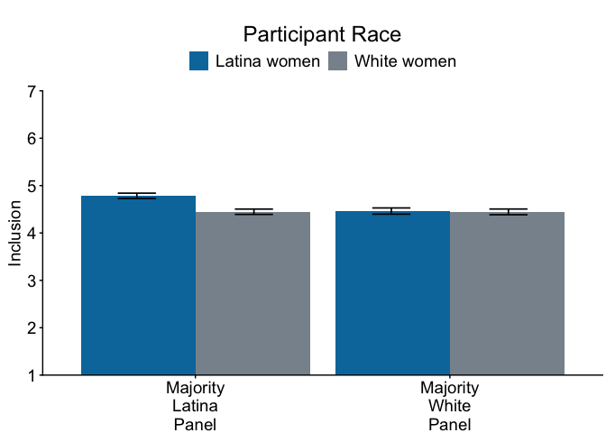<!-- -->

### Linked Fate


``` r
pd = position_dodge(.92)

llf =  data_lw %>%
  ggplot(aes(x = webad_race, y= lfsb_mean, fill = prace_name)) +
  geom_bar(stat = "summary", 
           fun = mean,
           position = "dodge") +
  stat_summary(fun.data=mean_se,
               geom='errorbar',
               #fun.args=list(conf.int=.95),
               size=.6,
               aes(width=.3),
               color="black",
               position=pd) +
  coord_cartesian(ylim = c(1,7)) +
  scale_y_continuous(name = "Linked fate", expand = c(0,0), breaks=seq(1,7,1)) + # set ticks at 1, 2, 3, 4 +
  scale_x_discrete(name = "Diversity Initiative Ad",
                 limits = c("majority latina",
                            "majority white"),
                 labels = c("majority latina" = "Majority\nLatina\nPanel",
                            "majority white" = "Majority\nWhite\nPanel")) +
 # scale_fill_discrete(labels = c("black_p" = "Black women", 
  #                             "white_p" = "White women")) +
  theme_classic() +
  theme(text = element_text(color = "black"),
        axis.text.x = element_text(size = 14, color = "black"),
        axis.title.x = element_blank(),
        axis.text.y = element_text(size = 14, color = "black"),
        axis.title.y = element_text(size = 14, color = "black"),
        #axis.title.y = element_blank(),
        legend.title = element_text(size = 18, hjust = .5),
        legend.text = element_text(size = 14),
        axis.title = element_text(size = 14),
        legend.position = "top",
        legend.title.position = "top",
        #legend.justification = "center",
        #legend.direction = "vertical",
        ) + # +
  #labs(fill = "Participant race") +
  scale_colour_discrete(guide="none",
                        labels = c("latina_p" = "Latina women", "white_p" = "White women")
                        ) +
  scale_fill_manual(name = "Participant Race", 
                  labels = c("latina_p" = "Latina women", "white_p" = "White women"),
                  values = c("#0078AB", "#89939C")) +
  theme(plot.margin = margin(.5,.1,0,.25, "cm"))  #(order goes top, right, bottom, left) 

llf
```

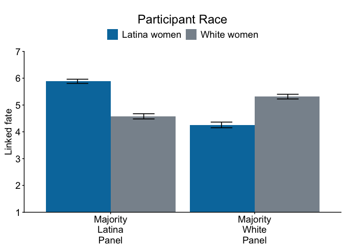<!-- -->

### Study 3b Combined Figure


``` r
ggarrange(llf,lsa,li,
          nrow = 1,
          common.legend = TRUE)
```

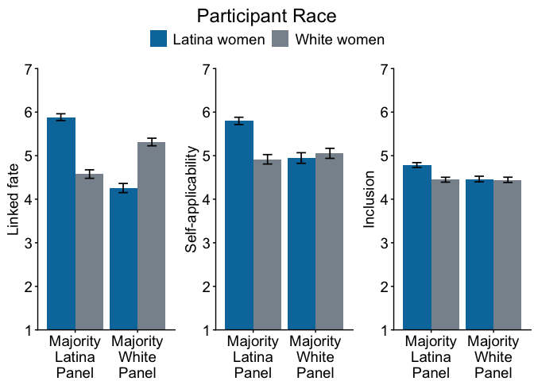<!-- -->


