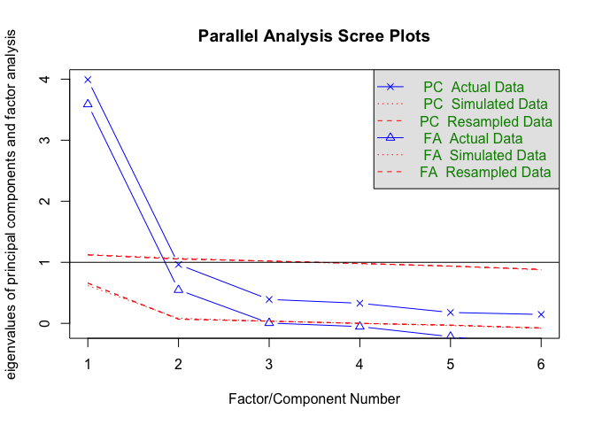
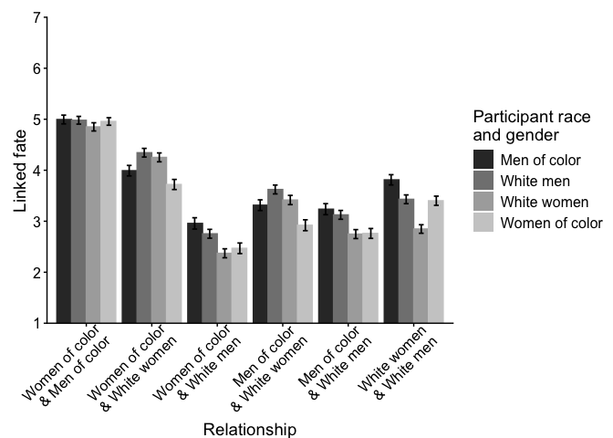

# Linked Fate Study 1: Technical Appendix

This appendix documents the Study 1 analysis for the linked fate project. Study 1 examines whether people perceive linked fate differently across race-gender relationships in the workplace, with a focal comparison between **women of color's perceptions of linked fate with White women** and **White women's perceptions of linked fate with women of color**.

## Data and Setup


<style>
.measure-card {
  border: 1px solid #e5eef7;
  border-radius: 1rem;
  padding: 1rem 1.25rem;
  margin: 1rem 0 1.5rem;
  background: #f7fbff;
}
.measure-list li {
  margin-bottom: 0.45rem;
}
</style>


``` r
library(boot)
library(broom.mixed)
library(car)
library(CGPfunctions)
library(corrplot)
library(data.table)
library(descriptr)
library(DescTools)
library(EFA.dimensions)
library(emmeans)
library(furniture)
library(ggplot2)
library(janitor)
library(jtools)
library(kableExtra)
library(knitr)
library(lattice)
library(lintr)
library(lme4)
library(nlme)
library(psych)
library(readxl)
library(rempsyc)
library(Rmisc)
library(rstatix)
library(see)
library(sjmisc)
library(sjPlot)
library(sjstats)
library(stats)
library(tidyverse)

data = read_csv("/Users/cem2272/Dropbox/Research/current projects/diversity gatekeeping/rmds + data for OSF/lf 2race x 2gender/lf 2race x 2gender_wide_clean.csv")
```


## Sample Characteristics

This section documents the final analytic sample after applying the study exclusions used in the analysis.

### Participant Gender

``` r
# Gender coding: 1 = man, 2 = woman, 3 = nonbinary, 4 = another response
# The analytic sample excludes participants outside the binary gender categories used in this design.
data = subset(data, pgender != "3")
data = subset(data, pgender != "4")

data = data %>% 
  mutate(gen_name =
           case_when(pgender == 1 ~ "men",  
                     pgender == 2 ~ "women"
                     ))

gender_table <- data %>%
  dplyr::count(gen_name, name = "N") %>%
  dplyr::mutate(
    `Participant gender` = clean_group_label(gen_name),
    Percentage = sprintf("%.2f", 100 * N / sum(N))
  ) %>%
  dplyr::select(`Participant gender`, N, Percentage)

gender_table %>%
  kableExtra::kable(
    format = "html",
    align = c("l", "c", "c"),
    caption = "Participant gender"
  ) %>%
  style_table()
```

<table class="table table-striped table-hover table-condensed" style="width: auto !important; margin-left: auto; margin-right: auto;">
<caption>Participant gender</caption>
 <thead>
  <tr>
   <th style="text-align:left;"> Participant gender </th>
   <th style="text-align:center;"> N </th>
   <th style="text-align:center;"> Percentage </th>
  </tr>
 </thead>
<tbody>
  <tr>
   <td style="text-align:left;"> Men </td>
   <td style="text-align:center;"> 404 </td>
   <td style="text-align:center;"> 50.75 </td>
  </tr>
  <tr>
   <td style="text-align:left;"> Women </td>
   <td style="text-align:center;"> 392 </td>
   <td style="text-align:center;"> 49.25 </td>
  </tr>
</tbody>
</table>


### Participant Race

``` r
# Race coding: 1 = Black, 2 = Hispanic/Latina, 3 = Asian, 4 = White, 5 = Multiracial/multiethnic, 6 = another race
race_table <- data %>%
  dplyr::filter(!is.na(prace)) %>%
  dplyr::mutate(
    `Participant race` = dplyr::recode(
      as.character(prace),
      "1" = "Black/African American",
      "2" = "Hispanic or Latina/o",
      "3" = "Asian/Asian American",
      "4" = "White",
      "5" = "Multiracial/Multiethnic",
      "6" = "Another race",
      .default = as.character(prace)
    )
  ) %>%
  dplyr::count(`Participant race`, name = "N") %>%
  dplyr::mutate(Percentage = sprintf("%.2f", 100 * N / sum(N)))

race_table %>%
  kableExtra::kable(
    format = "html",
    align = c("l", "c", "c"),
    caption = "Participant race"
  ) %>%
  style_table()
```

<table class="table table-striped table-hover table-condensed" style="width: auto !important; margin-left: auto; margin-right: auto;">
<caption>Participant race</caption>
 <thead>
  <tr>
   <th style="text-align:left;"> Participant race </th>
   <th style="text-align:center;"> N </th>
   <th style="text-align:center;"> Percentage </th>
  </tr>
 </thead>
<tbody>
  <tr>
   <td style="text-align:left;"> Asian/Asian American </td>
   <td style="text-align:center;"> 106 </td>
   <td style="text-align:center;"> 13.32 </td>
  </tr>
  <tr>
   <td style="text-align:left;"> Black/African American </td>
   <td style="text-align:center;"> 246 </td>
   <td style="text-align:center;"> 30.90 </td>
  </tr>
  <tr>
   <td style="text-align:left;"> Hispanic or Latina/o </td>
   <td style="text-align:center;"> 27 </td>
   <td style="text-align:center;"> 3.39 </td>
  </tr>
  <tr>
   <td style="text-align:left;"> Multiracial/Multiethnic </td>
   <td style="text-align:center;"> 12 </td>
   <td style="text-align:center;"> 1.51 </td>
  </tr>
  <tr>
   <td style="text-align:left;"> White </td>
   <td style="text-align:center;"> 405 </td>
   <td style="text-align:center;"> 50.88 </td>
  </tr>
</tbody>
</table>

``` r
# Recoding race for study analyses: 1 = White; 2 = people of color.
data$race_simple = dplyr::recode(data$prace, 
                              " " = 99,
                              "1" = 2, # Black
                              "2" = 2, # Latina/o
                              "3" = 2, # Asian
                              "4" = 1, # White
                              "5" = 2 # Multiracial/multiethnic
                              ) 

data$race_simple = as.factor(data$race_simple)

data = data %>% 
  mutate(race_name =
           case_when(race_simple == 1 ~ "white",  
                     race_simple == 2 ~ "poc"
                     ))

analytic_group_table <- data %>%
  dplyr::count(group2, name = "N") %>%
  dplyr::filter(!is.na(group2)) %>%
  dplyr::mutate(
    `Analytic group` = clean_group_label(group2),
    Percentage = sprintf("%.2f", 100 * N / sum(N))
  ) %>%
  dplyr::select(`Analytic group`, N, Percentage)

analytic_group_table %>%
  kableExtra::kable(
    format = "html",
    align = c("l", "c", "c"),
    caption = "Analytic race-gender groups"
  ) %>%
  style_table()
```

<table class="table table-striped table-hover table-condensed" style="width: auto !important; margin-left: auto; margin-right: auto;">
<caption>Analytic race-gender groups</caption>
 <thead>
  <tr>
   <th style="text-align:left;"> Analytic group </th>
   <th style="text-align:center;"> N </th>
   <th style="text-align:center;"> Percentage </th>
  </tr>
 </thead>
<tbody>
  <tr>
   <td style="text-align:left;"> Men of color </td>
   <td style="text-align:center;"> 196 </td>
   <td style="text-align:center;"> 24.62 </td>
  </tr>
  <tr>
   <td style="text-align:left;"> White men </td>
   <td style="text-align:center;"> 208 </td>
   <td style="text-align:center;"> 26.13 </td>
  </tr>
  <tr>
   <td style="text-align:left;"> White women </td>
   <td style="text-align:center;"> 197 </td>
   <td style="text-align:center;"> 24.75 </td>
  </tr>
  <tr>
   <td style="text-align:left;"> Women of color </td>
   <td style="text-align:center;"> 195 </td>
   <td style="text-align:center;"> 24.50 </td>
  </tr>
</tbody>
</table>


### Participant Age

``` r
data$age = as.numeric(data$age)

age_table <- tibble::tibble(
  N = sum(!is.na(data$age)),
  M = mean(data$age, na.rm = TRUE),
  SD = sd(data$age, na.rm = TRUE),
  Min = min(data$age, na.rm = TRUE),
  Max = max(data$age, na.rm = TRUE)
) %>%
  dplyr::mutate(
    M = sprintf("%.2f", M),
    SD = sprintf("%.2f", SD),
    Min = sprintf("%.0f", Min),
    Max = sprintf("%.0f", Max)
  )

age_table %>%
  kableExtra::kable(
    format = "html",
    align = c("c", "c", "c", "c", "c"),
    caption = "Participant age"
  ) %>%
  style_table()
```

<table class="table table-striped table-hover table-condensed" style="width: auto !important; margin-left: auto; margin-right: auto;">
<caption>Participant age</caption>
 <thead>
  <tr>
   <th style="text-align:center;"> N </th>
   <th style="text-align:center;"> M </th>
   <th style="text-align:center;"> SD </th>
   <th style="text-align:center;"> Min </th>
   <th style="text-align:center;"> Max </th>
  </tr>
 </thead>
<tbody>
  <tr>
   <td style="text-align:center;"> 796 </td>
   <td style="text-align:center;"> 37.80 </td>
   <td style="text-align:center;"> 12.92 </td>
   <td style="text-align:center;"> 5 </td>
   <td style="text-align:center;"> 95 </td>
  </tr>
</tbody>
</table>


## Reshape Data to Long Format 

``` r
#all LF items 
data_l_lfsb = data %>%
  pivot_longer(cols = c("lfsb_woc_moc_1","lfsb_woc_moc_2","lfsb_woc_moc_3","lfsb_woc_moc_4","lfsb_woc_moc_5", "lfsb_woc_moc_6",
                        "lfsb_woc_ww_1","lfsb_woc_ww_2","lfsb_woc_ww_3","lfsb_woc_ww_4","lfsb_woc_ww_5","lfsb_woc_ww_6",
                        "lfsb_woc_wm_1","lfsb_woc_wm_2","lfsb_woc_wm_3", "lfsb_woc_wm_4", "lfsb_woc_wm_5", "lfsb_woc_wm_6",
                        "lfsb_moc_wm_1","lfsb_woc_ww_2","lfsb_moc_ww_3","lfsb_moc_ww_4","lfsb_moc_ww_5","lfsb_moc_ww_6",
                        "lfsb_moc_wm_1","lfsb_moc_wm_2","lfsb_moc_wm_3","lfsb_moc_wm_4","lfsb_moc_wm_5","lfsb_moc_wm_6",
                        "lfsb_ww_wm_1","lfsb_ww_wm_2","lfsb_ww_wm_3","lfsb_ww_wm_4","lfsb_ww_wm_5","lfsb_ww_wm_6"), 
               names_to = "scale_name", 
               values_to = "scale_val")
```

## Exploratory Factor Analysis

The exploratory factor analysis evaluates whether the linked fate items appear to capture a common underlying construct. This is useful because the later analyses rely on linked fate composite scores rather than interpreting each item separately. The exploratory factor analysis focuses on the focal women of color / White women linked fate items to inspect the structure of the scale. We find that a two factor solution best fits the data, but theoretically, one factor makes more sense and our measures of fit are tolerable, so we continue with the scale as a single factor. 

### EFA for Women of Color / White Women Linked Fate Items
EFA Function for easier output reading 
credit = https://www.franciscowilhelm.com/blog/exploratory-factor-analysis-table/


#### Check Factor-Analysis Assumptions

``` r
#woc_ww items
scales_woc_ww = subset(data, select = c(lfsb_woc_ww_1, lfsb_woc_ww_2, lfsb_woc_ww_3, lfsb_woc_ww_4, lfsb_woc_ww_5, lfsb_woc_ww_6))

#correlation of all the items
corr_woc_ww = corr.test(scales_woc_ww, method = "pearson")

#checking the data to make sure FA is appropriate
woc_ww_kmo = KMO(corr_woc_ww$r)
woc_ww_bartlett = cortest.bartlett(corr_woc_ww$r, n = nrow(data))
woc_ww_det = det(corr_woc_ww$r)

fa_assumptions_table <- tibble::tibble(
  Check = c("Kaiser-Meyer-Olkin MSA", "Bartlett's test of sphericity", "Correlation matrix determinant"),
  Value = c(woc_ww_kmo$MSA, woc_ww_bartlett$chisq, woc_ww_det),
  p = c(NA_real_, woc_ww_bartlett$p.value, NA_real_),
  Interpretation = c(
    "Higher values indicate that the item correlations are suitable for factor analysis.",
    "A significant result indicates that the correlation matrix is not an identity matrix.",
    "Very small values can indicate multicollinearity; this value is reported as a diagnostic."
  )
) %>%
  dplyr::mutate(
    Value = dplyr::case_when(
      Check == "Correlation matrix determinant" ~ format(Value, scientific = TRUE, digits = 3),
      TRUE ~ sprintf("%.2f", Value)
    ),
    p = format_p(p)
  )

fa_assumptions_table %>%
  kableExtra::kable(
    format = "html",
    align = c("l", "c", "c", "l"),
    caption = "Factor-analysis suitability checks for the women of color / White women linked fate items"
  ) %>%
  style_table()
```

<table class="table table-striped table-hover table-condensed" style="width: auto !important; margin-left: auto; margin-right: auto;">
<caption>Factor-analysis suitability checks for the women of color / White women linked fate items</caption>
 <thead>
  <tr>
   <th style="text-align:left;"> Check </th>
   <th style="text-align:center;"> Value </th>
   <th style="text-align:center;"> p </th>
   <th style="text-align:left;"> Interpretation </th>
  </tr>
 </thead>
<tbody>
  <tr>
   <td style="text-align:left;"> Kaiser-Meyer-Olkin MSA </td>
   <td style="text-align:center;"> 0.83 </td>
   <td style="text-align:center;">  </td>
   <td style="text-align:left;"> Higher values indicate that the item correlations are suitable for factor analysis. </td>
  </tr>
  <tr>
   <td style="text-align:left;"> Bartlett's test of sphericity </td>
   <td style="text-align:center;"> 3449.33 </td>
   <td style="text-align:center;"> &lt; .001 </td>
   <td style="text-align:left;"> A significant result indicates that the correlation matrix is not an identity matrix. </td>
  </tr>
  <tr>
   <td style="text-align:left;"> Correlation matrix determinant </td>
   <td style="text-align:center;"> 1.29e-02 </td>
   <td style="text-align:center;">  </td>
   <td style="text-align:left;"> Very small values can indicate multicollinearity; this value is reported as a diagnostic. </td>
  </tr>
</tbody>
</table>


#### Eigenvalues and Scree Plot

``` r
ev <- eigen(corr_woc_ww$r) # get eigenvalues

eigen_table <- tibble::tibble(
  Factor = paste0("Factor ", seq_along(ev$values)),
  Eigenvalue = ev$values
) %>%
  dplyr::mutate(Eigenvalue = sprintf("%.2f", Eigenvalue))

eigen_table %>%
  kableExtra::kable(
    format = "html",
    align = c("l", "c"),
    caption = "Eigenvalues for women of color / White women linked fate items"
  ) %>%
  style_table()
```

<table class="table table-striped table-hover table-condensed" style="width: auto !important; margin-left: auto; margin-right: auto;">
<caption>Eigenvalues for women of color / White women linked fate items</caption>
 <thead>
  <tr>
   <th style="text-align:left;"> Factor </th>
   <th style="text-align:center;"> Eigenvalue </th>
  </tr>
 </thead>
<tbody>
  <tr>
   <td style="text-align:left;"> Factor 1 </td>
   <td style="text-align:center;"> 3.99 </td>
  </tr>
  <tr>
   <td style="text-align:left;"> Factor 2 </td>
   <td style="text-align:center;"> 0.96 </td>
  </tr>
  <tr>
   <td style="text-align:left;"> Factor 3 </td>
   <td style="text-align:center;"> 0.39 </td>
  </tr>
  <tr>
   <td style="text-align:left;"> Factor 4 </td>
   <td style="text-align:center;"> 0.33 </td>
  </tr>
  <tr>
   <td style="text-align:left;"> Factor 5 </td>
   <td style="text-align:center;"> 0.18 </td>
  </tr>
  <tr>
   <td style="text-align:left;"> Factor 6 </td>
   <td style="text-align:center;"> 0.15 </td>
  </tr>
</tbody>
</table>

``` r
# Parallel analysis / scree plot
parallel <- fa.parallel(scales_woc_ww, fm = "ml", cor = "cor")
```

<!-- -->Parallel analysis suggests that the number of factors =  2  and the number of components =  1 


#### Factor Solutions

##### Two-Factor Solution

``` r
fa_2 = fa(scales_woc_ww,nfactors=2, n.iter=100, rotate="promax", residuals=FALSE, covar=FALSE,symmetric=TRUE, warnings=TRUE, fm="ml", use="pairwise",cor="cor", correct=0,weight=NULL,smooth=FALSE)

tables_2 <- fa_table(fa_2, title = "Two-factor solution: item loadings")
tables_2$ind_table
```

```{=html}
<div id="vxhivffkzj" style="padding-left:0px;padding-right:0px;padding-top:10px;padding-bottom:10px;overflow-x:auto;overflow-y:auto;width:auto;height:auto;">
<style>#vxhivffkzj table {
  font-family: system-ui, 'Segoe UI', Roboto, Helvetica, Arial, sans-serif, 'Apple Color Emoji', 'Segoe UI Emoji', 'Segoe UI Symbol', 'Noto Color Emoji';
  -webkit-font-smoothing: antialiased;
  -moz-osx-font-smoothing: grayscale;
}

#vxhivffkzj thead, #vxhivffkzj tbody, #vxhivffkzj tfoot, #vxhivffkzj tr, #vxhivffkzj td, #vxhivffkzj th {
  border-style: none;
}

#vxhivffkzj p {
  margin: 0;
  padding: 0;
}

#vxhivffkzj .gt_table {
  display: table;
  border-collapse: collapse;
  line-height: normal;
  margin-left: auto;
  margin-right: auto;
  color: #333333;
  font-size: 16px;
  font-weight: normal;
  font-style: normal;
  background-color: #FFFFFF;
  width: auto;
  border-top-style: solid;
  border-top-width: 2px;
  border-top-color: #A8A8A8;
  border-right-style: none;
  border-right-width: 2px;
  border-right-color: #D3D3D3;
  border-bottom-style: solid;
  border-bottom-width: 2px;
  border-bottom-color: #A8A8A8;
  border-left-style: none;
  border-left-width: 2px;
  border-left-color: #D3D3D3;
}

#vxhivffkzj .gt_caption {
  padding-top: 4px;
  padding-bottom: 4px;
}

#vxhivffkzj .gt_title {
  color: #333333;
  font-size: 125%;
  font-weight: initial;
  padding-top: 4px;
  padding-bottom: 4px;
  padding-left: 5px;
  padding-right: 5px;
  border-bottom-color: #FFFFFF;
  border-bottom-width: 0;
}

#vxhivffkzj .gt_subtitle {
  color: #333333;
  font-size: 85%;
  font-weight: initial;
  padding-top: 3px;
  padding-bottom: 5px;
  padding-left: 5px;
  padding-right: 5px;
  border-top-color: #FFFFFF;
  border-top-width: 0;
}

#vxhivffkzj .gt_heading {
  background-color: #FFFFFF;
  text-align: center;
  border-bottom-color: #FFFFFF;
  border-left-style: none;
  border-left-width: 1px;
  border-left-color: #D3D3D3;
  border-right-style: none;
  border-right-width: 1px;
  border-right-color: #D3D3D3;
}

#vxhivffkzj .gt_bottom_border {
  border-bottom-style: solid;
  border-bottom-width: 2px;
  border-bottom-color: #D3D3D3;
}

#vxhivffkzj .gt_col_headings {
  border-top-style: solid;
  border-top-width: 2px;
  border-top-color: #D3D3D3;
  border-bottom-style: solid;
  border-bottom-width: 2px;
  border-bottom-color: #D3D3D3;
  border-left-style: none;
  border-left-width: 1px;
  border-left-color: #D3D3D3;
  border-right-style: none;
  border-right-width: 1px;
  border-right-color: #D3D3D3;
}

#vxhivffkzj .gt_col_heading {
  color: #333333;
  background-color: #FFFFFF;
  font-size: 100%;
  font-weight: normal;
  text-transform: inherit;
  border-left-style: none;
  border-left-width: 1px;
  border-left-color: #D3D3D3;
  border-right-style: none;
  border-right-width: 1px;
  border-right-color: #D3D3D3;
  vertical-align: bottom;
  padding-top: 5px;
  padding-bottom: 6px;
  padding-left: 5px;
  padding-right: 5px;
  overflow-x: hidden;
}

#vxhivffkzj .gt_column_spanner_outer {
  color: #333333;
  background-color: #FFFFFF;
  font-size: 100%;
  font-weight: normal;
  text-transform: inherit;
  padding-top: 0;
  padding-bottom: 0;
  padding-left: 4px;
  padding-right: 4px;
}

#vxhivffkzj .gt_column_spanner_outer:first-child {
  padding-left: 0;
}

#vxhivffkzj .gt_column_spanner_outer:last-child {
  padding-right: 0;
}

#vxhivffkzj .gt_column_spanner {
  border-bottom-style: solid;
  border-bottom-width: 2px;
  border-bottom-color: #D3D3D3;
  vertical-align: bottom;
  padding-top: 5px;
  padding-bottom: 5px;
  overflow-x: hidden;
  display: inline-block;
  width: 100%;
}

#vxhivffkzj .gt_spanner_row {
  border-bottom-style: hidden;
}

#vxhivffkzj .gt_group_heading {
  padding-top: 8px;
  padding-bottom: 8px;
  padding-left: 5px;
  padding-right: 5px;
  color: #333333;
  background-color: #FFFFFF;
  font-size: 100%;
  font-weight: initial;
  text-transform: inherit;
  border-top-style: solid;
  border-top-width: 2px;
  border-top-color: #D3D3D3;
  border-bottom-style: solid;
  border-bottom-width: 2px;
  border-bottom-color: #D3D3D3;
  border-left-style: none;
  border-left-width: 1px;
  border-left-color: #D3D3D3;
  border-right-style: none;
  border-right-width: 1px;
  border-right-color: #D3D3D3;
  vertical-align: middle;
  text-align: left;
}

#vxhivffkzj .gt_empty_group_heading {
  padding: 0.5px;
  color: #333333;
  background-color: #FFFFFF;
  font-size: 100%;
  font-weight: initial;
  border-top-style: solid;
  border-top-width: 2px;
  border-top-color: #D3D3D3;
  border-bottom-style: solid;
  border-bottom-width: 2px;
  border-bottom-color: #D3D3D3;
  vertical-align: middle;
}

#vxhivffkzj .gt_from_md > :first-child {
  margin-top: 0;
}

#vxhivffkzj .gt_from_md > :last-child {
  margin-bottom: 0;
}

#vxhivffkzj .gt_row {
  padding-top: 8px;
  padding-bottom: 8px;
  padding-left: 5px;
  padding-right: 5px;
  margin: 10px;
  border-top-style: solid;
  border-top-width: 1px;
  border-top-color: #D3D3D3;
  border-left-style: none;
  border-left-width: 1px;
  border-left-color: #D3D3D3;
  border-right-style: none;
  border-right-width: 1px;
  border-right-color: #D3D3D3;
  vertical-align: middle;
  overflow-x: hidden;
}

#vxhivffkzj .gt_stub {
  color: #333333;
  background-color: #FFFFFF;
  font-size: 100%;
  font-weight: initial;
  text-transform: inherit;
  border-right-style: solid;
  border-right-width: 2px;
  border-right-color: #D3D3D3;
  padding-left: 5px;
  padding-right: 5px;
}

#vxhivffkzj .gt_stub_row_group {
  color: #333333;
  background-color: #FFFFFF;
  font-size: 100%;
  font-weight: initial;
  text-transform: inherit;
  border-right-style: solid;
  border-right-width: 2px;
  border-right-color: #D3D3D3;
  padding-left: 5px;
  padding-right: 5px;
  vertical-align: top;
}

#vxhivffkzj .gt_row_group_first td {
  border-top-width: 2px;
}

#vxhivffkzj .gt_row_group_first th {
  border-top-width: 2px;
}

#vxhivffkzj .gt_summary_row {
  color: #333333;
  background-color: #FFFFFF;
  text-transform: inherit;
  padding-top: 8px;
  padding-bottom: 8px;
  padding-left: 5px;
  padding-right: 5px;
}

#vxhivffkzj .gt_first_summary_row {
  border-top-style: solid;
  border-top-color: #D3D3D3;
}

#vxhivffkzj .gt_first_summary_row.thick {
  border-top-width: 2px;
}

#vxhivffkzj .gt_last_summary_row {
  padding-top: 8px;
  padding-bottom: 8px;
  padding-left: 5px;
  padding-right: 5px;
  border-bottom-style: solid;
  border-bottom-width: 2px;
  border-bottom-color: #D3D3D3;
}

#vxhivffkzj .gt_grand_summary_row {
  color: #333333;
  background-color: #FFFFFF;
  text-transform: inherit;
  padding-top: 8px;
  padding-bottom: 8px;
  padding-left: 5px;
  padding-right: 5px;
}

#vxhivffkzj .gt_first_grand_summary_row {
  padding-top: 8px;
  padding-bottom: 8px;
  padding-left: 5px;
  padding-right: 5px;
  border-top-style: double;
  border-top-width: 6px;
  border-top-color: #D3D3D3;
}

#vxhivffkzj .gt_last_grand_summary_row_top {
  padding-top: 8px;
  padding-bottom: 8px;
  padding-left: 5px;
  padding-right: 5px;
  border-bottom-style: double;
  border-bottom-width: 6px;
  border-bottom-color: #D3D3D3;
}

#vxhivffkzj .gt_striped {
  background-color: rgba(128, 128, 128, 0.05);
}

#vxhivffkzj .gt_table_body {
  border-top-style: solid;
  border-top-width: 2px;
  border-top-color: #D3D3D3;
  border-bottom-style: solid;
  border-bottom-width: 2px;
  border-bottom-color: #D3D3D3;
}

#vxhivffkzj .gt_footnotes {
  color: #333333;
  background-color: #FFFFFF;
  border-bottom-style: none;
  border-bottom-width: 2px;
  border-bottom-color: #D3D3D3;
  border-left-style: none;
  border-left-width: 2px;
  border-left-color: #D3D3D3;
  border-right-style: none;
  border-right-width: 2px;
  border-right-color: #D3D3D3;
}

#vxhivffkzj .gt_footnote {
  margin: 0px;
  font-size: 90%;
  padding-top: 4px;
  padding-bottom: 4px;
  padding-left: 5px;
  padding-right: 5px;
}

#vxhivffkzj .gt_sourcenotes {
  color: #333333;
  background-color: #FFFFFF;
  border-bottom-style: none;
  border-bottom-width: 2px;
  border-bottom-color: #D3D3D3;
  border-left-style: none;
  border-left-width: 2px;
  border-left-color: #D3D3D3;
  border-right-style: none;
  border-right-width: 2px;
  border-right-color: #D3D3D3;
}

#vxhivffkzj .gt_sourcenote {
  font-size: 90%;
  padding-top: 4px;
  padding-bottom: 4px;
  padding-left: 5px;
  padding-right: 5px;
}

#vxhivffkzj .gt_left {
  text-align: left;
}

#vxhivffkzj .gt_center {
  text-align: center;
}

#vxhivffkzj .gt_right {
  text-align: right;
  font-variant-numeric: tabular-nums;
}

#vxhivffkzj .gt_font_normal {
  font-weight: normal;
}

#vxhivffkzj .gt_font_bold {
  font-weight: bold;
}

#vxhivffkzj .gt_font_italic {
  font-style: italic;
}

#vxhivffkzj .gt_super {
  font-size: 65%;
}

#vxhivffkzj .gt_footnote_marks {
  font-size: 75%;
  vertical-align: 0.4em;
  position: initial;
}

#vxhivffkzj .gt_asterisk {
  font-size: 100%;
  vertical-align: 0;
}

#vxhivffkzj .gt_indent_1 {
  text-indent: 5px;
}

#vxhivffkzj .gt_indent_2 {
  text-indent: 10px;
}

#vxhivffkzj .gt_indent_3 {
  text-indent: 15px;
}

#vxhivffkzj .gt_indent_4 {
  text-indent: 20px;
}

#vxhivffkzj .gt_indent_5 {
  text-indent: 25px;
}

#vxhivffkzj .katex-display {
  display: inline-flex !important;
  margin-bottom: 0.75em !important;
}

#vxhivffkzj div.Reactable > div.rt-table > div.rt-thead > div.rt-tr.rt-tr-group-header > div.rt-th-group:after {
  height: 0px !important;
}
</style>
<table class="gt_table" data-quarto-disable-processing="false" data-quarto-bootstrap="false">
  <thead>
    <tr class="gt_heading">
      <td colspan="6" class="gt_heading gt_title gt_font_normal gt_bottom_border" style>Two-factor solution: item loadings</td>
    </tr>
    
    <tr class="gt_col_headings">
      <th class="gt_col_heading gt_columns_bottom_border gt_left" rowspan="1" colspan="1" scope="col" id="a::stub"></th>
      <th class="gt_col_heading gt_columns_bottom_border gt_right" rowspan="1" colspan="1" scope="col" id="Factor_1">Factor_1</th>
      <th class="gt_col_heading gt_columns_bottom_border gt_right" rowspan="1" colspan="1" scope="col" id="Factor_2">Factor_2</th>
      <th class="gt_col_heading gt_columns_bottom_border gt_right" rowspan="1" colspan="1" scope="col" id="Communality">Communality</th>
      <th class="gt_col_heading gt_columns_bottom_border gt_right" rowspan="1" colspan="1" scope="col" id="Uniqueness">Uniqueness</th>
      <th class="gt_col_heading gt_columns_bottom_border gt_right" rowspan="1" colspan="1" scope="col" id="Complexity">Complexity</th>
    </tr>
  </thead>
  <tbody class="gt_table_body">
    <tr><th id="stub_1_1" scope="row" class="gt_row gt_left gt_stub">lfsb_woc_ww_4</th>
<td headers="stub_1_1 Factor_1" class="gt_row gt_right">0.973</td>
<td headers="stub_1_1 Factor_2" class="gt_row gt_right" style="color: #D3D3D3; font-style: italic;">-0.057</td>
<td headers="stub_1_1 Communality" class="gt_row gt_right">0.88</td>
<td headers="stub_1_1 Uniqueness" class="gt_row gt_right">0.12</td>
<td headers="stub_1_1 Complexity" class="gt_row gt_right">1.01</td></tr>
    <tr><th id="stub_1_2" scope="row" class="gt_row gt_left gt_stub">lfsb_woc_ww_5</th>
<td headers="stub_1_2 Factor_1" class="gt_row gt_right">0.910</td>
<td headers="stub_1_2 Factor_2" class="gt_row gt_right" style="color: #D3D3D3; font-style: italic;">-0.002</td>
<td headers="stub_1_2 Communality" class="gt_row gt_right">0.83</td>
<td headers="stub_1_2 Uniqueness" class="gt_row gt_right">0.17</td>
<td headers="stub_1_2 Complexity" class="gt_row gt_right">1.00</td></tr>
    <tr><th id="stub_1_3" scope="row" class="gt_row gt_left gt_stub">lfsb_woc_ww_6</th>
<td headers="stub_1_3 Factor_1" class="gt_row gt_right">0.698</td>
<td headers="stub_1_3 Factor_2" class="gt_row gt_right" style="color: #D3D3D3; font-style: italic;">0.107</td>
<td headers="stub_1_3 Communality" class="gt_row gt_right">0.60</td>
<td headers="stub_1_3 Uniqueness" class="gt_row gt_right">0.40</td>
<td headers="stub_1_3 Complexity" class="gt_row gt_right">1.05</td></tr>
    <tr><th id="stub_1_4" scope="row" class="gt_row gt_left gt_stub">lfsb_woc_ww_3</th>
<td headers="stub_1_4 Factor_1" class="gt_row gt_right" style="color: #D3D3D3; font-style: italic;">-0.051</td>
<td headers="stub_1_4 Factor_2" class="gt_row gt_right">0.958</td>
<td headers="stub_1_4 Communality" class="gt_row gt_right">0.86</td>
<td headers="stub_1_4 Uniqueness" class="gt_row gt_right">0.14</td>
<td headers="stub_1_4 Complexity" class="gt_row gt_right">1.01</td></tr>
    <tr><th id="stub_1_5" scope="row" class="gt_row gt_left gt_stub">lfsb_woc_ww_1</th>
<td headers="stub_1_5 Factor_1" class="gt_row gt_right" style="color: #D3D3D3; font-style: italic;">-0.009</td>
<td headers="stub_1_5 Factor_2" class="gt_row gt_right">0.890</td>
<td headers="stub_1_5 Communality" class="gt_row gt_right">0.78</td>
<td headers="stub_1_5 Uniqueness" class="gt_row gt_right">0.22</td>
<td headers="stub_1_5 Complexity" class="gt_row gt_right">1.00</td></tr>
    <tr><th id="stub_1_6" scope="row" class="gt_row gt_left gt_stub">lfsb_woc_ww_2</th>
<td headers="stub_1_6 Factor_1" class="gt_row gt_right" style="color: #D3D3D3; font-style: italic;">0.123</td>
<td headers="stub_1_6 Factor_2" class="gt_row gt_right">0.664</td>
<td headers="stub_1_6 Communality" class="gt_row gt_right">0.56</td>
<td headers="stub_1_6 Uniqueness" class="gt_row gt_right">0.44</td>
<td headers="stub_1_6 Complexity" class="gt_row gt_right">1.07</td></tr>
  </tbody>
  
</table>
</div>
```

``` r
tables_2$f_table
```

```{=html}
<div id="nyoysiupjf" style="padding-left:0px;padding-right:0px;padding-top:10px;padding-bottom:10px;overflow-x:auto;overflow-y:auto;width:auto;height:auto;">
<style>#nyoysiupjf table {
  font-family: system-ui, 'Segoe UI', Roboto, Helvetica, Arial, sans-serif, 'Apple Color Emoji', 'Segoe UI Emoji', 'Segoe UI Symbol', 'Noto Color Emoji';
  -webkit-font-smoothing: antialiased;
  -moz-osx-font-smoothing: grayscale;
}

#nyoysiupjf thead, #nyoysiupjf tbody, #nyoysiupjf tfoot, #nyoysiupjf tr, #nyoysiupjf td, #nyoysiupjf th {
  border-style: none;
}

#nyoysiupjf p {
  margin: 0;
  padding: 0;
}

#nyoysiupjf .gt_table {
  display: table;
  border-collapse: collapse;
  line-height: normal;
  margin-left: auto;
  margin-right: auto;
  color: #333333;
  font-size: 16px;
  font-weight: normal;
  font-style: normal;
  background-color: #FFFFFF;
  width: auto;
  border-top-style: solid;
  border-top-width: 2px;
  border-top-color: #A8A8A8;
  border-right-style: none;
  border-right-width: 2px;
  border-right-color: #D3D3D3;
  border-bottom-style: solid;
  border-bottom-width: 2px;
  border-bottom-color: #A8A8A8;
  border-left-style: none;
  border-left-width: 2px;
  border-left-color: #D3D3D3;
}

#nyoysiupjf .gt_caption {
  padding-top: 4px;
  padding-bottom: 4px;
}

#nyoysiupjf .gt_title {
  color: #333333;
  font-size: 125%;
  font-weight: initial;
  padding-top: 4px;
  padding-bottom: 4px;
  padding-left: 5px;
  padding-right: 5px;
  border-bottom-color: #FFFFFF;
  border-bottom-width: 0;
}

#nyoysiupjf .gt_subtitle {
  color: #333333;
  font-size: 85%;
  font-weight: initial;
  padding-top: 3px;
  padding-bottom: 5px;
  padding-left: 5px;
  padding-right: 5px;
  border-top-color: #FFFFFF;
  border-top-width: 0;
}

#nyoysiupjf .gt_heading {
  background-color: #FFFFFF;
  text-align: center;
  border-bottom-color: #FFFFFF;
  border-left-style: none;
  border-left-width: 1px;
  border-left-color: #D3D3D3;
  border-right-style: none;
  border-right-width: 1px;
  border-right-color: #D3D3D3;
}

#nyoysiupjf .gt_bottom_border {
  border-bottom-style: solid;
  border-bottom-width: 2px;
  border-bottom-color: #D3D3D3;
}

#nyoysiupjf .gt_col_headings {
  border-top-style: solid;
  border-top-width: 2px;
  border-top-color: #D3D3D3;
  border-bottom-style: solid;
  border-bottom-width: 2px;
  border-bottom-color: #D3D3D3;
  border-left-style: none;
  border-left-width: 1px;
  border-left-color: #D3D3D3;
  border-right-style: none;
  border-right-width: 1px;
  border-right-color: #D3D3D3;
}

#nyoysiupjf .gt_col_heading {
  color: #333333;
  background-color: #FFFFFF;
  font-size: 100%;
  font-weight: normal;
  text-transform: inherit;
  border-left-style: none;
  border-left-width: 1px;
  border-left-color: #D3D3D3;
  border-right-style: none;
  border-right-width: 1px;
  border-right-color: #D3D3D3;
  vertical-align: bottom;
  padding-top: 5px;
  padding-bottom: 6px;
  padding-left: 5px;
  padding-right: 5px;
  overflow-x: hidden;
}

#nyoysiupjf .gt_column_spanner_outer {
  color: #333333;
  background-color: #FFFFFF;
  font-size: 100%;
  font-weight: normal;
  text-transform: inherit;
  padding-top: 0;
  padding-bottom: 0;
  padding-left: 4px;
  padding-right: 4px;
}

#nyoysiupjf .gt_column_spanner_outer:first-child {
  padding-left: 0;
}

#nyoysiupjf .gt_column_spanner_outer:last-child {
  padding-right: 0;
}

#nyoysiupjf .gt_column_spanner {
  border-bottom-style: solid;
  border-bottom-width: 2px;
  border-bottom-color: #D3D3D3;
  vertical-align: bottom;
  padding-top: 5px;
  padding-bottom: 5px;
  overflow-x: hidden;
  display: inline-block;
  width: 100%;
}

#nyoysiupjf .gt_spanner_row {
  border-bottom-style: hidden;
}

#nyoysiupjf .gt_group_heading {
  padding-top: 8px;
  padding-bottom: 8px;
  padding-left: 5px;
  padding-right: 5px;
  color: #333333;
  background-color: #FFFFFF;
  font-size: 100%;
  font-weight: initial;
  text-transform: inherit;
  border-top-style: solid;
  border-top-width: 2px;
  border-top-color: #D3D3D3;
  border-bottom-style: solid;
  border-bottom-width: 2px;
  border-bottom-color: #D3D3D3;
  border-left-style: none;
  border-left-width: 1px;
  border-left-color: #D3D3D3;
  border-right-style: none;
  border-right-width: 1px;
  border-right-color: #D3D3D3;
  vertical-align: middle;
  text-align: left;
}

#nyoysiupjf .gt_empty_group_heading {
  padding: 0.5px;
  color: #333333;
  background-color: #FFFFFF;
  font-size: 100%;
  font-weight: initial;
  border-top-style: solid;
  border-top-width: 2px;
  border-top-color: #D3D3D3;
  border-bottom-style: solid;
  border-bottom-width: 2px;
  border-bottom-color: #D3D3D3;
  vertical-align: middle;
}

#nyoysiupjf .gt_from_md > :first-child {
  margin-top: 0;
}

#nyoysiupjf .gt_from_md > :last-child {
  margin-bottom: 0;
}

#nyoysiupjf .gt_row {
  padding-top: 8px;
  padding-bottom: 8px;
  padding-left: 5px;
  padding-right: 5px;
  margin: 10px;
  border-top-style: solid;
  border-top-width: 1px;
  border-top-color: #D3D3D3;
  border-left-style: none;
  border-left-width: 1px;
  border-left-color: #D3D3D3;
  border-right-style: none;
  border-right-width: 1px;
  border-right-color: #D3D3D3;
  vertical-align: middle;
  overflow-x: hidden;
}

#nyoysiupjf .gt_stub {
  color: #333333;
  background-color: #FFFFFF;
  font-size: 100%;
  font-weight: initial;
  text-transform: inherit;
  border-right-style: solid;
  border-right-width: 2px;
  border-right-color: #D3D3D3;
  padding-left: 5px;
  padding-right: 5px;
}

#nyoysiupjf .gt_stub_row_group {
  color: #333333;
  background-color: #FFFFFF;
  font-size: 100%;
  font-weight: initial;
  text-transform: inherit;
  border-right-style: solid;
  border-right-width: 2px;
  border-right-color: #D3D3D3;
  padding-left: 5px;
  padding-right: 5px;
  vertical-align: top;
}

#nyoysiupjf .gt_row_group_first td {
  border-top-width: 2px;
}

#nyoysiupjf .gt_row_group_first th {
  border-top-width: 2px;
}

#nyoysiupjf .gt_summary_row {
  color: #333333;
  background-color: #FFFFFF;
  text-transform: inherit;
  padding-top: 8px;
  padding-bottom: 8px;
  padding-left: 5px;
  padding-right: 5px;
}

#nyoysiupjf .gt_first_summary_row {
  border-top-style: solid;
  border-top-color: #D3D3D3;
}

#nyoysiupjf .gt_first_summary_row.thick {
  border-top-width: 2px;
}

#nyoysiupjf .gt_last_summary_row {
  padding-top: 8px;
  padding-bottom: 8px;
  padding-left: 5px;
  padding-right: 5px;
  border-bottom-style: solid;
  border-bottom-width: 2px;
  border-bottom-color: #D3D3D3;
}

#nyoysiupjf .gt_grand_summary_row {
  color: #333333;
  background-color: #FFFFFF;
  text-transform: inherit;
  padding-top: 8px;
  padding-bottom: 8px;
  padding-left: 5px;
  padding-right: 5px;
}

#nyoysiupjf .gt_first_grand_summary_row {
  padding-top: 8px;
  padding-bottom: 8px;
  padding-left: 5px;
  padding-right: 5px;
  border-top-style: double;
  border-top-width: 6px;
  border-top-color: #D3D3D3;
}

#nyoysiupjf .gt_last_grand_summary_row_top {
  padding-top: 8px;
  padding-bottom: 8px;
  padding-left: 5px;
  padding-right: 5px;
  border-bottom-style: double;
  border-bottom-width: 6px;
  border-bottom-color: #D3D3D3;
}

#nyoysiupjf .gt_striped {
  background-color: rgba(128, 128, 128, 0.05);
}

#nyoysiupjf .gt_table_body {
  border-top-style: solid;
  border-top-width: 2px;
  border-top-color: #D3D3D3;
  border-bottom-style: solid;
  border-bottom-width: 2px;
  border-bottom-color: #D3D3D3;
}

#nyoysiupjf .gt_footnotes {
  color: #333333;
  background-color: #FFFFFF;
  border-bottom-style: none;
  border-bottom-width: 2px;
  border-bottom-color: #D3D3D3;
  border-left-style: none;
  border-left-width: 2px;
  border-left-color: #D3D3D3;
  border-right-style: none;
  border-right-width: 2px;
  border-right-color: #D3D3D3;
}

#nyoysiupjf .gt_footnote {
  margin: 0px;
  font-size: 90%;
  padding-top: 4px;
  padding-bottom: 4px;
  padding-left: 5px;
  padding-right: 5px;
}

#nyoysiupjf .gt_sourcenotes {
  color: #333333;
  background-color: #FFFFFF;
  border-bottom-style: none;
  border-bottom-width: 2px;
  border-bottom-color: #D3D3D3;
  border-left-style: none;
  border-left-width: 2px;
  border-left-color: #D3D3D3;
  border-right-style: none;
  border-right-width: 2px;
  border-right-color: #D3D3D3;
}

#nyoysiupjf .gt_sourcenote {
  font-size: 90%;
  padding-top: 4px;
  padding-bottom: 4px;
  padding-left: 5px;
  padding-right: 5px;
}

#nyoysiupjf .gt_left {
  text-align: left;
}

#nyoysiupjf .gt_center {
  text-align: center;
}

#nyoysiupjf .gt_right {
  text-align: right;
  font-variant-numeric: tabular-nums;
}

#nyoysiupjf .gt_font_normal {
  font-weight: normal;
}

#nyoysiupjf .gt_font_bold {
  font-weight: bold;
}

#nyoysiupjf .gt_font_italic {
  font-style: italic;
}

#nyoysiupjf .gt_super {
  font-size: 65%;
}

#nyoysiupjf .gt_footnote_marks {
  font-size: 75%;
  vertical-align: 0.4em;
  position: initial;
}

#nyoysiupjf .gt_asterisk {
  font-size: 100%;
  vertical-align: 0;
}

#nyoysiupjf .gt_indent_1 {
  text-indent: 5px;
}

#nyoysiupjf .gt_indent_2 {
  text-indent: 10px;
}

#nyoysiupjf .gt_indent_3 {
  text-indent: 15px;
}

#nyoysiupjf .gt_indent_4 {
  text-indent: 20px;
}

#nyoysiupjf .gt_indent_5 {
  text-indent: 25px;
}

#nyoysiupjf .katex-display {
  display: inline-flex !important;
  margin-bottom: 0.75em !important;
}

#nyoysiupjf div.Reactable > div.rt-table > div.rt-thead > div.rt-tr.rt-tr-group-header > div.rt-th-group:after {
  height: 0px !important;
}
</style>
<table class="gt_table" data-quarto-disable-processing="false" data-quarto-bootstrap="false">
  <thead>
    <tr class="gt_heading">
      <td colspan="3" class="gt_heading gt_title gt_font_normal gt_bottom_border" style>Eigenvalues, Variance Explained, and Factor Correlations for Rotated Factor Solution</td>
    </tr>
    
    <tr class="gt_col_headings">
      <th class="gt_col_heading gt_columns_bottom_border gt_left" rowspan="1" colspan="1" scope="col" id="Property">Property</th>
      <th class="gt_col_heading gt_columns_bottom_border gt_right" rowspan="1" colspan="1" scope="col" id="Factor_1">Factor_1</th>
      <th class="gt_col_heading gt_columns_bottom_border gt_right" rowspan="1" colspan="1" scope="col" id="Factor_2">Factor_2</th>
    </tr>
  </thead>
  <tbody class="gt_table_body">
    <tr><td headers="Property" class="gt_row gt_left">SS loadings</td>
<td headers="Factor_1" class="gt_row gt_right">2.309</td>
<td headers="Factor_2" class="gt_row gt_right">2.194</td></tr>
    <tr><td headers="Property" class="gt_row gt_left">Proportion Var</td>
<td headers="Factor_1" class="gt_row gt_right">0.385</td>
<td headers="Factor_2" class="gt_row gt_right">0.366</td></tr>
    <tr><td headers="Property" class="gt_row gt_left">Cumulative Var</td>
<td headers="Factor_1" class="gt_row gt_right">0.385</td>
<td headers="Factor_2" class="gt_row gt_right">0.750</td></tr>
    <tr><td headers="Property" class="gt_row gt_left">Proportion Explained</td>
<td headers="Factor_1" class="gt_row gt_right">0.513</td>
<td headers="Factor_2" class="gt_row gt_right">0.487</td></tr>
    <tr><td headers="Property" class="gt_row gt_left">Cumulative Proportion</td>
<td headers="Factor_1" class="gt_row gt_right">0.513</td>
<td headers="Factor_2" class="gt_row gt_right">1.000</td></tr>
    <tr><td headers="Property" class="gt_row gt_left">Factor_1</td>
<td headers="Factor_1" class="gt_row gt_right">1.000</td>
<td headers="Factor_2" class="gt_row gt_right">0.654</td></tr>
    <tr><td headers="Property" class="gt_row gt_left">Factor_2</td>
<td headers="Factor_1" class="gt_row gt_right">0.654</td>
<td headers="Factor_2" class="gt_row gt_right">1.000</td></tr>
  </tbody>
  
</table>
</div>
```


##### One-Factor Solution

``` r
fa_1 = fa(scales_woc_ww,nfactors=1, n.iter=100, rotate="promax", residuals=FALSE, covar=FALSE,symmetric=TRUE, warnings=TRUE, fm="ml", use="pairwise",cor="cor", correct=0,weight=NULL,smooth=FALSE)

tables_1 <- fa_table(fa_1, title = "One-factor solution: item loadings")
tables_1$ind_table
```

```{=html}
<div id="vtnvngcuyx" style="padding-left:0px;padding-right:0px;padding-top:10px;padding-bottom:10px;overflow-x:auto;overflow-y:auto;width:auto;height:auto;">
<style>#vtnvngcuyx table {
  font-family: system-ui, 'Segoe UI', Roboto, Helvetica, Arial, sans-serif, 'Apple Color Emoji', 'Segoe UI Emoji', 'Segoe UI Symbol', 'Noto Color Emoji';
  -webkit-font-smoothing: antialiased;
  -moz-osx-font-smoothing: grayscale;
}

#vtnvngcuyx thead, #vtnvngcuyx tbody, #vtnvngcuyx tfoot, #vtnvngcuyx tr, #vtnvngcuyx td, #vtnvngcuyx th {
  border-style: none;
}

#vtnvngcuyx p {
  margin: 0;
  padding: 0;
}

#vtnvngcuyx .gt_table {
  display: table;
  border-collapse: collapse;
  line-height: normal;
  margin-left: auto;
  margin-right: auto;
  color: #333333;
  font-size: 16px;
  font-weight: normal;
  font-style: normal;
  background-color: #FFFFFF;
  width: auto;
  border-top-style: solid;
  border-top-width: 2px;
  border-top-color: #A8A8A8;
  border-right-style: none;
  border-right-width: 2px;
  border-right-color: #D3D3D3;
  border-bottom-style: solid;
  border-bottom-width: 2px;
  border-bottom-color: #A8A8A8;
  border-left-style: none;
  border-left-width: 2px;
  border-left-color: #D3D3D3;
}

#vtnvngcuyx .gt_caption {
  padding-top: 4px;
  padding-bottom: 4px;
}

#vtnvngcuyx .gt_title {
  color: #333333;
  font-size: 125%;
  font-weight: initial;
  padding-top: 4px;
  padding-bottom: 4px;
  padding-left: 5px;
  padding-right: 5px;
  border-bottom-color: #FFFFFF;
  border-bottom-width: 0;
}

#vtnvngcuyx .gt_subtitle {
  color: #333333;
  font-size: 85%;
  font-weight: initial;
  padding-top: 3px;
  padding-bottom: 5px;
  padding-left: 5px;
  padding-right: 5px;
  border-top-color: #FFFFFF;
  border-top-width: 0;
}

#vtnvngcuyx .gt_heading {
  background-color: #FFFFFF;
  text-align: center;
  border-bottom-color: #FFFFFF;
  border-left-style: none;
  border-left-width: 1px;
  border-left-color: #D3D3D3;
  border-right-style: none;
  border-right-width: 1px;
  border-right-color: #D3D3D3;
}

#vtnvngcuyx .gt_bottom_border {
  border-bottom-style: solid;
  border-bottom-width: 2px;
  border-bottom-color: #D3D3D3;
}

#vtnvngcuyx .gt_col_headings {
  border-top-style: solid;
  border-top-width: 2px;
  border-top-color: #D3D3D3;
  border-bottom-style: solid;
  border-bottom-width: 2px;
  border-bottom-color: #D3D3D3;
  border-left-style: none;
  border-left-width: 1px;
  border-left-color: #D3D3D3;
  border-right-style: none;
  border-right-width: 1px;
  border-right-color: #D3D3D3;
}

#vtnvngcuyx .gt_col_heading {
  color: #333333;
  background-color: #FFFFFF;
  font-size: 100%;
  font-weight: normal;
  text-transform: inherit;
  border-left-style: none;
  border-left-width: 1px;
  border-left-color: #D3D3D3;
  border-right-style: none;
  border-right-width: 1px;
  border-right-color: #D3D3D3;
  vertical-align: bottom;
  padding-top: 5px;
  padding-bottom: 6px;
  padding-left: 5px;
  padding-right: 5px;
  overflow-x: hidden;
}

#vtnvngcuyx .gt_column_spanner_outer {
  color: #333333;
  background-color: #FFFFFF;
  font-size: 100%;
  font-weight: normal;
  text-transform: inherit;
  padding-top: 0;
  padding-bottom: 0;
  padding-left: 4px;
  padding-right: 4px;
}

#vtnvngcuyx .gt_column_spanner_outer:first-child {
  padding-left: 0;
}

#vtnvngcuyx .gt_column_spanner_outer:last-child {
  padding-right: 0;
}

#vtnvngcuyx .gt_column_spanner {
  border-bottom-style: solid;
  border-bottom-width: 2px;
  border-bottom-color: #D3D3D3;
  vertical-align: bottom;
  padding-top: 5px;
  padding-bottom: 5px;
  overflow-x: hidden;
  display: inline-block;
  width: 100%;
}

#vtnvngcuyx .gt_spanner_row {
  border-bottom-style: hidden;
}

#vtnvngcuyx .gt_group_heading {
  padding-top: 8px;
  padding-bottom: 8px;
  padding-left: 5px;
  padding-right: 5px;
  color: #333333;
  background-color: #FFFFFF;
  font-size: 100%;
  font-weight: initial;
  text-transform: inherit;
  border-top-style: solid;
  border-top-width: 2px;
  border-top-color: #D3D3D3;
  border-bottom-style: solid;
  border-bottom-width: 2px;
  border-bottom-color: #D3D3D3;
  border-left-style: none;
  border-left-width: 1px;
  border-left-color: #D3D3D3;
  border-right-style: none;
  border-right-width: 1px;
  border-right-color: #D3D3D3;
  vertical-align: middle;
  text-align: left;
}

#vtnvngcuyx .gt_empty_group_heading {
  padding: 0.5px;
  color: #333333;
  background-color: #FFFFFF;
  font-size: 100%;
  font-weight: initial;
  border-top-style: solid;
  border-top-width: 2px;
  border-top-color: #D3D3D3;
  border-bottom-style: solid;
  border-bottom-width: 2px;
  border-bottom-color: #D3D3D3;
  vertical-align: middle;
}

#vtnvngcuyx .gt_from_md > :first-child {
  margin-top: 0;
}

#vtnvngcuyx .gt_from_md > :last-child {
  margin-bottom: 0;
}

#vtnvngcuyx .gt_row {
  padding-top: 8px;
  padding-bottom: 8px;
  padding-left: 5px;
  padding-right: 5px;
  margin: 10px;
  border-top-style: solid;
  border-top-width: 1px;
  border-top-color: #D3D3D3;
  border-left-style: none;
  border-left-width: 1px;
  border-left-color: #D3D3D3;
  border-right-style: none;
  border-right-width: 1px;
  border-right-color: #D3D3D3;
  vertical-align: middle;
  overflow-x: hidden;
}

#vtnvngcuyx .gt_stub {
  color: #333333;
  background-color: #FFFFFF;
  font-size: 100%;
  font-weight: initial;
  text-transform: inherit;
  border-right-style: solid;
  border-right-width: 2px;
  border-right-color: #D3D3D3;
  padding-left: 5px;
  padding-right: 5px;
}

#vtnvngcuyx .gt_stub_row_group {
  color: #333333;
  background-color: #FFFFFF;
  font-size: 100%;
  font-weight: initial;
  text-transform: inherit;
  border-right-style: solid;
  border-right-width: 2px;
  border-right-color: #D3D3D3;
  padding-left: 5px;
  padding-right: 5px;
  vertical-align: top;
}

#vtnvngcuyx .gt_row_group_first td {
  border-top-width: 2px;
}

#vtnvngcuyx .gt_row_group_first th {
  border-top-width: 2px;
}

#vtnvngcuyx .gt_summary_row {
  color: #333333;
  background-color: #FFFFFF;
  text-transform: inherit;
  padding-top: 8px;
  padding-bottom: 8px;
  padding-left: 5px;
  padding-right: 5px;
}

#vtnvngcuyx .gt_first_summary_row {
  border-top-style: solid;
  border-top-color: #D3D3D3;
}

#vtnvngcuyx .gt_first_summary_row.thick {
  border-top-width: 2px;
}

#vtnvngcuyx .gt_last_summary_row {
  padding-top: 8px;
  padding-bottom: 8px;
  padding-left: 5px;
  padding-right: 5px;
  border-bottom-style: solid;
  border-bottom-width: 2px;
  border-bottom-color: #D3D3D3;
}

#vtnvngcuyx .gt_grand_summary_row {
  color: #333333;
  background-color: #FFFFFF;
  text-transform: inherit;
  padding-top: 8px;
  padding-bottom: 8px;
  padding-left: 5px;
  padding-right: 5px;
}

#vtnvngcuyx .gt_first_grand_summary_row {
  padding-top: 8px;
  padding-bottom: 8px;
  padding-left: 5px;
  padding-right: 5px;
  border-top-style: double;
  border-top-width: 6px;
  border-top-color: #D3D3D3;
}

#vtnvngcuyx .gt_last_grand_summary_row_top {
  padding-top: 8px;
  padding-bottom: 8px;
  padding-left: 5px;
  padding-right: 5px;
  border-bottom-style: double;
  border-bottom-width: 6px;
  border-bottom-color: #D3D3D3;
}

#vtnvngcuyx .gt_striped {
  background-color: rgba(128, 128, 128, 0.05);
}

#vtnvngcuyx .gt_table_body {
  border-top-style: solid;
  border-top-width: 2px;
  border-top-color: #D3D3D3;
  border-bottom-style: solid;
  border-bottom-width: 2px;
  border-bottom-color: #D3D3D3;
}

#vtnvngcuyx .gt_footnotes {
  color: #333333;
  background-color: #FFFFFF;
  border-bottom-style: none;
  border-bottom-width: 2px;
  border-bottom-color: #D3D3D3;
  border-left-style: none;
  border-left-width: 2px;
  border-left-color: #D3D3D3;
  border-right-style: none;
  border-right-width: 2px;
  border-right-color: #D3D3D3;
}

#vtnvngcuyx .gt_footnote {
  margin: 0px;
  font-size: 90%;
  padding-top: 4px;
  padding-bottom: 4px;
  padding-left: 5px;
  padding-right: 5px;
}

#vtnvngcuyx .gt_sourcenotes {
  color: #333333;
  background-color: #FFFFFF;
  border-bottom-style: none;
  border-bottom-width: 2px;
  border-bottom-color: #D3D3D3;
  border-left-style: none;
  border-left-width: 2px;
  border-left-color: #D3D3D3;
  border-right-style: none;
  border-right-width: 2px;
  border-right-color: #D3D3D3;
}

#vtnvngcuyx .gt_sourcenote {
  font-size: 90%;
  padding-top: 4px;
  padding-bottom: 4px;
  padding-left: 5px;
  padding-right: 5px;
}

#vtnvngcuyx .gt_left {
  text-align: left;
}

#vtnvngcuyx .gt_center {
  text-align: center;
}

#vtnvngcuyx .gt_right {
  text-align: right;
  font-variant-numeric: tabular-nums;
}

#vtnvngcuyx .gt_font_normal {
  font-weight: normal;
}

#vtnvngcuyx .gt_font_bold {
  font-weight: bold;
}

#vtnvngcuyx .gt_font_italic {
  font-style: italic;
}

#vtnvngcuyx .gt_super {
  font-size: 65%;
}

#vtnvngcuyx .gt_footnote_marks {
  font-size: 75%;
  vertical-align: 0.4em;
  position: initial;
}

#vtnvngcuyx .gt_asterisk {
  font-size: 100%;
  vertical-align: 0;
}

#vtnvngcuyx .gt_indent_1 {
  text-indent: 5px;
}

#vtnvngcuyx .gt_indent_2 {
  text-indent: 10px;
}

#vtnvngcuyx .gt_indent_3 {
  text-indent: 15px;
}

#vtnvngcuyx .gt_indent_4 {
  text-indent: 20px;
}

#vtnvngcuyx .gt_indent_5 {
  text-indent: 25px;
}

#vtnvngcuyx .katex-display {
  display: inline-flex !important;
  margin-bottom: 0.75em !important;
}

#vtnvngcuyx div.Reactable > div.rt-table > div.rt-thead > div.rt-tr.rt-tr-group-header > div.rt-th-group:after {
  height: 0px !important;
}
</style>
<table class="gt_table" data-quarto-disable-processing="false" data-quarto-bootstrap="false">
  <thead>
    <tr class="gt_heading">
      <td colspan="5" class="gt_heading gt_title gt_font_normal gt_bottom_border" style>One-factor solution: item loadings</td>
    </tr>
    
    <tr class="gt_col_headings">
      <th class="gt_col_heading gt_columns_bottom_border gt_left" rowspan="1" colspan="1" scope="col" id="a::stub"></th>
      <th class="gt_col_heading gt_columns_bottom_border gt_right" rowspan="1" colspan="1" scope="col" id="Factor_1">Factor_1</th>
      <th class="gt_col_heading gt_columns_bottom_border gt_right" rowspan="1" colspan="1" scope="col" id="Communality">Communality</th>
      <th class="gt_col_heading gt_columns_bottom_border gt_right" rowspan="1" colspan="1" scope="col" id="Uniqueness">Uniqueness</th>
      <th class="gt_col_heading gt_columns_bottom_border gt_right" rowspan="1" colspan="1" scope="col" id="Complexity">Complexity</th>
    </tr>
  </thead>
  <tbody class="gt_table_body">
    <tr><th id="stub_1_1" scope="row" class="gt_row gt_left gt_stub">lfsb_woc_ww_4</th>
<td headers="stub_1_1 Factor_1" class="gt_row gt_right">0.893</td>
<td headers="stub_1_1 Communality" class="gt_row gt_right">0.80</td>
<td headers="stub_1_1 Uniqueness" class="gt_row gt_right">0.20</td>
<td headers="stub_1_1 Complexity" class="gt_row gt_right">1</td></tr>
    <tr><th id="stub_1_2" scope="row" class="gt_row gt_left gt_stub">lfsb_woc_ww_5</th>
<td headers="stub_1_2 Factor_1" class="gt_row gt_right">0.891</td>
<td headers="stub_1_2 Communality" class="gt_row gt_right">0.79</td>
<td headers="stub_1_2 Uniqueness" class="gt_row gt_right">0.21</td>
<td headers="stub_1_2 Complexity" class="gt_row gt_right">1</td></tr>
    <tr><th id="stub_1_3" scope="row" class="gt_row gt_left gt_stub">lfsb_woc_ww_6</th>
<td headers="stub_1_3 Factor_1" class="gt_row gt_right">0.785</td>
<td headers="stub_1_3 Communality" class="gt_row gt_right">0.62</td>
<td headers="stub_1_3 Uniqueness" class="gt_row gt_right">0.38</td>
<td headers="stub_1_3 Complexity" class="gt_row gt_right">1</td></tr>
    <tr><th id="stub_1_4" scope="row" class="gt_row gt_left gt_stub">lfsb_woc_ww_3</th>
<td headers="stub_1_4 Factor_1" class="gt_row gt_right">0.663</td>
<td headers="stub_1_4 Communality" class="gt_row gt_right">0.44</td>
<td headers="stub_1_4 Uniqueness" class="gt_row gt_right">0.56</td>
<td headers="stub_1_4 Complexity" class="gt_row gt_right">1</td></tr>
    <tr><th id="stub_1_5" scope="row" class="gt_row gt_left gt_stub">lfsb_woc_ww_1</th>
<td headers="stub_1_5 Factor_1" class="gt_row gt_right">0.661</td>
<td headers="stub_1_5 Communality" class="gt_row gt_right">0.44</td>
<td headers="stub_1_5 Uniqueness" class="gt_row gt_right">0.56</td>
<td headers="stub_1_5 Complexity" class="gt_row gt_right">1</td></tr>
    <tr><th id="stub_1_6" scope="row" class="gt_row gt_left gt_stub">lfsb_woc_ww_2</th>
<td headers="stub_1_6 Factor_1" class="gt_row gt_right">0.633</td>
<td headers="stub_1_6 Communality" class="gt_row gt_right">0.40</td>
<td headers="stub_1_6 Uniqueness" class="gt_row gt_right">0.60</td>
<td headers="stub_1_6 Complexity" class="gt_row gt_right">1</td></tr>
  </tbody>
  
</table>
</div>
```

``` r
tables_1$f_table
```

```{=html}
<div id="jmevdlldxj" style="padding-left:0px;padding-right:0px;padding-top:10px;padding-bottom:10px;overflow-x:auto;overflow-y:auto;width:auto;height:auto;">
<style>#jmevdlldxj table {
  font-family: system-ui, 'Segoe UI', Roboto, Helvetica, Arial, sans-serif, 'Apple Color Emoji', 'Segoe UI Emoji', 'Segoe UI Symbol', 'Noto Color Emoji';
  -webkit-font-smoothing: antialiased;
  -moz-osx-font-smoothing: grayscale;
}

#jmevdlldxj thead, #jmevdlldxj tbody, #jmevdlldxj tfoot, #jmevdlldxj tr, #jmevdlldxj td, #jmevdlldxj th {
  border-style: none;
}

#jmevdlldxj p {
  margin: 0;
  padding: 0;
}

#jmevdlldxj .gt_table {
  display: table;
  border-collapse: collapse;
  line-height: normal;
  margin-left: auto;
  margin-right: auto;
  color: #333333;
  font-size: 16px;
  font-weight: normal;
  font-style: normal;
  background-color: #FFFFFF;
  width: auto;
  border-top-style: solid;
  border-top-width: 2px;
  border-top-color: #A8A8A8;
  border-right-style: none;
  border-right-width: 2px;
  border-right-color: #D3D3D3;
  border-bottom-style: solid;
  border-bottom-width: 2px;
  border-bottom-color: #A8A8A8;
  border-left-style: none;
  border-left-width: 2px;
  border-left-color: #D3D3D3;
}

#jmevdlldxj .gt_caption {
  padding-top: 4px;
  padding-bottom: 4px;
}

#jmevdlldxj .gt_title {
  color: #333333;
  font-size: 125%;
  font-weight: initial;
  padding-top: 4px;
  padding-bottom: 4px;
  padding-left: 5px;
  padding-right: 5px;
  border-bottom-color: #FFFFFF;
  border-bottom-width: 0;
}

#jmevdlldxj .gt_subtitle {
  color: #333333;
  font-size: 85%;
  font-weight: initial;
  padding-top: 3px;
  padding-bottom: 5px;
  padding-left: 5px;
  padding-right: 5px;
  border-top-color: #FFFFFF;
  border-top-width: 0;
}

#jmevdlldxj .gt_heading {
  background-color: #FFFFFF;
  text-align: center;
  border-bottom-color: #FFFFFF;
  border-left-style: none;
  border-left-width: 1px;
  border-left-color: #D3D3D3;
  border-right-style: none;
  border-right-width: 1px;
  border-right-color: #D3D3D3;
}

#jmevdlldxj .gt_bottom_border {
  border-bottom-style: solid;
  border-bottom-width: 2px;
  border-bottom-color: #D3D3D3;
}

#jmevdlldxj .gt_col_headings {
  border-top-style: solid;
  border-top-width: 2px;
  border-top-color: #D3D3D3;
  border-bottom-style: solid;
  border-bottom-width: 2px;
  border-bottom-color: #D3D3D3;
  border-left-style: none;
  border-left-width: 1px;
  border-left-color: #D3D3D3;
  border-right-style: none;
  border-right-width: 1px;
  border-right-color: #D3D3D3;
}

#jmevdlldxj .gt_col_heading {
  color: #333333;
  background-color: #FFFFFF;
  font-size: 100%;
  font-weight: normal;
  text-transform: inherit;
  border-left-style: none;
  border-left-width: 1px;
  border-left-color: #D3D3D3;
  border-right-style: none;
  border-right-width: 1px;
  border-right-color: #D3D3D3;
  vertical-align: bottom;
  padding-top: 5px;
  padding-bottom: 6px;
  padding-left: 5px;
  padding-right: 5px;
  overflow-x: hidden;
}

#jmevdlldxj .gt_column_spanner_outer {
  color: #333333;
  background-color: #FFFFFF;
  font-size: 100%;
  font-weight: normal;
  text-transform: inherit;
  padding-top: 0;
  padding-bottom: 0;
  padding-left: 4px;
  padding-right: 4px;
}

#jmevdlldxj .gt_column_spanner_outer:first-child {
  padding-left: 0;
}

#jmevdlldxj .gt_column_spanner_outer:last-child {
  padding-right: 0;
}

#jmevdlldxj .gt_column_spanner {
  border-bottom-style: solid;
  border-bottom-width: 2px;
  border-bottom-color: #D3D3D3;
  vertical-align: bottom;
  padding-top: 5px;
  padding-bottom: 5px;
  overflow-x: hidden;
  display: inline-block;
  width: 100%;
}

#jmevdlldxj .gt_spanner_row {
  border-bottom-style: hidden;
}

#jmevdlldxj .gt_group_heading {
  padding-top: 8px;
  padding-bottom: 8px;
  padding-left: 5px;
  padding-right: 5px;
  color: #333333;
  background-color: #FFFFFF;
  font-size: 100%;
  font-weight: initial;
  text-transform: inherit;
  border-top-style: solid;
  border-top-width: 2px;
  border-top-color: #D3D3D3;
  border-bottom-style: solid;
  border-bottom-width: 2px;
  border-bottom-color: #D3D3D3;
  border-left-style: none;
  border-left-width: 1px;
  border-left-color: #D3D3D3;
  border-right-style: none;
  border-right-width: 1px;
  border-right-color: #D3D3D3;
  vertical-align: middle;
  text-align: left;
}

#jmevdlldxj .gt_empty_group_heading {
  padding: 0.5px;
  color: #333333;
  background-color: #FFFFFF;
  font-size: 100%;
  font-weight: initial;
  border-top-style: solid;
  border-top-width: 2px;
  border-top-color: #D3D3D3;
  border-bottom-style: solid;
  border-bottom-width: 2px;
  border-bottom-color: #D3D3D3;
  vertical-align: middle;
}

#jmevdlldxj .gt_from_md > :first-child {
  margin-top: 0;
}

#jmevdlldxj .gt_from_md > :last-child {
  margin-bottom: 0;
}

#jmevdlldxj .gt_row {
  padding-top: 8px;
  padding-bottom: 8px;
  padding-left: 5px;
  padding-right: 5px;
  margin: 10px;
  border-top-style: solid;
  border-top-width: 1px;
  border-top-color: #D3D3D3;
  border-left-style: none;
  border-left-width: 1px;
  border-left-color: #D3D3D3;
  border-right-style: none;
  border-right-width: 1px;
  border-right-color: #D3D3D3;
  vertical-align: middle;
  overflow-x: hidden;
}

#jmevdlldxj .gt_stub {
  color: #333333;
  background-color: #FFFFFF;
  font-size: 100%;
  font-weight: initial;
  text-transform: inherit;
  border-right-style: solid;
  border-right-width: 2px;
  border-right-color: #D3D3D3;
  padding-left: 5px;
  padding-right: 5px;
}

#jmevdlldxj .gt_stub_row_group {
  color: #333333;
  background-color: #FFFFFF;
  font-size: 100%;
  font-weight: initial;
  text-transform: inherit;
  border-right-style: solid;
  border-right-width: 2px;
  border-right-color: #D3D3D3;
  padding-left: 5px;
  padding-right: 5px;
  vertical-align: top;
}

#jmevdlldxj .gt_row_group_first td {
  border-top-width: 2px;
}

#jmevdlldxj .gt_row_group_first th {
  border-top-width: 2px;
}

#jmevdlldxj .gt_summary_row {
  color: #333333;
  background-color: #FFFFFF;
  text-transform: inherit;
  padding-top: 8px;
  padding-bottom: 8px;
  padding-left: 5px;
  padding-right: 5px;
}

#jmevdlldxj .gt_first_summary_row {
  border-top-style: solid;
  border-top-color: #D3D3D3;
}

#jmevdlldxj .gt_first_summary_row.thick {
  border-top-width: 2px;
}

#jmevdlldxj .gt_last_summary_row {
  padding-top: 8px;
  padding-bottom: 8px;
  padding-left: 5px;
  padding-right: 5px;
  border-bottom-style: solid;
  border-bottom-width: 2px;
  border-bottom-color: #D3D3D3;
}

#jmevdlldxj .gt_grand_summary_row {
  color: #333333;
  background-color: #FFFFFF;
  text-transform: inherit;
  padding-top: 8px;
  padding-bottom: 8px;
  padding-left: 5px;
  padding-right: 5px;
}

#jmevdlldxj .gt_first_grand_summary_row {
  padding-top: 8px;
  padding-bottom: 8px;
  padding-left: 5px;
  padding-right: 5px;
  border-top-style: double;
  border-top-width: 6px;
  border-top-color: #D3D3D3;
}

#jmevdlldxj .gt_last_grand_summary_row_top {
  padding-top: 8px;
  padding-bottom: 8px;
  padding-left: 5px;
  padding-right: 5px;
  border-bottom-style: double;
  border-bottom-width: 6px;
  border-bottom-color: #D3D3D3;
}

#jmevdlldxj .gt_striped {
  background-color: rgba(128, 128, 128, 0.05);
}

#jmevdlldxj .gt_table_body {
  border-top-style: solid;
  border-top-width: 2px;
  border-top-color: #D3D3D3;
  border-bottom-style: solid;
  border-bottom-width: 2px;
  border-bottom-color: #D3D3D3;
}

#jmevdlldxj .gt_footnotes {
  color: #333333;
  background-color: #FFFFFF;
  border-bottom-style: none;
  border-bottom-width: 2px;
  border-bottom-color: #D3D3D3;
  border-left-style: none;
  border-left-width: 2px;
  border-left-color: #D3D3D3;
  border-right-style: none;
  border-right-width: 2px;
  border-right-color: #D3D3D3;
}

#jmevdlldxj .gt_footnote {
  margin: 0px;
  font-size: 90%;
  padding-top: 4px;
  padding-bottom: 4px;
  padding-left: 5px;
  padding-right: 5px;
}

#jmevdlldxj .gt_sourcenotes {
  color: #333333;
  background-color: #FFFFFF;
  border-bottom-style: none;
  border-bottom-width: 2px;
  border-bottom-color: #D3D3D3;
  border-left-style: none;
  border-left-width: 2px;
  border-left-color: #D3D3D3;
  border-right-style: none;
  border-right-width: 2px;
  border-right-color: #D3D3D3;
}

#jmevdlldxj .gt_sourcenote {
  font-size: 90%;
  padding-top: 4px;
  padding-bottom: 4px;
  padding-left: 5px;
  padding-right: 5px;
}

#jmevdlldxj .gt_left {
  text-align: left;
}

#jmevdlldxj .gt_center {
  text-align: center;
}

#jmevdlldxj .gt_right {
  text-align: right;
  font-variant-numeric: tabular-nums;
}

#jmevdlldxj .gt_font_normal {
  font-weight: normal;
}

#jmevdlldxj .gt_font_bold {
  font-weight: bold;
}

#jmevdlldxj .gt_font_italic {
  font-style: italic;
}

#jmevdlldxj .gt_super {
  font-size: 65%;
}

#jmevdlldxj .gt_footnote_marks {
  font-size: 75%;
  vertical-align: 0.4em;
  position: initial;
}

#jmevdlldxj .gt_asterisk {
  font-size: 100%;
  vertical-align: 0;
}

#jmevdlldxj .gt_indent_1 {
  text-indent: 5px;
}

#jmevdlldxj .gt_indent_2 {
  text-indent: 10px;
}

#jmevdlldxj .gt_indent_3 {
  text-indent: 15px;
}

#jmevdlldxj .gt_indent_4 {
  text-indent: 20px;
}

#jmevdlldxj .gt_indent_5 {
  text-indent: 25px;
}

#jmevdlldxj .katex-display {
  display: inline-flex !important;
  margin-bottom: 0.75em !important;
}

#jmevdlldxj div.Reactable > div.rt-table > div.rt-thead > div.rt-tr.rt-tr-group-header > div.rt-th-group:after {
  height: 0px !important;
}
</style>
<table class="gt_table" data-quarto-disable-processing="false" data-quarto-bootstrap="false">
  <thead>
    <tr class="gt_heading">
      <td colspan="2" class="gt_heading gt_title gt_font_normal gt_bottom_border" style>Eigenvalues, Variance Explained, and Factor Correlations for Rotated Factor Solution</td>
    </tr>
    
    <tr class="gt_col_headings">
      <th class="gt_col_heading gt_columns_bottom_border gt_left" rowspan="1" colspan="1" scope="col" id="Property">Property</th>
      <th class="gt_col_heading gt_columns_bottom_border gt_right" rowspan="1" colspan="1" scope="col" id="Factor_1">Factor_1</th>
    </tr>
  </thead>
  <tbody class="gt_table_body">
    <tr><td headers="Property" class="gt_row gt_left">SS loadings</td>
<td headers="Factor_1" class="gt_row gt_right">3.486</td></tr>
    <tr><td headers="Property" class="gt_row gt_left">Proportion Var</td>
<td headers="Factor_1" class="gt_row gt_right">0.581</td></tr>
  </tbody>
  
</table>
</div>
```


##### Three-Factor Solution

``` r
fa_3 = fa(scales_woc_ww,nfactors=3, n.iter=100, rotate="promax", residuals=FALSE, covar=FALSE,symmetric=TRUE, warnings=TRUE, fm="ml", use="pairwise",cor="cor", correct=0,weight=NULL,smooth=FALSE)

tables_3 <- fa_table(fa_3, title = "Three-factor solution: item loadings")
tables_3$ind_table
```

```{=html}
<div id="cxbakmibzk" style="padding-left:0px;padding-right:0px;padding-top:10px;padding-bottom:10px;overflow-x:auto;overflow-y:auto;width:auto;height:auto;">
<style>#cxbakmibzk table {
  font-family: system-ui, 'Segoe UI', Roboto, Helvetica, Arial, sans-serif, 'Apple Color Emoji', 'Segoe UI Emoji', 'Segoe UI Symbol', 'Noto Color Emoji';
  -webkit-font-smoothing: antialiased;
  -moz-osx-font-smoothing: grayscale;
}

#cxbakmibzk thead, #cxbakmibzk tbody, #cxbakmibzk tfoot, #cxbakmibzk tr, #cxbakmibzk td, #cxbakmibzk th {
  border-style: none;
}

#cxbakmibzk p {
  margin: 0;
  padding: 0;
}

#cxbakmibzk .gt_table {
  display: table;
  border-collapse: collapse;
  line-height: normal;
  margin-left: auto;
  margin-right: auto;
  color: #333333;
  font-size: 16px;
  font-weight: normal;
  font-style: normal;
  background-color: #FFFFFF;
  width: auto;
  border-top-style: solid;
  border-top-width: 2px;
  border-top-color: #A8A8A8;
  border-right-style: none;
  border-right-width: 2px;
  border-right-color: #D3D3D3;
  border-bottom-style: solid;
  border-bottom-width: 2px;
  border-bottom-color: #A8A8A8;
  border-left-style: none;
  border-left-width: 2px;
  border-left-color: #D3D3D3;
}

#cxbakmibzk .gt_caption {
  padding-top: 4px;
  padding-bottom: 4px;
}

#cxbakmibzk .gt_title {
  color: #333333;
  font-size: 125%;
  font-weight: initial;
  padding-top: 4px;
  padding-bottom: 4px;
  padding-left: 5px;
  padding-right: 5px;
  border-bottom-color: #FFFFFF;
  border-bottom-width: 0;
}

#cxbakmibzk .gt_subtitle {
  color: #333333;
  font-size: 85%;
  font-weight: initial;
  padding-top: 3px;
  padding-bottom: 5px;
  padding-left: 5px;
  padding-right: 5px;
  border-top-color: #FFFFFF;
  border-top-width: 0;
}

#cxbakmibzk .gt_heading {
  background-color: #FFFFFF;
  text-align: center;
  border-bottom-color: #FFFFFF;
  border-left-style: none;
  border-left-width: 1px;
  border-left-color: #D3D3D3;
  border-right-style: none;
  border-right-width: 1px;
  border-right-color: #D3D3D3;
}

#cxbakmibzk .gt_bottom_border {
  border-bottom-style: solid;
  border-bottom-width: 2px;
  border-bottom-color: #D3D3D3;
}

#cxbakmibzk .gt_col_headings {
  border-top-style: solid;
  border-top-width: 2px;
  border-top-color: #D3D3D3;
  border-bottom-style: solid;
  border-bottom-width: 2px;
  border-bottom-color: #D3D3D3;
  border-left-style: none;
  border-left-width: 1px;
  border-left-color: #D3D3D3;
  border-right-style: none;
  border-right-width: 1px;
  border-right-color: #D3D3D3;
}

#cxbakmibzk .gt_col_heading {
  color: #333333;
  background-color: #FFFFFF;
  font-size: 100%;
  font-weight: normal;
  text-transform: inherit;
  border-left-style: none;
  border-left-width: 1px;
  border-left-color: #D3D3D3;
  border-right-style: none;
  border-right-width: 1px;
  border-right-color: #D3D3D3;
  vertical-align: bottom;
  padding-top: 5px;
  padding-bottom: 6px;
  padding-left: 5px;
  padding-right: 5px;
  overflow-x: hidden;
}

#cxbakmibzk .gt_column_spanner_outer {
  color: #333333;
  background-color: #FFFFFF;
  font-size: 100%;
  font-weight: normal;
  text-transform: inherit;
  padding-top: 0;
  padding-bottom: 0;
  padding-left: 4px;
  padding-right: 4px;
}

#cxbakmibzk .gt_column_spanner_outer:first-child {
  padding-left: 0;
}

#cxbakmibzk .gt_column_spanner_outer:last-child {
  padding-right: 0;
}

#cxbakmibzk .gt_column_spanner {
  border-bottom-style: solid;
  border-bottom-width: 2px;
  border-bottom-color: #D3D3D3;
  vertical-align: bottom;
  padding-top: 5px;
  padding-bottom: 5px;
  overflow-x: hidden;
  display: inline-block;
  width: 100%;
}

#cxbakmibzk .gt_spanner_row {
  border-bottom-style: hidden;
}

#cxbakmibzk .gt_group_heading {
  padding-top: 8px;
  padding-bottom: 8px;
  padding-left: 5px;
  padding-right: 5px;
  color: #333333;
  background-color: #FFFFFF;
  font-size: 100%;
  font-weight: initial;
  text-transform: inherit;
  border-top-style: solid;
  border-top-width: 2px;
  border-top-color: #D3D3D3;
  border-bottom-style: solid;
  border-bottom-width: 2px;
  border-bottom-color: #D3D3D3;
  border-left-style: none;
  border-left-width: 1px;
  border-left-color: #D3D3D3;
  border-right-style: none;
  border-right-width: 1px;
  border-right-color: #D3D3D3;
  vertical-align: middle;
  text-align: left;
}

#cxbakmibzk .gt_empty_group_heading {
  padding: 0.5px;
  color: #333333;
  background-color: #FFFFFF;
  font-size: 100%;
  font-weight: initial;
  border-top-style: solid;
  border-top-width: 2px;
  border-top-color: #D3D3D3;
  border-bottom-style: solid;
  border-bottom-width: 2px;
  border-bottom-color: #D3D3D3;
  vertical-align: middle;
}

#cxbakmibzk .gt_from_md > :first-child {
  margin-top: 0;
}

#cxbakmibzk .gt_from_md > :last-child {
  margin-bottom: 0;
}

#cxbakmibzk .gt_row {
  padding-top: 8px;
  padding-bottom: 8px;
  padding-left: 5px;
  padding-right: 5px;
  margin: 10px;
  border-top-style: solid;
  border-top-width: 1px;
  border-top-color: #D3D3D3;
  border-left-style: none;
  border-left-width: 1px;
  border-left-color: #D3D3D3;
  border-right-style: none;
  border-right-width: 1px;
  border-right-color: #D3D3D3;
  vertical-align: middle;
  overflow-x: hidden;
}

#cxbakmibzk .gt_stub {
  color: #333333;
  background-color: #FFFFFF;
  font-size: 100%;
  font-weight: initial;
  text-transform: inherit;
  border-right-style: solid;
  border-right-width: 2px;
  border-right-color: #D3D3D3;
  padding-left: 5px;
  padding-right: 5px;
}

#cxbakmibzk .gt_stub_row_group {
  color: #333333;
  background-color: #FFFFFF;
  font-size: 100%;
  font-weight: initial;
  text-transform: inherit;
  border-right-style: solid;
  border-right-width: 2px;
  border-right-color: #D3D3D3;
  padding-left: 5px;
  padding-right: 5px;
  vertical-align: top;
}

#cxbakmibzk .gt_row_group_first td {
  border-top-width: 2px;
}

#cxbakmibzk .gt_row_group_first th {
  border-top-width: 2px;
}

#cxbakmibzk .gt_summary_row {
  color: #333333;
  background-color: #FFFFFF;
  text-transform: inherit;
  padding-top: 8px;
  padding-bottom: 8px;
  padding-left: 5px;
  padding-right: 5px;
}

#cxbakmibzk .gt_first_summary_row {
  border-top-style: solid;
  border-top-color: #D3D3D3;
}

#cxbakmibzk .gt_first_summary_row.thick {
  border-top-width: 2px;
}

#cxbakmibzk .gt_last_summary_row {
  padding-top: 8px;
  padding-bottom: 8px;
  padding-left: 5px;
  padding-right: 5px;
  border-bottom-style: solid;
  border-bottom-width: 2px;
  border-bottom-color: #D3D3D3;
}

#cxbakmibzk .gt_grand_summary_row {
  color: #333333;
  background-color: #FFFFFF;
  text-transform: inherit;
  padding-top: 8px;
  padding-bottom: 8px;
  padding-left: 5px;
  padding-right: 5px;
}

#cxbakmibzk .gt_first_grand_summary_row {
  padding-top: 8px;
  padding-bottom: 8px;
  padding-left: 5px;
  padding-right: 5px;
  border-top-style: double;
  border-top-width: 6px;
  border-top-color: #D3D3D3;
}

#cxbakmibzk .gt_last_grand_summary_row_top {
  padding-top: 8px;
  padding-bottom: 8px;
  padding-left: 5px;
  padding-right: 5px;
  border-bottom-style: double;
  border-bottom-width: 6px;
  border-bottom-color: #D3D3D3;
}

#cxbakmibzk .gt_striped {
  background-color: rgba(128, 128, 128, 0.05);
}

#cxbakmibzk .gt_table_body {
  border-top-style: solid;
  border-top-width: 2px;
  border-top-color: #D3D3D3;
  border-bottom-style: solid;
  border-bottom-width: 2px;
  border-bottom-color: #D3D3D3;
}

#cxbakmibzk .gt_footnotes {
  color: #333333;
  background-color: #FFFFFF;
  border-bottom-style: none;
  border-bottom-width: 2px;
  border-bottom-color: #D3D3D3;
  border-left-style: none;
  border-left-width: 2px;
  border-left-color: #D3D3D3;
  border-right-style: none;
  border-right-width: 2px;
  border-right-color: #D3D3D3;
}

#cxbakmibzk .gt_footnote {
  margin: 0px;
  font-size: 90%;
  padding-top: 4px;
  padding-bottom: 4px;
  padding-left: 5px;
  padding-right: 5px;
}

#cxbakmibzk .gt_sourcenotes {
  color: #333333;
  background-color: #FFFFFF;
  border-bottom-style: none;
  border-bottom-width: 2px;
  border-bottom-color: #D3D3D3;
  border-left-style: none;
  border-left-width: 2px;
  border-left-color: #D3D3D3;
  border-right-style: none;
  border-right-width: 2px;
  border-right-color: #D3D3D3;
}

#cxbakmibzk .gt_sourcenote {
  font-size: 90%;
  padding-top: 4px;
  padding-bottom: 4px;
  padding-left: 5px;
  padding-right: 5px;
}

#cxbakmibzk .gt_left {
  text-align: left;
}

#cxbakmibzk .gt_center {
  text-align: center;
}

#cxbakmibzk .gt_right {
  text-align: right;
  font-variant-numeric: tabular-nums;
}

#cxbakmibzk .gt_font_normal {
  font-weight: normal;
}

#cxbakmibzk .gt_font_bold {
  font-weight: bold;
}

#cxbakmibzk .gt_font_italic {
  font-style: italic;
}

#cxbakmibzk .gt_super {
  font-size: 65%;
}

#cxbakmibzk .gt_footnote_marks {
  font-size: 75%;
  vertical-align: 0.4em;
  position: initial;
}

#cxbakmibzk .gt_asterisk {
  font-size: 100%;
  vertical-align: 0;
}

#cxbakmibzk .gt_indent_1 {
  text-indent: 5px;
}

#cxbakmibzk .gt_indent_2 {
  text-indent: 10px;
}

#cxbakmibzk .gt_indent_3 {
  text-indent: 15px;
}

#cxbakmibzk .gt_indent_4 {
  text-indent: 20px;
}

#cxbakmibzk .gt_indent_5 {
  text-indent: 25px;
}

#cxbakmibzk .katex-display {
  display: inline-flex !important;
  margin-bottom: 0.75em !important;
}

#cxbakmibzk div.Reactable > div.rt-table > div.rt-thead > div.rt-tr.rt-tr-group-header > div.rt-th-group:after {
  height: 0px !important;
}
</style>
<table class="gt_table" data-quarto-disable-processing="false" data-quarto-bootstrap="false">
  <thead>
    <tr class="gt_heading">
      <td colspan="7" class="gt_heading gt_title gt_font_normal gt_bottom_border" style>Three-factor solution: item loadings</td>
    </tr>
    
    <tr class="gt_col_headings">
      <th class="gt_col_heading gt_columns_bottom_border gt_left" rowspan="1" colspan="1" scope="col" id="a::stub"></th>
      <th class="gt_col_heading gt_columns_bottom_border gt_right" rowspan="1" colspan="1" scope="col" id="Factor_1">Factor_1</th>
      <th class="gt_col_heading gt_columns_bottom_border gt_right" rowspan="1" colspan="1" scope="col" id="Factor_2">Factor_2</th>
      <th class="gt_col_heading gt_columns_bottom_border gt_right" rowspan="1" colspan="1" scope="col" id="Factor_3">Factor_3</th>
      <th class="gt_col_heading gt_columns_bottom_border gt_right" rowspan="1" colspan="1" scope="col" id="Communality">Communality</th>
      <th class="gt_col_heading gt_columns_bottom_border gt_right" rowspan="1" colspan="1" scope="col" id="Uniqueness">Uniqueness</th>
      <th class="gt_col_heading gt_columns_bottom_border gt_right" rowspan="1" colspan="1" scope="col" id="Complexity">Complexity</th>
    </tr>
  </thead>
  <tbody class="gt_table_body">
    <tr><th id="stub_1_1" scope="row" class="gt_row gt_left gt_stub">lfsb_woc_ww_3</th>
<td headers="stub_1_1 Factor_1" class="gt_row gt_right">0.979</td>
<td headers="stub_1_1 Factor_2" class="gt_row gt_right" style="color: #D3D3D3; font-style: italic;">-0.010</td>
<td headers="stub_1_1 Factor_3" class="gt_row gt_right" style="color: #D3D3D3; font-style: italic;">-0.070</td>
<td headers="stub_1_1 Communality" class="gt_row gt_right">0.88</td>
<td headers="stub_1_1 Uniqueness" class="gt_row gt_right">0.12</td>
<td headers="stub_1_1 Complexity" class="gt_row gt_right">1.01</td></tr>
    <tr><th id="stub_1_2" scope="row" class="gt_row gt_left gt_stub">lfsb_woc_ww_1</th>
<td headers="stub_1_2 Factor_1" class="gt_row gt_right">0.867</td>
<td headers="stub_1_2 Factor_2" class="gt_row gt_right" style="color: #D3D3D3; font-style: italic;">0.027</td>
<td headers="stub_1_2 Factor_3" class="gt_row gt_right" style="color: #D3D3D3; font-style: italic;">-0.010</td>
<td headers="stub_1_2 Communality" class="gt_row gt_right">0.77</td>
<td headers="stub_1_2 Uniqueness" class="gt_row gt_right">0.23</td>
<td headers="stub_1_2 Complexity" class="gt_row gt_right">1.00</td></tr>
    <tr><th id="stub_1_3" scope="row" class="gt_row gt_left gt_stub">lfsb_woc_ww_2</th>
<td headers="stub_1_3 Factor_1" class="gt_row gt_right">0.604</td>
<td headers="stub_1_3 Factor_2" class="gt_row gt_right" style="color: #D3D3D3; font-style: italic;">0.038</td>
<td headers="stub_1_3 Factor_3" class="gt_row gt_right" style="color: #D3D3D3; font-style: italic;">0.209</td>
<td headers="stub_1_3 Communality" class="gt_row gt_right">0.59</td>
<td headers="stub_1_3 Uniqueness" class="gt_row gt_right">0.41</td>
<td headers="stub_1_3 Complexity" class="gt_row gt_right">1.25</td></tr>
    <tr><th id="stub_1_4" scope="row" class="gt_row gt_left gt_stub">lfsb_woc_ww_5</th>
<td headers="stub_1_4 Factor_1" class="gt_row gt_right" style="color: #D3D3D3; font-style: italic;">0.038</td>
<td headers="stub_1_4 Factor_2" class="gt_row gt_right">1.019</td>
<td headers="stub_1_4 Factor_3" class="gt_row gt_right" style="color: #D3D3D3; font-style: italic;">-0.091</td>
<td headers="stub_1_4 Communality" class="gt_row gt_right">1.00</td>
<td headers="stub_1_4 Uniqueness" class="gt_row gt_right">0.00</td>
<td headers="stub_1_4 Complexity" class="gt_row gt_right">1.02</td></tr>
    <tr><th id="stub_1_5" scope="row" class="gt_row gt_left gt_stub">lfsb_woc_ww_4</th>
<td headers="stub_1_5 Factor_1" class="gt_row gt_right" style="color: #D3D3D3; font-style: italic;">-0.007</td>
<td headers="stub_1_5 Factor_2" class="gt_row gt_right">0.751</td>
<td headers="stub_1_5 Factor_3" class="gt_row gt_right" style="color: #D3D3D3; font-style: italic;">0.241</td>
<td headers="stub_1_5 Communality" class="gt_row gt_right">0.80</td>
<td headers="stub_1_5 Uniqueness" class="gt_row gt_right">0.20</td>
<td headers="stub_1_5 Complexity" class="gt_row gt_right">1.20</td></tr>
    <tr><th id="stub_1_6" scope="row" class="gt_row gt_left gt_stub">lfsb_woc_ww_6</th>
<td headers="stub_1_6 Factor_1" class="gt_row gt_right" style="color: #D3D3D3; font-style: italic; background-color: #D93B3B;">0.017</td>
<td headers="stub_1_6 Factor_2" class="gt_row gt_right" style="background-color: #D93B3B;">0.497</td>
<td headers="stub_1_6 Factor_3" class="gt_row gt_right" style="font-style: italic; background-color: #D93B3B;">0.438</td>
<td headers="stub_1_6 Communality" class="gt_row gt_right" style="background-color: #D93B3B;">0.68</td>
<td headers="stub_1_6 Uniqueness" class="gt_row gt_right" style="background-color: #D93B3B;">0.32</td>
<td headers="stub_1_6 Complexity" class="gt_row gt_right" style="background-color: #D93B3B;">1.97</td></tr>
  </tbody>
  
</table>
</div>
```

``` r
tables_3$f_table
```

```{=html}
<div id="ueicfimrjz" style="padding-left:0px;padding-right:0px;padding-top:10px;padding-bottom:10px;overflow-x:auto;overflow-y:auto;width:auto;height:auto;">
<style>#ueicfimrjz table {
  font-family: system-ui, 'Segoe UI', Roboto, Helvetica, Arial, sans-serif, 'Apple Color Emoji', 'Segoe UI Emoji', 'Segoe UI Symbol', 'Noto Color Emoji';
  -webkit-font-smoothing: antialiased;
  -moz-osx-font-smoothing: grayscale;
}

#ueicfimrjz thead, #ueicfimrjz tbody, #ueicfimrjz tfoot, #ueicfimrjz tr, #ueicfimrjz td, #ueicfimrjz th {
  border-style: none;
}

#ueicfimrjz p {
  margin: 0;
  padding: 0;
}

#ueicfimrjz .gt_table {
  display: table;
  border-collapse: collapse;
  line-height: normal;
  margin-left: auto;
  margin-right: auto;
  color: #333333;
  font-size: 16px;
  font-weight: normal;
  font-style: normal;
  background-color: #FFFFFF;
  width: auto;
  border-top-style: solid;
  border-top-width: 2px;
  border-top-color: #A8A8A8;
  border-right-style: none;
  border-right-width: 2px;
  border-right-color: #D3D3D3;
  border-bottom-style: solid;
  border-bottom-width: 2px;
  border-bottom-color: #A8A8A8;
  border-left-style: none;
  border-left-width: 2px;
  border-left-color: #D3D3D3;
}

#ueicfimrjz .gt_caption {
  padding-top: 4px;
  padding-bottom: 4px;
}

#ueicfimrjz .gt_title {
  color: #333333;
  font-size: 125%;
  font-weight: initial;
  padding-top: 4px;
  padding-bottom: 4px;
  padding-left: 5px;
  padding-right: 5px;
  border-bottom-color: #FFFFFF;
  border-bottom-width: 0;
}

#ueicfimrjz .gt_subtitle {
  color: #333333;
  font-size: 85%;
  font-weight: initial;
  padding-top: 3px;
  padding-bottom: 5px;
  padding-left: 5px;
  padding-right: 5px;
  border-top-color: #FFFFFF;
  border-top-width: 0;
}

#ueicfimrjz .gt_heading {
  background-color: #FFFFFF;
  text-align: center;
  border-bottom-color: #FFFFFF;
  border-left-style: none;
  border-left-width: 1px;
  border-left-color: #D3D3D3;
  border-right-style: none;
  border-right-width: 1px;
  border-right-color: #D3D3D3;
}

#ueicfimrjz .gt_bottom_border {
  border-bottom-style: solid;
  border-bottom-width: 2px;
  border-bottom-color: #D3D3D3;
}

#ueicfimrjz .gt_col_headings {
  border-top-style: solid;
  border-top-width: 2px;
  border-top-color: #D3D3D3;
  border-bottom-style: solid;
  border-bottom-width: 2px;
  border-bottom-color: #D3D3D3;
  border-left-style: none;
  border-left-width: 1px;
  border-left-color: #D3D3D3;
  border-right-style: none;
  border-right-width: 1px;
  border-right-color: #D3D3D3;
}

#ueicfimrjz .gt_col_heading {
  color: #333333;
  background-color: #FFFFFF;
  font-size: 100%;
  font-weight: normal;
  text-transform: inherit;
  border-left-style: none;
  border-left-width: 1px;
  border-left-color: #D3D3D3;
  border-right-style: none;
  border-right-width: 1px;
  border-right-color: #D3D3D3;
  vertical-align: bottom;
  padding-top: 5px;
  padding-bottom: 6px;
  padding-left: 5px;
  padding-right: 5px;
  overflow-x: hidden;
}

#ueicfimrjz .gt_column_spanner_outer {
  color: #333333;
  background-color: #FFFFFF;
  font-size: 100%;
  font-weight: normal;
  text-transform: inherit;
  padding-top: 0;
  padding-bottom: 0;
  padding-left: 4px;
  padding-right: 4px;
}

#ueicfimrjz .gt_column_spanner_outer:first-child {
  padding-left: 0;
}

#ueicfimrjz .gt_column_spanner_outer:last-child {
  padding-right: 0;
}

#ueicfimrjz .gt_column_spanner {
  border-bottom-style: solid;
  border-bottom-width: 2px;
  border-bottom-color: #D3D3D3;
  vertical-align: bottom;
  padding-top: 5px;
  padding-bottom: 5px;
  overflow-x: hidden;
  display: inline-block;
  width: 100%;
}

#ueicfimrjz .gt_spanner_row {
  border-bottom-style: hidden;
}

#ueicfimrjz .gt_group_heading {
  padding-top: 8px;
  padding-bottom: 8px;
  padding-left: 5px;
  padding-right: 5px;
  color: #333333;
  background-color: #FFFFFF;
  font-size: 100%;
  font-weight: initial;
  text-transform: inherit;
  border-top-style: solid;
  border-top-width: 2px;
  border-top-color: #D3D3D3;
  border-bottom-style: solid;
  border-bottom-width: 2px;
  border-bottom-color: #D3D3D3;
  border-left-style: none;
  border-left-width: 1px;
  border-left-color: #D3D3D3;
  border-right-style: none;
  border-right-width: 1px;
  border-right-color: #D3D3D3;
  vertical-align: middle;
  text-align: left;
}

#ueicfimrjz .gt_empty_group_heading {
  padding: 0.5px;
  color: #333333;
  background-color: #FFFFFF;
  font-size: 100%;
  font-weight: initial;
  border-top-style: solid;
  border-top-width: 2px;
  border-top-color: #D3D3D3;
  border-bottom-style: solid;
  border-bottom-width: 2px;
  border-bottom-color: #D3D3D3;
  vertical-align: middle;
}

#ueicfimrjz .gt_from_md > :first-child {
  margin-top: 0;
}

#ueicfimrjz .gt_from_md > :last-child {
  margin-bottom: 0;
}

#ueicfimrjz .gt_row {
  padding-top: 8px;
  padding-bottom: 8px;
  padding-left: 5px;
  padding-right: 5px;
  margin: 10px;
  border-top-style: solid;
  border-top-width: 1px;
  border-top-color: #D3D3D3;
  border-left-style: none;
  border-left-width: 1px;
  border-left-color: #D3D3D3;
  border-right-style: none;
  border-right-width: 1px;
  border-right-color: #D3D3D3;
  vertical-align: middle;
  overflow-x: hidden;
}

#ueicfimrjz .gt_stub {
  color: #333333;
  background-color: #FFFFFF;
  font-size: 100%;
  font-weight: initial;
  text-transform: inherit;
  border-right-style: solid;
  border-right-width: 2px;
  border-right-color: #D3D3D3;
  padding-left: 5px;
  padding-right: 5px;
}

#ueicfimrjz .gt_stub_row_group {
  color: #333333;
  background-color: #FFFFFF;
  font-size: 100%;
  font-weight: initial;
  text-transform: inherit;
  border-right-style: solid;
  border-right-width: 2px;
  border-right-color: #D3D3D3;
  padding-left: 5px;
  padding-right: 5px;
  vertical-align: top;
}

#ueicfimrjz .gt_row_group_first td {
  border-top-width: 2px;
}

#ueicfimrjz .gt_row_group_first th {
  border-top-width: 2px;
}

#ueicfimrjz .gt_summary_row {
  color: #333333;
  background-color: #FFFFFF;
  text-transform: inherit;
  padding-top: 8px;
  padding-bottom: 8px;
  padding-left: 5px;
  padding-right: 5px;
}

#ueicfimrjz .gt_first_summary_row {
  border-top-style: solid;
  border-top-color: #D3D3D3;
}

#ueicfimrjz .gt_first_summary_row.thick {
  border-top-width: 2px;
}

#ueicfimrjz .gt_last_summary_row {
  padding-top: 8px;
  padding-bottom: 8px;
  padding-left: 5px;
  padding-right: 5px;
  border-bottom-style: solid;
  border-bottom-width: 2px;
  border-bottom-color: #D3D3D3;
}

#ueicfimrjz .gt_grand_summary_row {
  color: #333333;
  background-color: #FFFFFF;
  text-transform: inherit;
  padding-top: 8px;
  padding-bottom: 8px;
  padding-left: 5px;
  padding-right: 5px;
}

#ueicfimrjz .gt_first_grand_summary_row {
  padding-top: 8px;
  padding-bottom: 8px;
  padding-left: 5px;
  padding-right: 5px;
  border-top-style: double;
  border-top-width: 6px;
  border-top-color: #D3D3D3;
}

#ueicfimrjz .gt_last_grand_summary_row_top {
  padding-top: 8px;
  padding-bottom: 8px;
  padding-left: 5px;
  padding-right: 5px;
  border-bottom-style: double;
  border-bottom-width: 6px;
  border-bottom-color: #D3D3D3;
}

#ueicfimrjz .gt_striped {
  background-color: rgba(128, 128, 128, 0.05);
}

#ueicfimrjz .gt_table_body {
  border-top-style: solid;
  border-top-width: 2px;
  border-top-color: #D3D3D3;
  border-bottom-style: solid;
  border-bottom-width: 2px;
  border-bottom-color: #D3D3D3;
}

#ueicfimrjz .gt_footnotes {
  color: #333333;
  background-color: #FFFFFF;
  border-bottom-style: none;
  border-bottom-width: 2px;
  border-bottom-color: #D3D3D3;
  border-left-style: none;
  border-left-width: 2px;
  border-left-color: #D3D3D3;
  border-right-style: none;
  border-right-width: 2px;
  border-right-color: #D3D3D3;
}

#ueicfimrjz .gt_footnote {
  margin: 0px;
  font-size: 90%;
  padding-top: 4px;
  padding-bottom: 4px;
  padding-left: 5px;
  padding-right: 5px;
}

#ueicfimrjz .gt_sourcenotes {
  color: #333333;
  background-color: #FFFFFF;
  border-bottom-style: none;
  border-bottom-width: 2px;
  border-bottom-color: #D3D3D3;
  border-left-style: none;
  border-left-width: 2px;
  border-left-color: #D3D3D3;
  border-right-style: none;
  border-right-width: 2px;
  border-right-color: #D3D3D3;
}

#ueicfimrjz .gt_sourcenote {
  font-size: 90%;
  padding-top: 4px;
  padding-bottom: 4px;
  padding-left: 5px;
  padding-right: 5px;
}

#ueicfimrjz .gt_left {
  text-align: left;
}

#ueicfimrjz .gt_center {
  text-align: center;
}

#ueicfimrjz .gt_right {
  text-align: right;
  font-variant-numeric: tabular-nums;
}

#ueicfimrjz .gt_font_normal {
  font-weight: normal;
}

#ueicfimrjz .gt_font_bold {
  font-weight: bold;
}

#ueicfimrjz .gt_font_italic {
  font-style: italic;
}

#ueicfimrjz .gt_super {
  font-size: 65%;
}

#ueicfimrjz .gt_footnote_marks {
  font-size: 75%;
  vertical-align: 0.4em;
  position: initial;
}

#ueicfimrjz .gt_asterisk {
  font-size: 100%;
  vertical-align: 0;
}

#ueicfimrjz .gt_indent_1 {
  text-indent: 5px;
}

#ueicfimrjz .gt_indent_2 {
  text-indent: 10px;
}

#ueicfimrjz .gt_indent_3 {
  text-indent: 15px;
}

#ueicfimrjz .gt_indent_4 {
  text-indent: 20px;
}

#ueicfimrjz .gt_indent_5 {
  text-indent: 25px;
}

#ueicfimrjz .katex-display {
  display: inline-flex !important;
  margin-bottom: 0.75em !important;
}

#ueicfimrjz div.Reactable > div.rt-table > div.rt-thead > div.rt-tr.rt-tr-group-header > div.rt-th-group:after {
  height: 0px !important;
}
</style>
<table class="gt_table" data-quarto-disable-processing="false" data-quarto-bootstrap="false">
  <thead>
    <tr class="gt_heading">
      <td colspan="4" class="gt_heading gt_title gt_font_normal gt_bottom_border" style>Eigenvalues, Variance Explained, and Factor Correlations for Rotated Factor Solution</td>
    </tr>
    
    <tr class="gt_col_headings">
      <th class="gt_col_heading gt_columns_bottom_border gt_left" rowspan="1" colspan="1" scope="col" id="Property">Property</th>
      <th class="gt_col_heading gt_columns_bottom_border gt_right" rowspan="1" colspan="1" scope="col" id="Factor_1">Factor_1</th>
      <th class="gt_col_heading gt_columns_bottom_border gt_right" rowspan="1" colspan="1" scope="col" id="Factor_2">Factor_2</th>
      <th class="gt_col_heading gt_columns_bottom_border gt_right" rowspan="1" colspan="1" scope="col" id="Factor_3">Factor_3</th>
    </tr>
  </thead>
  <tbody class="gt_table_body">
    <tr><td headers="Property" class="gt_row gt_left">SS loadings</td>
<td headers="Factor_1" class="gt_row gt_right">2.153</td>
<td headers="Factor_2" class="gt_row gt_right">2.057</td>
<td headers="Factor_3" class="gt_row gt_right">0.496</td></tr>
    <tr><td headers="Property" class="gt_row gt_left">Proportion Var</td>
<td headers="Factor_1" class="gt_row gt_right">0.359</td>
<td headers="Factor_2" class="gt_row gt_right">0.343</td>
<td headers="Factor_3" class="gt_row gt_right">0.083</td></tr>
    <tr><td headers="Property" class="gt_row gt_left">Cumulative Var</td>
<td headers="Factor_1" class="gt_row gt_right">0.359</td>
<td headers="Factor_2" class="gt_row gt_right">0.702</td>
<td headers="Factor_3" class="gt_row gt_right">0.784</td></tr>
    <tr><td headers="Property" class="gt_row gt_left">Proportion Explained</td>
<td headers="Factor_1" class="gt_row gt_right">0.457</td>
<td headers="Factor_2" class="gt_row gt_right">0.437</td>
<td headers="Factor_3" class="gt_row gt_right">0.105</td></tr>
    <tr><td headers="Property" class="gt_row gt_left">Cumulative Proportion</td>
<td headers="Factor_1" class="gt_row gt_right">0.457</td>
<td headers="Factor_2" class="gt_row gt_right">0.895</td>
<td headers="Factor_3" class="gt_row gt_right">1.000</td></tr>
    <tr><td headers="Property" class="gt_row gt_left">Factor_1</td>
<td headers="Factor_1" class="gt_row gt_right">1.000</td>
<td headers="Factor_2" class="gt_row gt_right">0.581</td>
<td headers="Factor_3" class="gt_row gt_right">0.574</td></tr>
    <tr><td headers="Property" class="gt_row gt_left">Factor_2</td>
<td headers="Factor_1" class="gt_row gt_right">0.581</td>
<td headers="Factor_2" class="gt_row gt_right">1.000</td>
<td headers="Factor_3" class="gt_row gt_right">0.507</td></tr>
    <tr><td headers="Property" class="gt_row gt_left">Factor_3</td>
<td headers="Factor_1" class="gt_row gt_right">0.574</td>
<td headers="Factor_2" class="gt_row gt_right">0.507</td>
<td headers="Factor_3" class="gt_row gt_right">1.000</td></tr>
  </tbody>
  
</table>
</div>
```


## Confirmatory Factor Analysis

This section compares one- and two-factor confirmatory factor models for the women of color / White women linked fate items.


``` r
library(lavaan)
m1a  <- ' f  =~ lfsb_woc_ww_1 + lfsb_woc_ww_2 + lfsb_woc_ww_3 + lfsb_woc_ww_4 + lfsb_woc_ww_5 + lfsb_woc_ww_6'
onefac6items_a <- cfa(m1a, data=data) 

m2a  <- ' f1  =~ lfsb_woc_ww_1 + lfsb_woc_ww_2 + lfsb_woc_ww_3 
          f2  =~ lfsb_woc_ww_4 + lfsb_woc_ww_5 + lfsb_woc_ww_6'
twofac6items_a <- cfa(m2a, data=data) 

fit_table <- tibble::tibble(
  Model = c("One-factor model", "Two-factor model"),
  CFI = c(lavaan::fitMeasures(onefac6items_a, "cfi"), lavaan::fitMeasures(twofac6items_a, "cfi")),
  TLI = c(lavaan::fitMeasures(onefac6items_a, "tli"), lavaan::fitMeasures(twofac6items_a, "tli")),
  RMSEA = c(lavaan::fitMeasures(onefac6items_a, "rmsea"), lavaan::fitMeasures(twofac6items_a, "rmsea")),
  SRMR = c(lavaan::fitMeasures(onefac6items_a, "srmr"), lavaan::fitMeasures(twofac6items_a, "srmr"))
) %>%
  dplyr::mutate(dplyr::across(CFI:SRMR, ~ sprintf("%.3f", .x)))

fit_table %>%
  kableExtra::kable(
    format = "html",
    caption = "Comparison of confirmatory factor models",
    align = c("l", "c", "c", "c", "c")
  ) %>%
  style_table()
```

<table class="table table-striped table-hover table-condensed" style="width: auto !important; margin-left: auto; margin-right: auto;">
<caption>Comparison of confirmatory factor models</caption>
 <thead>
  <tr>
   <th style="text-align:left;"> Model </th>
   <th style="text-align:center;"> CFI </th>
   <th style="text-align:center;"> TLI </th>
   <th style="text-align:center;"> RMSEA </th>
   <th style="text-align:center;"> SRMR </th>
  </tr>
 </thead>
<tbody>
  <tr>
   <td style="text-align:left;"> One-factor model </td>
   <td style="text-align:center;"> 0.752 </td>
   <td style="text-align:center;"> 0.586 </td>
   <td style="text-align:center;"> 0.346 </td>
   <td style="text-align:center;"> 0.121 </td>
  </tr>
  <tr>
   <td style="text-align:left;"> Two-factor model </td>
   <td style="text-align:center;"> 0.987 </td>
   <td style="text-align:center;"> 0.975 </td>
   <td style="text-align:center;"> 0.085 </td>
   <td style="text-align:center;"> 0.038 </td>
  </tr>
</tbody>
</table>

Overall, the EFA and CFA results support treating the linked fate items as a coherent scale. The factor loadings and model-fit indices provide evidence that the items capture a shared construct.

## Scale Construction

The following sections construct linked fate scale scores for each race-gender relationship.

### Linked Fate Items
Participants rated the extent to which two race-gender groups were linked in the workplace. Items were measured on a 7-point scale from 1 = strongly disagree to 7 = strongly agree. Higher values indicate greater perceived linked fate.

<div class="measure-card">
<p><strong>Prompt:</strong> When thinking about [group 1] and [group 2] in the workplace, to what extent do you agree that...</p>
<ul class="measure-list">
  <li>Career progress for one group also means career progress for the other group.</li>
  <li>If treatment for one of these groups gets worse, the treatment of the other group will also get worse.</li>
  <li>If treatment for one of these groups gets better, the treatment of the other group will also get better.</li>
  <li>[Group 1] and [group 2] have encountered similar discrimination in the past.</li>
  <li>[Group 1] and [group 2] have had to deal with similar bias in the past.</li>
  <li>Workplace issues that affect [group 1] also affect [group 2].</li>
</ul>
</div>


#### All Linked Fate Items

``` r
##combined scales
lfsb_all_scale = subset(data, select = c(lfsb_woc_moc_1, lfsb_woc_ww_1, lfsb_woc_wm_1, lfsb_moc_ww_1,lfsb_moc_wm_1, lfsb_ww_wm_1,
                                          lfsb_woc_moc_2, lfsb_woc_ww_2, lfsb_woc_wm_2, lfsb_moc_ww_2,lfsb_moc_wm_2, lfsb_ww_wm_2,
                                          lfsb_woc_moc_3, lfsb_woc_ww_3, lfsb_woc_wm_3, lfsb_moc_ww_3,lfsb_moc_wm_3, lfsb_ww_wm_3,
                                          lfsb_woc_moc_4, lfsb_woc_ww_4, lfsb_woc_wm_4, lfsb_moc_ww_4,lfsb_moc_wm_4, lfsb_ww_wm_4,
                                          lfsb_woc_moc_5, lfsb_woc_ww_5, lfsb_woc_wm_5, lfsb_moc_ww_5,lfsb_moc_wm_5, lfsb_ww_wm_5,
                                          lfsb_woc_moc_6, lfsb_woc_ww_6, lfsb_woc_wm_6, lfsb_moc_ww_6,lfsb_moc_wm_6, lfsb_ww_wm_6))


lfsb_all_alpha = psych::alpha(lfsb_all_scale, check.keys = TRUE) #alpha = .87
lfsb_all_alpha

data$lfsb_all_mean = rowmeans(data[, c("lfsb_woc_moc_1", "lfsb_woc_ww_1", "lfsb_woc_wm_1", "lfsb_moc_ww_1","lfsb_moc_wm_1", "lfsb_ww_wm_1",
                                           "lfsb_woc_moc_2", "lfsb_woc_ww_2", "lfsb_woc_wm_2", "lfsb_moc_ww_2","lfsb_moc_wm_2", "lfsb_ww_wm_2",
                                           "lfsb_woc_moc_3", "lfsb_woc_ww_3", "lfsb_woc_wm_3", "lfsb_moc_ww_3","lfsb_moc_wm_3", "lfsb_ww_wm_3",
                                           "lfsb_woc_moc_4", "lfsb_woc_ww_4", "lfsb_woc_wm_4", "lfsb_moc_ww_4","lfsb_moc_wm_4", "lfsb_ww_wm_4",
                                           "lfsb_woc_moc_5", "lfsb_woc_ww_5", "lfsb_woc_wm_5", "lfsb_moc_ww_5","lfsb_moc_wm_5", "lfsb_ww_wm_5",
                                           "lfsb_woc_moc_6", "lfsb_woc_ww_6", "lfsb_woc_wm_6", "lfsb_moc_ww_6","lfsb_moc_wm_6", "lfsb_ww_wm_6")])

summarySE(data, measurevar= c("lfsb_all_mean"), groupvars=c("race_name", "gen_name"), na.rm = TRUE) 
summarySE(data, measurevar= c("lfsb_all_mean"), na.rm = TRUE) 
```

#### Women of Color / Men of Color Scale

``` r
##combined scales
lf_woc_moc_scale = subset(data, select = c(lfsb_woc_moc_1, lfsb_woc_moc_2, lfsb_woc_moc_3, lfsb_woc_moc_4, lfsb_woc_moc_5, lfsb_woc_moc_6))


lf_woc_moc_alpha = psych::alpha(lf_woc_moc_scale, check.keys = TRUE) #alpha = .87
lf_woc_moc_alpha

data$lf_woc_moc_mean = rowmeans(data[, c("lfsb_woc_moc_1", "lfsb_woc_moc_2", "lfsb_woc_moc_3", "lfsb_woc_moc_4","lfsb_woc_moc_5", "lfsb_woc_moc_6")])

summarySE(data, measurevar= c("lf_woc_moc_mean"), groupvars=c("race_name", "gen_name"), na.rm = TRUE) 
summarySE(data, measurevar= c("lf_woc_moc_mean"), na.rm = TRUE) 
```

#### Women of Color / White Women Scale

``` r
##combined scales
lf_woc_ww_scale = subset(data, select = c(lfsb_woc_ww_1, lfsb_woc_ww_2, lfsb_woc_ww_3, lfsb_woc_ww_4, lfsb_woc_ww_5, lfsb_woc_ww_6))


lf_woc_ww_alpha = psych::alpha(lf_woc_ww_scale, check.keys = TRUE) #alpha = .90
lf_woc_ww_alpha

data$lf_woc_ww_mean = rowmeans(data[, c("lfsb_woc_ww_1", "lfsb_woc_ww_2", "lfsb_woc_ww_3", "lfsb_woc_ww_4","lfsb_woc_ww_5", "lfsb_woc_ww_6")])

summarySE(data, measurevar= c("lf_woc_ww_mean"), groupvars=c("race_name", "gen_name"), na.rm = TRUE) 
summarySE(data, measurevar= c("lf_woc_ww_mean"), groupvars=c("gen_name"), na.rm = TRUE)
summarySE(data, measurevar= c("lf_woc_ww_mean"), na.rm = TRUE) 
```

#### Women of Color / White Men Scale

``` r
##combined scales
lf_woc_wm_scale = subset(data, select = c(lfsb_woc_wm_1, lfsb_woc_wm_2, lfsb_woc_wm_3, lfsb_woc_wm_4, lfsb_woc_wm_5, lfsb_woc_wm_6))


lf_woc_wm_alpha = psych::alpha(lf_woc_wm_scale, check.keys = TRUE) #alpha = .90
lf_woc_wm_alpha

data$lf_woc_wm_mean = rowmeans(data[, c("lfsb_woc_wm_1", "lfsb_woc_wm_2", "lfsb_woc_wm_3", "lfsb_woc_wm_4","lfsb_woc_wm_5", "lfsb_woc_wm_6")])

summarySE(data, measurevar= c("lf_woc_wm_mean"), groupvars=c("race_name", "gen_name"), na.rm = TRUE) 
summarySE(data, measurevar= c("lf_woc_wm_mean"), na.rm = TRUE) 
```

#### Men of Color / White Women Scale

``` r
##combined scales
lf_moc_ww_scale = subset(data, select = c(lfsb_moc_ww_1, lfsb_moc_ww_2, lfsb_moc_ww_3, lfsb_moc_ww_4, lfsb_moc_ww_5, lfsb_moc_ww_6))


lf_moc_ww_alpha = psych::alpha(lf_moc_ww_scale, check.keys = TRUE) #alpha = .90
lf_moc_ww_alpha

data$lf_moc_ww_mean = rowmeans(data[, c("lfsb_moc_ww_1", "lfsb_moc_ww_2", "lfsb_moc_ww_3", "lfsb_moc_ww_4","lfsb_moc_ww_5", "lfsb_moc_ww_6")])

summarySE(data, measurevar= c("lf_moc_ww_mean"), groupvars=c("race_name", "gen_name"), na.rm = TRUE) 
summarySE(data, measurevar= c("lf_moc_ww_mean"), na.rm = TRUE) 
```

#### Men of Color / White Men Scale

``` r
##combined scales
lf_moc_wm_scale = subset(data, select = c(lfsb_moc_wm_1, lfsb_moc_wm_2, lfsb_moc_wm_3, lfsb_moc_wm_4, lfsb_moc_wm_5, lfsb_moc_wm_6))


lf_moc_wm_alpha = psych::alpha(lf_moc_wm_scale, check.keys = TRUE) #alpha = .90
lf_moc_wm_alpha

data$lf_moc_wm_mean = rowmeans(data[, c("lfsb_moc_wm_1", "lfsb_moc_wm_2", "lfsb_moc_wm_3", "lfsb_moc_wm_4","lfsb_moc_wm_5", "lfsb_moc_wm_6")])

summarySE(data, measurevar= c("lf_moc_wm_mean"), groupvars=c("race_name", "gen_name"), na.rm = TRUE) 
summarySE(data, measurevar= c("lf_moc_wm_mean"), na.rm = TRUE) 
```

#### White Women / White Men Scale


``` r
##combined scales
lf_ww_wm_scale = subset(data, select = c(lfsb_ww_wm_1, lfsb_ww_wm_2, lfsb_ww_wm_3, lfsb_ww_wm_4, lfsb_ww_wm_5, lfsb_ww_wm_6))


lf_ww_wm_alpha = psych::alpha(lf_ww_wm_scale, check.keys = TRUE) #alpha = .90
lf_ww_wm_alpha

data$lf_ww_wm_mean = rowmeans(data[, c("lfsb_ww_wm_1", "lfsb_ww_wm_2", "lfsb_ww_wm_3", "lfsb_ww_wm_4","lfsb_ww_wm_5", "lfsb_ww_wm_6")])

summarySE(data, measurevar= c("lf_ww_wm_mean"), groupvars=c("race_name", "gen_name"), na.rm = TRUE) 
summarySE(data, measurevar= c("lf_ww_wm_mean"), na.rm = TRUE) 
```


### Scale Reliability and Descriptive Summary

The reliability table summarizes internal consistency for each linked fate composite. The descriptive table summarizes each relationship rating across the full analytic sample.


``` r
reliability_table <- dplyr::bind_rows(
  make_alpha_row(lfsb_all_alpha, "All linked fate items", ncol(lfsb_all_scale)),
  make_alpha_row(lf_woc_moc_alpha, "Women of color / men of color", ncol(lf_woc_moc_scale)),
  make_alpha_row(lf_woc_ww_alpha, "Women of color / White women", ncol(lf_woc_ww_scale)),
  make_alpha_row(lf_woc_wm_alpha, "Women of color / White men", ncol(lf_woc_wm_scale)),
  make_alpha_row(lf_moc_ww_alpha, "Men of color / White women", ncol(lf_moc_ww_scale)),
  make_alpha_row(lf_moc_wm_alpha, "Men of color / White men", ncol(lf_moc_wm_scale)),
  make_alpha_row(lf_ww_wm_alpha, "White women / White men", ncol(lf_ww_wm_scale))
) %>%
  dplyr::mutate(
    `Cronbach's alpha` = sprintf("%.2f", `Cronbach's alpha`),
    `Standardized alpha` = sprintf("%.2f", `Standardized alpha`),
    `Average inter-item correlation` = sprintf("%.2f", `Average inter-item correlation`)
  )

reliability_table %>%
  kableExtra::kable(
    format = "html",
    align = c("l", "c", "c", "c", "c"),
    caption = "Reliability of linked fate composites"
  ) %>%
  style_table()
```

<table class="table table-striped table-hover table-condensed" style="width: auto !important; margin-left: auto; margin-right: auto;">
<caption>Reliability of linked fate composites</caption>
 <thead>
  <tr>
   <th style="text-align:left;"> Scale </th>
   <th style="text-align:center;"> Number of items </th>
   <th style="text-align:center;"> Cronbach's alpha </th>
   <th style="text-align:center;"> Standardized alpha </th>
   <th style="text-align:center;"> Average inter-item correlation </th>
  </tr>
 </thead>
<tbody>
  <tr>
   <td style="text-align:left;"> All linked fate items </td>
   <td style="text-align:center;"> 36 </td>
   <td style="text-align:center;"> 0.95 </td>
   <td style="text-align:center;"> 0.95 </td>
   <td style="text-align:center;"> 0.33 </td>
  </tr>
  <tr>
   <td style="text-align:left;"> Women of color / men of color </td>
   <td style="text-align:center;"> 6 </td>
   <td style="text-align:center;"> 0.88 </td>
   <td style="text-align:center;"> 0.88 </td>
   <td style="text-align:center;"> 0.54 </td>
  </tr>
  <tr>
   <td style="text-align:left;"> Women of color / White women </td>
   <td style="text-align:center;"> 6 </td>
   <td style="text-align:center;"> 0.90 </td>
   <td style="text-align:center;"> 0.90 </td>
   <td style="text-align:center;"> 0.60 </td>
  </tr>
  <tr>
   <td style="text-align:left;"> Women of color / White men </td>
   <td style="text-align:center;"> 6 </td>
   <td style="text-align:center;"> 0.92 </td>
   <td style="text-align:center;"> 0.92 </td>
   <td style="text-align:center;"> 0.66 </td>
  </tr>
  <tr>
   <td style="text-align:left;"> Men of color / White women </td>
   <td style="text-align:center;"> 6 </td>
   <td style="text-align:center;"> 0.91 </td>
   <td style="text-align:center;"> 0.91 </td>
   <td style="text-align:center;"> 0.63 </td>
  </tr>
  <tr>
   <td style="text-align:left;"> Men of color / White men </td>
   <td style="text-align:center;"> 6 </td>
   <td style="text-align:center;"> 0.90 </td>
   <td style="text-align:center;"> 0.91 </td>
   <td style="text-align:center;"> 0.61 </td>
  </tr>
  <tr>
   <td style="text-align:left;"> White women / White men </td>
   <td style="text-align:center;"> 6 </td>
   <td style="text-align:center;"> 0.89 </td>
   <td style="text-align:center;"> 0.89 </td>
   <td style="text-align:center;"> 0.57 </td>
  </tr>
</tbody>
</table>


``` r
scale_descriptive_table <- data %>%
  dplyr::select(
    `Women of color / men of color` = lf_woc_moc_mean,
    `Women of color / White women` = lf_woc_ww_mean,
    `Women of color / White men` = lf_woc_wm_mean,
    `Men of color / White women` = lf_moc_ww_mean,
    `Men of color / White men` = lf_moc_wm_mean,
    `White women / White men` = lf_ww_wm_mean
  ) %>%
  tidyr::pivot_longer(cols = dplyr::everything(), names_to = "Linked fate relationship", values_to = "Linked fate") %>%
  dplyr::group_by(`Linked fate relationship`) %>%
  dplyr::summarise(
    N = sum(!is.na(`Linked fate`)),
    M = mean(`Linked fate`, na.rm = TRUE),
    SD = sd(`Linked fate`, na.rm = TRUE),
    .groups = "drop"
  ) %>%
  dplyr::mutate(
    M = sprintf("%.2f", M),
    SD = sprintf("%.2f", SD)
  )

scale_descriptive_table %>%
  kableExtra::kable(
    format = "html",
    align = c("l", "c", "c", "c"),
    caption = "Descriptive statistics for linked fate composites"
  ) %>%
  style_table()
```

<table class="table table-striped table-hover table-condensed" style="width: auto !important; margin-left: auto; margin-right: auto;">
<caption>Descriptive statistics for linked fate composites</caption>
 <thead>
  <tr>
   <th style="text-align:left;"> Linked fate relationship </th>
   <th style="text-align:center;"> N </th>
   <th style="text-align:center;"> M </th>
   <th style="text-align:center;"> SD </th>
  </tr>
 </thead>
<tbody>
  <tr>
   <td style="text-align:left;"> Men of color / White men </td>
   <td style="text-align:center;"> 796 </td>
   <td style="text-align:center;"> 2.97 </td>
   <td style="text-align:center;"> 1.36 </td>
  </tr>
  <tr>
   <td style="text-align:left;"> Men of color / White women </td>
   <td style="text-align:center;"> 796 </td>
   <td style="text-align:center;"> 3.32 </td>
   <td style="text-align:center;"> 1.40 </td>
  </tr>
  <tr>
   <td style="text-align:left;"> White women / White men </td>
   <td style="text-align:center;"> 796 </td>
   <td style="text-align:center;"> 3.37 </td>
   <td style="text-align:center;"> 1.32 </td>
  </tr>
  <tr>
   <td style="text-align:left;"> Women of color / White men </td>
   <td style="text-align:center;"> 796 </td>
   <td style="text-align:center;"> 2.64 </td>
   <td style="text-align:center;"> 1.39 </td>
  </tr>
  <tr>
   <td style="text-align:left;"> Women of color / White women </td>
   <td style="text-align:center;"> 796 </td>
   <td style="text-align:center;"> 4.08 </td>
   <td style="text-align:center;"> 1.34 </td>
  </tr>
  <tr>
   <td style="text-align:left;"> Women of color / men of color </td>
   <td style="text-align:center;"> 796 </td>
   <td style="text-align:center;"> 4.95 </td>
   <td style="text-align:center;"> 1.12 </td>
  </tr>
</tbody>
</table>

## Analyses

### Mixed-Effects Model

The mixed-effects model tests whether linked fate ratings differed as a function of participant race, participant gender, and the race-gender relationship being evaluated. Because each participant rated multiple linked fate relationships, participant ID was included as a random intercept. This accounts for the fact that observations from the same participant are not independent.

Wide-to-long restructuring for the linked fate means:

``` r
#creating the long df 
data_l_lf_means = data %>%
  pivot_longer(cols = c("lf_woc_moc_mean",
                        "lf_woc_ww_mean",
                        "lf_woc_wm_mean",
                        "lf_moc_ww_mean",
                        "lf_moc_wm_mean",
                        "lf_ww_wm_mean"),
               names_to = "scale_name", 
               values_to = "scale_val")
```
#### Model Specification

``` r
mod1<-lmer(scale_val~gen_name*race_name*scale_name + (1|ppid), data = data_l_lf_means)

model_params <- parameters::model_parameters(
  mod1,
  effects = "fixed",
  ci = 0.95,
  p_adjust = "none"
)

format_p_text <- function(p) {
  dplyr::case_when(
    is.na(p) ~ "",
    p < .001 ~ "< .001",
    TRUE ~ sprintf("%.3f", p)
  )
}

clean_parameter_label <- function(x) {
  x <- as.character(x)

  # Standardize separators first
  x <- stringr::str_replace_all(x, " × ", " × ")
  x <- stringr::str_replace_all(x, ":", " × ")

  # Replace raw variable-level names
  x <- stringr::str_replace_all(x, "gen_namewomen", "Participant gender: women")
  x <- stringr::str_replace_all(x, "race_namewhite", "Participant race: White")

  # Replace parameters-style variable-level names
  x <- stringr::str_replace_all(x, "gen name \\[women\\]", "Participant gender: women")
  x <- stringr::str_replace_all(x, "race name \\[white\\]", "Participant race: White")

  # Replace raw scale names
  x <- stringr::str_replace_all(x, "scale_namelf_woc_moc_mean", "Linked fate: women of color / men of color")
  x <- stringr::str_replace_all(x, "scale_namelf_woc_ww_mean", "Linked fate: women of color / White women")
  x <- stringr::str_replace_all(x, "scale_namelf_woc_wm_mean", "Linked fate: women of color / White men")
  x <- stringr::str_replace_all(x, "scale_namelf_moc_ww_mean", "Linked fate: men of color / White women")
  x <- stringr::str_replace_all(x, "scale_namelf_moc_wm_mean", "Linked fate: men of color / White men")
  x <- stringr::str_replace_all(x, "scale_namelf_ww_wm_mean", "Linked fate: White women / White men")

  # Replace versions where underscores may already have become spaces
  x <- stringr::str_replace_all(x, "scale namelf woc moc mean", "Linked fate: women of color / men of color")
  x <- stringr::str_replace_all(x, "scale namelf woc ww mean", "Linked fate: women of color / White women")
  x <- stringr::str_replace_all(x, "scale namelf woc wm mean", "Linked fate: women of color / White men")
  x <- stringr::str_replace_all(x, "scale namelf moc ww mean", "Linked fate: men of color / White women")
  x <- stringr::str_replace_all(x, "scale namelf moc wm mean", "Linked fate: men of color / White men")
  x <- stringr::str_replace_all(x, "scale namelf ww wm mean", "Linked fate: White women / White men")

  # Replace parameters-style scale names
  x <- stringr::str_replace_all(x, "scale name \\[lf woc moc mean\\]", "Linked fate: women of color / men of color")
  x <- stringr::str_replace_all(x, "scale name \\[lf woc ww mean\\]", "Linked fate: women of color / White women")
  x <- stringr::str_replace_all(x, "scale name \\[lf woc wm mean\\]", "Linked fate: women of color / White men")
  x <- stringr::str_replace_all(x, "scale name \\[lf moc ww mean\\]", "Linked fate: men of color / White women")
  x <- stringr::str_replace_all(x, "scale name \\[lf moc wm mean\\]", "Linked fate: men of color / White men")
  x <- stringr::str_replace_all(x, "scale name \\[lf ww wm mean\\]", "Linked fate: White women / White men")

  # Clean any leftover underscores/spaces/brackets
  x <- stringr::str_replace_all(x, "_", " ")
  x <- stringr::str_replace_all(x, "\\[|\\]", "")
  x <- stringr::str_squish(x)

  return(x)
}

model_table <- model_params %>%
  dplyr::filter(Parameter != "(Intercept)") %>%
  dplyr::mutate(
    Predictor = clean_parameter_label(Parameter),
    p_clean = format_p_text(p),
    b = sprintf("%.2f", Coefficient),
    SE = sprintf("%.2f", SE),
    t = sprintf("%.2f", t)
  ) %>%
  dplyr::select(
    Predictor,
    b,
    SE,
    t,
    p = p_clean
  )

model_table %>%
  kableExtra::kable(
    format = "html",
    caption = "Mixed-effects model predicting linked fate ratings",
    align = c("l", "c", "c", "c", "c"),
    escape = TRUE
  ) %>%
  kableExtra::kable_styling(
    full_width = FALSE,
    position = "center",
    bootstrap_options = c("striped", "hover", "condensed")
  )
```

<table class="table table-striped table-hover table-condensed" style="width: auto !important; margin-left: auto; margin-right: auto;">
<caption>Mixed-effects model predicting linked fate ratings</caption>
 <thead>
  <tr>
   <th style="text-align:left;"> Predictor </th>
   <th style="text-align:center;"> b </th>
   <th style="text-align:center;"> SE </th>
   <th style="text-align:center;"> t </th>
   <th style="text-align:center;"> p </th>
  </tr>
 </thead>
<tbody>
  <tr>
   <td style="text-align:left;"> Participant gender: women </td>
   <td style="text-align:center;"> -0.48 </td>
   <td style="text-align:center;"> 0.13 </td>
   <td style="text-align:center;"> -3.61 </td>
   <td style="text-align:center;"> &lt; .001 </td>
  </tr>
  <tr>
   <td style="text-align:left;"> Participant race: White </td>
   <td style="text-align:center;"> -0.11 </td>
   <td style="text-align:center;"> 0.13 </td>
   <td style="text-align:center;"> -0.86 </td>
   <td style="text-align:center;"> 0.391 </td>
  </tr>
  <tr>
   <td style="text-align:left;"> Linked fate: men of color / White women </td>
   <td style="text-align:center;"> 0.08 </td>
   <td style="text-align:center;"> 0.10 </td>
   <td style="text-align:center;"> 0.79 </td>
   <td style="text-align:center;"> 0.430 </td>
  </tr>
  <tr>
   <td style="text-align:left;"> Linked fate: women of color / men of color </td>
   <td style="text-align:center;"> 1.76 </td>
   <td style="text-align:center;"> 0.10 </td>
   <td style="text-align:center;"> 17.75 </td>
   <td style="text-align:center;"> &lt; .001 </td>
  </tr>
  <tr>
   <td style="text-align:left;"> Linked fate: women of color / White men </td>
   <td style="text-align:center;"> -0.28 </td>
   <td style="text-align:center;"> 0.10 </td>
   <td style="text-align:center;"> -2.82 </td>
   <td style="text-align:center;"> 0.005 </td>
  </tr>
  <tr>
   <td style="text-align:left;"> Linked fate: women of color / White women </td>
   <td style="text-align:center;"> 0.76 </td>
   <td style="text-align:center;"> 0.10 </td>
   <td style="text-align:center;"> 7.62 </td>
   <td style="text-align:center;"> &lt; .001 </td>
  </tr>
  <tr>
   <td style="text-align:left;"> Linked fate: White women / White men </td>
   <td style="text-align:center;"> 0.58 </td>
   <td style="text-align:center;"> 0.10 </td>
   <td style="text-align:center;"> 5.81 </td>
   <td style="text-align:center;"> &lt; .001 </td>
  </tr>
  <tr>
   <td style="text-align:left;"> Participant gender: women × Participant race: White </td>
   <td style="text-align:center;"> 0.10 </td>
   <td style="text-align:center;"> 0.18 </td>
   <td style="text-align:center;"> 0.53 </td>
   <td style="text-align:center;"> 0.594 </td>
  </tr>
  <tr>
   <td style="text-align:left;"> Participant gender: women × Linked fate: men of color / White women </td>
   <td style="text-align:center;"> 0.08 </td>
   <td style="text-align:center;"> 0.14 </td>
   <td style="text-align:center;"> 0.59 </td>
   <td style="text-align:center;"> 0.557 </td>
  </tr>
  <tr>
   <td style="text-align:left;"> Participant gender: women × Linked fate: women of color / men of color </td>
   <td style="text-align:center;"> 0.44 </td>
   <td style="text-align:center;"> 0.14 </td>
   <td style="text-align:center;"> 3.12 </td>
   <td style="text-align:center;"> 0.002 </td>
  </tr>
  <tr>
   <td style="text-align:left;"> Participant gender: women × Linked fate: women of color / White men </td>
   <td style="text-align:center;"> -0.01 </td>
   <td style="text-align:center;"> 0.14 </td>
   <td style="text-align:center;"> -0.09 </td>
   <td style="text-align:center;"> 0.929 </td>
  </tr>
  <tr>
   <td style="text-align:left;"> Participant gender: women × Linked fate: women of color / White women </td>
   <td style="text-align:center;"> 0.20 </td>
   <td style="text-align:center;"> 0.14 </td>
   <td style="text-align:center;"> 1.46 </td>
   <td style="text-align:center;"> 0.145 </td>
  </tr>
  <tr>
   <td style="text-align:left;"> Participant gender: women × Linked fate: White women / White men </td>
   <td style="text-align:center;"> 0.07 </td>
   <td style="text-align:center;"> 0.14 </td>
   <td style="text-align:center;"> 0.47 </td>
   <td style="text-align:center;"> 0.641 </td>
  </tr>
  <tr>
   <td style="text-align:left;"> Participant race: White × Linked fate: men of color / White women </td>
   <td style="text-align:center;"> 0.42 </td>
   <td style="text-align:center;"> 0.14 </td>
   <td style="text-align:center;"> 3.04 </td>
   <td style="text-align:center;"> 0.002 </td>
  </tr>
  <tr>
   <td style="text-align:left;"> Participant race: White × Linked fate: women of color / men of color </td>
   <td style="text-align:center;"> 0.10 </td>
   <td style="text-align:center;"> 0.14 </td>
   <td style="text-align:center;"> 0.70 </td>
   <td style="text-align:center;"> 0.485 </td>
  </tr>
  <tr>
   <td style="text-align:left;"> Participant race: White × Linked fate: women of color / White men </td>
   <td style="text-align:center;"> -0.09 </td>
   <td style="text-align:center;"> 0.14 </td>
   <td style="text-align:center;"> -0.67 </td>
   <td style="text-align:center;"> 0.505 </td>
  </tr>
  <tr>
   <td style="text-align:left;"> Participant race: White × Linked fate: women of color / White women </td>
   <td style="text-align:center;"> 0.46 </td>
   <td style="text-align:center;"> 0.14 </td>
   <td style="text-align:center;"> 3.36 </td>
   <td style="text-align:center;"> &lt; .001 </td>
  </tr>
  <tr>
   <td style="text-align:left;"> Participant race: White × Linked fate: White women / White men </td>
   <td style="text-align:center;"> -0.27 </td>
   <td style="text-align:center;"> 0.14 </td>
   <td style="text-align:center;"> -1.96 </td>
   <td style="text-align:center;"> 0.050 </td>
  </tr>
  <tr>
   <td style="text-align:left;"> Participant gender: women × Participant race: White × Linked fate: men of color / White women </td>
   <td style="text-align:center;"> 0.09 </td>
   <td style="text-align:center;"> 0.20 </td>
   <td style="text-align:center;"> 0.45 </td>
   <td style="text-align:center;"> 0.653 </td>
  </tr>
  <tr>
   <td style="text-align:left;"> Participant gender: women × Participant race: White × Linked fate: women of color / men of color </td>
   <td style="text-align:center;"> -0.19 </td>
   <td style="text-align:center;"> 0.20 </td>
   <td style="text-align:center;"> -0.96 </td>
   <td style="text-align:center;"> 0.335 </td>
  </tr>
  <tr>
   <td style="text-align:left;"> Participant gender: women × Participant race: White × Linked fate: women of color / White men </td>
   <td style="text-align:center;"> 0.01 </td>
   <td style="text-align:center;"> 0.20 </td>
   <td style="text-align:center;"> 0.04 </td>
   <td style="text-align:center;"> 0.971 </td>
  </tr>
  <tr>
   <td style="text-align:left;"> Participant gender: women × Participant race: White × Linked fate: women of color / White women </td>
   <td style="text-align:center;"> 0.08 </td>
   <td style="text-align:center;"> 0.20 </td>
   <td style="text-align:center;"> 0.41 </td>
   <td style="text-align:center;"> 0.681 </td>
  </tr>
  <tr>
   <td style="text-align:left;"> Participant gender: women × Participant race: White × Linked fate: White women / White men </td>
   <td style="text-align:center;"> -0.27 </td>
   <td style="text-align:center;"> 0.20 </td>
   <td style="text-align:center;"> -1.38 </td>
   <td style="text-align:center;"> 0.169 </td>
  </tr>
</tbody>
</table>

### Plot: Linked Fate Across Race-Gender Relationships

``` r
pd = position_dodge(.92)

data_l_lf_means %>%
  ggplot(aes(x = scale_name, y= scale_val, colour = group2, fill = group2)) +
  geom_bar(stat = "summary", 
           fun = mean,
           position = "dodge") +
  stat_summary(fun.data=mean_se,
               geom='errorbar',
               #fun.args=list(conf.int=.95),
               size=.6,
               aes(width=.3),
               color="black",
               position=pd) +
  coord_cartesian(ylim = c(1,7)) +
  scale_y_continuous(name = "Linked fate", expand = c(0,0), breaks=seq(1,7,1)) + # set ticks at 1, 2, 3, 4 +
  scale_x_discrete(name = "Relationship",
                   limits = c("lf_woc_moc_mean",
                        "lf_woc_ww_mean",
                        "lf_woc_wm_mean",
                        "lf_moc_ww_mean",
                        "lf_moc_wm_mean",
                        "lf_ww_wm_mean"),
                   labels = c("lf_woc_moc_mean" = "Women of color\n& Men of color",
                        "lf_woc_ww_mean" = "Women of color\n& White women",
                        "lf_woc_wm_mean" = "Women of color\n& White men",
                        "lf_moc_ww_mean" = "Men of color\n& White women",
                        "lf_moc_wm_mean" = "Men of color\n& White men",
                        "lf_ww_wm_mean" = "White women\n& White men")) +
  theme_classic() +
  theme(text = element_text(color = "black"),
        axis.text.x = element_text(size = 12, color = "black", angle = 45, hjust = 0.9),
        axis.title.x = element_text(size = 14, color = "black", margin = margin(0,0,0,0, unit = "cm")),
        axis.title.y = element_text(size = 14, color = "black"),
        axis.text.y = element_text(size = 12, color = "black"),
        legend.text = element_text(size = 12, color = "black"),
        legend.title = element_text(size = 14, color = "black")
        ) +
  scale_fill_grey(labels = c("men of color" = "Men of color",
                        "white men" = "White men",
                        "white women" = "White women",
                        "women of color" = "Women of color")) +
  labs(fill = "Participant race \nand gender") +
  scale_colour_grey(guide="none") +
  theme(plot.margin = margin(.5,.1,0,.4, "cm"))  #(order goes top, right, bottom, left) 
```

<!-- -->

### Post Hoc Comparisons

Post hoc tests focus first on the core theoretical comparison between White women and women of color, then contextualize that comparison with race-based linked fate among people of color and White participants.

#### Focal Comparison: White Women and Women of Color

This comparison tests whether women of color perceive lower linked fate with White women than White women perceive with women of color.


``` r
emm_options(pbkrtest.limit = 4776)

em_ww_woc = emmeans(mod1, specs = pairwise ~ gen_name*race_name*scale_name, 
         at = list(gen_name = "women",
                   scale_name = "lf_woc_ww_mean")) 

focal_emmeans_table <- as.data.frame(summary(em_ww_woc$emmeans, infer = TRUE)) %>%
  dplyr::mutate(
    `Participant gender` = clean_group_label(gen_name),
    `Participant race` = clean_group_label(race_name),
    `Linked fate relationship` = clean_scale_label(scale_name),
    M = sprintf("%.2f", emmean),
    SE = sprintf("%.2f", SE),
    `Lower 95% CI` = sprintf("%.2f", lower.CL),
    `Upper 95% CI` = sprintf("%.2f", upper.CL)
  ) %>%
  dplyr::select(`Participant gender`, `Participant race`, `Linked fate relationship`, M, SE, `Lower 95% CI`, `Upper 95% CI`)

focal_emmeans_table %>%
  kableExtra::kable(
    format = "html",
    align = c("l", "l", "l", "c", "c", "c", "c"),
    caption = "Estimated marginal means for the focal women of color / White women comparison"
  ) %>%
  style_table()
```

<table class="table table-striped table-hover table-condensed" style="width: auto !important; margin-left: auto; margin-right: auto;">
<caption>Estimated marginal means for the focal women of color / White women comparison</caption>
 <thead>
  <tr>
   <th style="text-align:left;"> Participant gender </th>
   <th style="text-align:left;"> Participant race </th>
   <th style="text-align:left;"> Linked fate relationship </th>
   <th style="text-align:center;"> M </th>
   <th style="text-align:center;"> SE </th>
   <th style="text-align:center;"> Lower 95% CI </th>
   <th style="text-align:center;"> Upper 95% CI </th>
  </tr>
 </thead>
<tbody>
  <tr>
   <td style="text-align:left;"> Women </td>
   <td style="text-align:left;"> People of color </td>
   <td style="text-align:left;"> Women of color / White women </td>
   <td style="text-align:center;"> 3.72 </td>
   <td style="text-align:center;"> 0.09 </td>
   <td style="text-align:center;"> 3.54 </td>
   <td style="text-align:center;"> 3.90 </td>
  </tr>
  <tr>
   <td style="text-align:left;"> Women </td>
   <td style="text-align:left;"> White participants </td>
   <td style="text-align:left;"> Women of color / White women </td>
   <td style="text-align:center;"> 4.25 </td>
   <td style="text-align:center;"> 0.09 </td>
   <td style="text-align:center;"> 4.07 </td>
   <td style="text-align:center;"> 4.43 </td>
  </tr>
</tbody>
</table>

``` r
focal_contrast_table <- as.data.frame(summary(em_ww_woc$contrasts, infer = TRUE)) %>%
  dplyr::mutate(
    Contrast = stringr::str_replace_all(contrast, c(
      "women poc" = "Women of color participants",
      "women white" = "White women participants",
      " - " = " − "
    )),
    b = sprintf("%.2f", estimate),
    SE = sprintf("%.2f", SE),
    df = sprintf("%.1f", df),
    t = sprintf("%.2f", t.ratio),
    p = format_p(p.value)
  ) %>%
  dplyr::select(Contrast, b, SE, df, t, p)

focal_contrast_table %>%
  kableExtra::kable(
    format = "html",
    align = c("l", "c", "c", "c", "c", "c"),
    caption = "Focal post hoc comparison"
  ) %>%
  style_table()
```

<table class="table table-striped table-hover table-condensed" style="width: auto !important; margin-left: auto; margin-right: auto;">
<caption>Focal post hoc comparison</caption>
 <thead>
  <tr>
   <th style="text-align:left;"> Contrast </th>
   <th style="text-align:center;"> b </th>
   <th style="text-align:center;"> SE </th>
   <th style="text-align:center;"> df </th>
   <th style="text-align:center;"> t </th>
   <th style="text-align:center;"> p </th>
  </tr>
 </thead>
<tbody>
  <tr>
   <td style="text-align:left;"> Women of color participants lf_woc_ww_mean − White women participants lf_woc_ww_mean </td>
   <td style="text-align:center;"> -0.53 </td>
   <td style="text-align:center;"> 0.13 </td>
   <td style="text-align:center;"> 2448.6 </td>
   <td style="text-align:center;"> -4.04 </td>
   <td style="text-align:center;"> &lt; .001 </td>
  </tr>
</tbody>
</table>

``` r
focal_effect_size_table <- as.data.frame(eff_size(em_ww_woc$emmeans, sigma = sigma(mod1), edf = df.residual(mod1))) %>%
  dplyr::mutate(
    Contrast = stringr::str_replace_all(contrast, c(
      "women poc" = "Women of color participants",
      "women white" = "White women participants",
      " - " = " − "
    )),
    d = sprintf("%.2f", effect.size),
    SE = sprintf("%.2f", SE),
    df = sprintf("%.1f", df),
    `Lower 95% CI` = sprintf("%.2f", lower.CL),
    `Upper 95% CI` = sprintf("%.2f", upper.CL)
  ) %>%
  dplyr::select(Contrast, d, SE, df, `Lower 95% CI`, `Upper 95% CI`)

focal_effect_size_table %>%
  kableExtra::kable(
    format = "html",
    align = c("l", "c", "c", "c", "c", "c"),
    caption = "Standardized effect size for the focal comparison"
  ) %>%
  style_table()
```

<table class="table table-striped table-hover table-condensed" style="width: auto !important; margin-left: auto; margin-right: auto;">
<caption>Standardized effect size for the focal comparison</caption>
 <thead>
  <tr>
   <th style="text-align:left;"> Contrast </th>
   <th style="text-align:center;"> d </th>
   <th style="text-align:center;"> SE </th>
   <th style="text-align:center;"> df </th>
   <th style="text-align:center;"> Lower 95% CI </th>
   <th style="text-align:center;"> Upper 95% CI </th>
  </tr>
 </thead>
<tbody>
  <tr>
   <td style="text-align:left;"> Women of color participants lf_woc_ww_mean − White women participants lf_woc_ww_mean </td>
   <td style="text-align:center;"> -0.54 </td>
   <td style="text-align:center;"> 0.13 </td>
   <td style="text-align:center;"> 2448.6 </td>
   <td style="text-align:center;"> -0.81 </td>
   <td style="text-align:center;"> -0.28 </td>
  </tr>
</tbody>
</table>

The focal comparison shows that linked fate was asymmetric: women of color reported lower linked fate with White women than White women reported with women of color. This contrast motivates the follow-up studies, which examine what explains this asymmetry and whether it shapes reactions to workplace gender-equality initiatives.

#### Tests Against the Scale Midpoint

The midpoint tests examine whether each focal group differs from the neutral scale midpoint of 4.


``` r
data_woc = subset(data, group2 == "women of color")
data_ww = subset(data, group2 == "white women")

midpoint_table <- dplyr::bind_rows(
  one_sample_row(data_woc, "lf_woc_ww_mean", 4, "Women of color rating linked fate with White women"),
  one_sample_row(data_ww, "lf_woc_ww_mean", 4, "White women rating linked fate with women of color")
) %>%
  dplyr::mutate(
    M = sprintf("%.2f", M),
    SD = sprintf("%.2f", SD),
    t = sprintf("%.2f", t),
    df = sprintf("%.1f", df),
    p = format_p(p),
    d = sprintf("%.2f", d)
  )

midpoint_table %>%
  kableExtra::kable(
    format = "html",
    align = c("l", "c", "c", "c", "c", "c", "c", "c", "c"),
    caption = "One-sample tests against the scale midpoint"
  ) %>%
  style_table()
```

<table class="table table-striped table-hover table-condensed" style="width: auto !important; margin-left: auto; margin-right: auto;">
<caption>One-sample tests against the scale midpoint</caption>
 <thead>
  <tr>
   <th style="text-align:left;"> Group </th>
   <th style="text-align:center;"> N </th>
   <th style="text-align:center;"> M </th>
   <th style="text-align:center;"> SD </th>
   <th style="text-align:center;"> Test value </th>
   <th style="text-align:center;"> t </th>
   <th style="text-align:center;"> df </th>
   <th style="text-align:center;"> p </th>
   <th style="text-align:center;"> d </th>
  </tr>
 </thead>
<tbody>
  <tr>
   <td style="text-align:left;"> Women of color rating linked fate with White women </td>
   <td style="text-align:center;"> 195 </td>
   <td style="text-align:center;"> 3.72 </td>
   <td style="text-align:center;"> 1.38 </td>
   <td style="text-align:center;"> 4 </td>
   <td style="text-align:center;"> -2.82 </td>
   <td style="text-align:center;"> 194.0 </td>
   <td style="text-align:center;"> 0.005 </td>
   <td style="text-align:center;"> -0.20 </td>
  </tr>
  <tr>
   <td style="text-align:left;"> White women rating linked fate with women of color </td>
   <td style="text-align:center;"> 197 </td>
   <td style="text-align:center;"> 4.25 </td>
   <td style="text-align:center;"> 1.22 </td>
   <td style="text-align:center;"> 4 </td>
   <td style="text-align:center;"> 2.89 </td>
   <td style="text-align:center;"> 196.0 </td>
   <td style="text-align:center;"> 0.004 </td>
   <td style="text-align:center;"> 0.21 </td>
  </tr>
</tbody>
</table>

We see that while White women's average score is above the midpoint, women of color's average scoreis below the midpoint, underscoring the differences in their perceptions of linked fate. 

#### Race-Based Linked Fate Comparisons

These comparisons contextualize the focal gender-based linked fate result by examining race-based linked fate among people of color and White participants.

##### Women of Color and Men of Color


``` r
em_woc_moc = emmeans(mod1, specs = pairwise ~ gen_name*race_name*scale_name, 
         at = list(race_name = "poc",
                   scale_name = "lf_woc_moc_mean")) 

woc_moc_emmeans_table <- as.data.frame(summary(em_woc_moc$emmeans, infer = TRUE)) %>%
  dplyr::mutate(
    `Participant gender` = clean_group_label(gen_name),
    `Participant race` = clean_group_label(race_name),
    `Linked fate relationship` = clean_scale_label(scale_name),
    M = sprintf("%.2f", emmean),
    SE = sprintf("%.2f", SE),
    `Lower 95% CI` = sprintf("%.2f", lower.CL),
    `Upper 95% CI` = sprintf("%.2f", upper.CL)
  ) %>%
  dplyr::select(`Participant gender`, `Participant race`, `Linked fate relationship`, M, SE, `Lower 95% CI`, `Upper 95% CI`)

woc_moc_emmeans_table %>%
  kableExtra::kable(
    format = "html",
    align = c("l", "l", "l", "c", "c", "c", "c"),
    caption = "Estimated marginal means for women of color / men of color linked fate"
  ) %>%
  style_table()
```

<table class="table table-striped table-hover table-condensed" style="width: auto !important; margin-left: auto; margin-right: auto;">
<caption>Estimated marginal means for women of color / men of color linked fate</caption>
 <thead>
  <tr>
   <th style="text-align:left;"> Participant gender </th>
   <th style="text-align:left;"> Participant race </th>
   <th style="text-align:left;"> Linked fate relationship </th>
   <th style="text-align:center;"> M </th>
   <th style="text-align:center;"> SE </th>
   <th style="text-align:center;"> Lower 95% CI </th>
   <th style="text-align:center;"> Upper 95% CI </th>
  </tr>
 </thead>
<tbody>
  <tr>
   <td style="text-align:left;"> Men </td>
   <td style="text-align:left;"> People of color </td>
   <td style="text-align:left;"> Women of color / men of color </td>
   <td style="text-align:center;"> 4.99 </td>
   <td style="text-align:center;"> 0.09 </td>
   <td style="text-align:center;"> 4.81 </td>
   <td style="text-align:center;"> 5.18 </td>
  </tr>
  <tr>
   <td style="text-align:left;"> Women </td>
   <td style="text-align:left;"> People of color </td>
   <td style="text-align:left;"> Women of color / men of color </td>
   <td style="text-align:center;"> 4.96 </td>
   <td style="text-align:center;"> 0.09 </td>
   <td style="text-align:center;"> 4.77 </td>
   <td style="text-align:center;"> 5.14 </td>
  </tr>
</tbody>
</table>

``` r
woc_moc_contrast_table <- as.data.frame(summary(em_woc_moc$contrasts, infer = TRUE)) %>%
  dplyr::mutate(
    Contrast = stringr::str_replace_all(contrast, c(
      "women poc" = "Women of color participants",
      "men poc" = "Men of color participants",
      " - " = " − "
    )),
    b = sprintf("%.2f", estimate),
    SE = sprintf("%.2f", SE),
    df = sprintf("%.1f", df),
    t = sprintf("%.2f", t.ratio),
    p = format_p(p.value)
  ) %>%
  dplyr::select(Contrast, b, SE, df, t, p)

woc_moc_contrast_table %>%
  kableExtra::kable(
    format = "html",
    align = c("l", "c", "c", "c", "c", "c"),
    caption = "Post hoc comparison for women of color / men of color linked fate"
  ) %>%
  style_table()
```

<table class="table table-striped table-hover table-condensed" style="width: auto !important; margin-left: auto; margin-right: auto;">
<caption>Post hoc comparison for women of color / men of color linked fate</caption>
 <thead>
  <tr>
   <th style="text-align:left;"> Contrast </th>
   <th style="text-align:center;"> b </th>
   <th style="text-align:center;"> SE </th>
   <th style="text-align:center;"> df </th>
   <th style="text-align:center;"> t </th>
   <th style="text-align:center;"> p </th>
  </tr>
 </thead>
<tbody>
  <tr>
   <td style="text-align:left;"> Men of color participants lf_woc_moc_mean − Women of color participants lf_woc_moc_mean </td>
   <td style="text-align:center;"> 0.04 </td>
   <td style="text-align:center;"> 0.13 </td>
   <td style="text-align:center;"> 2448.6 </td>
   <td style="text-align:center;"> 0.29 </td>
   <td style="text-align:center;"> 0.770 </td>
  </tr>
</tbody>
</table>

``` r
data_wocmoc = subset(data, race_name == "poc")

race_midpoint_table <- dplyr::bind_rows(
  one_sample_row(subset(data, group2 == "women of color"), "lf_woc_moc_mean", 4, "Women of color rating linked fate with men of color"),
  one_sample_row(subset(data, group2 == "men of color"), "lf_woc_moc_mean", 4, "Men of color rating linked fate with women of color")
) %>%
  dplyr::mutate(
    M = sprintf("%.2f", M),
    SD = sprintf("%.2f", SD),
    t = sprintf("%.2f", t),
    df = sprintf("%.1f", df),
    p = format_p(p),
    d = sprintf("%.2f", d)
  )

race_midpoint_table %>%
  kableExtra::kable(
    format = "html",
    align = c("l", "c", "c", "c", "c", "c", "c", "c", "c"),
    caption = "One-sample midpoint tests for women of color / men of color linked fate"
  ) %>%
  style_table()
```

<table class="table table-striped table-hover table-condensed" style="width: auto !important; margin-left: auto; margin-right: auto;">
<caption>One-sample midpoint tests for women of color / men of color linked fate</caption>
 <thead>
  <tr>
   <th style="text-align:left;"> Group </th>
   <th style="text-align:center;"> N </th>
   <th style="text-align:center;"> M </th>
   <th style="text-align:center;"> SD </th>
   <th style="text-align:center;"> Test value </th>
   <th style="text-align:center;"> t </th>
   <th style="text-align:center;"> df </th>
   <th style="text-align:center;"> p </th>
   <th style="text-align:center;"> d </th>
  </tr>
 </thead>
<tbody>
  <tr>
   <td style="text-align:left;"> Women of color rating linked fate with men of color </td>
   <td style="text-align:center;"> 195 </td>
   <td style="text-align:center;"> 4.96 </td>
   <td style="text-align:center;"> 1.04 </td>
   <td style="text-align:center;"> 4 </td>
   <td style="text-align:center;"> 12.90 </td>
   <td style="text-align:center;"> 194.0 </td>
   <td style="text-align:center;"> &lt; .001 </td>
   <td style="text-align:center;"> 0.92 </td>
  </tr>
  <tr>
   <td style="text-align:left;"> Men of color rating linked fate with women of color </td>
   <td style="text-align:center;"> 196 </td>
   <td style="text-align:center;"> 4.99 </td>
   <td style="text-align:center;"> 1.20 </td>
   <td style="text-align:center;"> 4 </td>
   <td style="text-align:center;"> 11.58 </td>
   <td style="text-align:center;"> 195.0 </td>
   <td style="text-align:center;"> &lt; .001 </td>
   <td style="text-align:center;"> 0.83 </td>
  </tr>
</tbody>
</table>
Here we see that women of color and men of color agree about the extent to which their fates are linked and both groups differ significantly from 4, meaning they agree that their fates are linked, on average. 

##### White Women and White Men


``` r
em_ww_wm = emmeans(mod1, specs = pairwise ~ gen_name*race_name*scale_name, 
         at = list(race_name = "white",
                   scale_name = c("lf_ww_wm_mean"))) 

ww_wm_emmeans_table <- as.data.frame(summary(em_ww_wm$emmeans, infer = TRUE)) %>%
  dplyr::mutate(
    `Participant gender` = clean_group_label(gen_name),
    `Participant race` = clean_group_label(race_name),
    `Linked fate relationship` = clean_scale_label(scale_name),
    M = sprintf("%.2f", emmean),
    SE = sprintf("%.2f", SE),
    `Lower 95% CI` = sprintf("%.2f", lower.CL),
    `Upper 95% CI` = sprintf("%.2f", upper.CL)
  ) %>%
  dplyr::select(`Participant gender`, `Participant race`, `Linked fate relationship`, M, SE, `Lower 95% CI`, `Upper 95% CI`)

ww_wm_emmeans_table %>%
  kableExtra::kable(
    format = "html",
    align = c("l", "l", "l", "c", "c", "c", "c"),
    caption = "Estimated marginal means for White women / White men linked fate"
  ) %>%
  style_table()
```

<table class="table table-striped table-hover table-condensed" style="width: auto !important; margin-left: auto; margin-right: auto;">
<caption>Estimated marginal means for White women / White men linked fate</caption>
 <thead>
  <tr>
   <th style="text-align:left;"> Participant gender </th>
   <th style="text-align:left;"> Participant race </th>
   <th style="text-align:left;"> Linked fate relationship </th>
   <th style="text-align:center;"> M </th>
   <th style="text-align:center;"> SE </th>
   <th style="text-align:center;"> Lower 95% CI </th>
   <th style="text-align:center;"> Upper 95% CI </th>
  </tr>
 </thead>
<tbody>
  <tr>
   <td style="text-align:left;"> Men </td>
   <td style="text-align:left;"> White participants </td>
   <td style="text-align:left;"> White women / White men </td>
   <td style="text-align:center;"> 3.43 </td>
   <td style="text-align:center;"> 0.09 </td>
   <td style="text-align:center;"> 3.25 </td>
   <td style="text-align:center;"> 3.61 </td>
  </tr>
  <tr>
   <td style="text-align:left;"> Women </td>
   <td style="text-align:left;"> White participants </td>
   <td style="text-align:left;"> White women / White men </td>
   <td style="text-align:center;"> 2.85 </td>
   <td style="text-align:center;"> 0.09 </td>
   <td style="text-align:center;"> 2.67 </td>
   <td style="text-align:center;"> 3.03 </td>
  </tr>
</tbody>
</table>

``` r
ww_wm_contrast_table <- as.data.frame(summary(em_ww_wm$contrasts, infer = TRUE)) %>%
  dplyr::mutate(
    Contrast = stringr::str_replace_all(contrast, c(
      "women white" = "White women participants",
      "men white" = "White men participants",
      " - " = " − "
    )),
    b = sprintf("%.2f", estimate),
    SE = sprintf("%.2f", SE),
    df = sprintf("%.1f", df),
    t = sprintf("%.2f", t.ratio),
    p = format_p(p.value)
  ) %>%
  dplyr::select(Contrast, b, SE, df, t, p)

ww_wm_contrast_table %>%
  kableExtra::kable(
    format = "html",
    align = c("l", "c", "c", "c", "c", "c"),
    caption = "Post hoc comparison for White women / White men linked fate"
  ) %>%
  style_table()
```

<table class="table table-striped table-hover table-condensed" style="width: auto !important; margin-left: auto; margin-right: auto;">
<caption>Post hoc comparison for White women / White men linked fate</caption>
 <thead>
  <tr>
   <th style="text-align:left;"> Contrast </th>
   <th style="text-align:center;"> b </th>
   <th style="text-align:center;"> SE </th>
   <th style="text-align:center;"> df </th>
   <th style="text-align:center;"> t </th>
   <th style="text-align:center;"> p </th>
  </tr>
 </thead>
<tbody>
  <tr>
   <td style="text-align:left;"> White men participants lf_ww_wm_mean − White women participants lf_ww_wm_mean </td>
   <td style="text-align:center;"> 0.58 </td>
   <td style="text-align:center;"> 0.13 </td>
   <td style="text-align:center;"> 2448.6 </td>
   <td style="text-align:center;"> 4.50 </td>
   <td style="text-align:center;"> &lt; .001 </td>
  </tr>
</tbody>
</table>

``` r
white_midpoint_table <- dplyr::bind_rows(
  one_sample_row(subset(data, group2 == "white women"), "lf_ww_wm_mean", 4, "White women rating linked fate with White men"),
  one_sample_row(subset(data, group2 == "white men"), "lf_ww_wm_mean", 4, "White men rating linked fate with White women")
) %>%
  dplyr::mutate(
    M = sprintf("%.2f", M),
    SD = sprintf("%.2f", SD),
    t = sprintf("%.2f", t),
    df = sprintf("%.1f", df),
    p = format_p(p),
    d = sprintf("%.2f", d)
  )

white_midpoint_table %>%
  kableExtra::kable(
    format = "html",
    align = c("l", "c", "c", "c", "c", "c", "c", "c", "c"),
    caption = "One-sample midpoint tests for White women / White men linked fate"
  ) %>%
  style_table()
```

<table class="table table-striped table-hover table-condensed" style="width: auto !important; margin-left: auto; margin-right: auto;">
<caption>One-sample midpoint tests for White women / White men linked fate</caption>
 <thead>
  <tr>
   <th style="text-align:left;"> Group </th>
   <th style="text-align:center;"> N </th>
   <th style="text-align:center;"> M </th>
   <th style="text-align:center;"> SD </th>
   <th style="text-align:center;"> Test value </th>
   <th style="text-align:center;"> t </th>
   <th style="text-align:center;"> df </th>
   <th style="text-align:center;"> p </th>
   <th style="text-align:center;"> d </th>
  </tr>
 </thead>
<tbody>
  <tr>
   <td style="text-align:left;"> White women rating linked fate with White men </td>
   <td style="text-align:center;"> 197 </td>
   <td style="text-align:center;"> 2.85 </td>
   <td style="text-align:center;"> 1.18 </td>
   <td style="text-align:center;"> 4 </td>
   <td style="text-align:center;"> -13.76 </td>
   <td style="text-align:center;"> 196.0 </td>
   <td style="text-align:center;"> &lt; .001 </td>
   <td style="text-align:center;"> -0.98 </td>
  </tr>
  <tr>
   <td style="text-align:left;"> White men rating linked fate with White women </td>
   <td style="text-align:center;"> 208 </td>
   <td style="text-align:center;"> 3.43 </td>
   <td style="text-align:center;"> 1.24 </td>
   <td style="text-align:center;"> 4 </td>
   <td style="text-align:center;"> -6.63 </td>
   <td style="text-align:center;"> 207.0 </td>
   <td style="text-align:center;"> &lt; .001 </td>
   <td style="text-align:center;"> -0.46 </td>
  </tr>
</tbody>
</table>
Meanwhile, White women and White men disagree about the extent to which their fates are linked, with White men seeing their fates as more linked. Additionally, both groups fall significantly below the midpoint of 4, suggesting they on average disagree that their fates are linked. 
